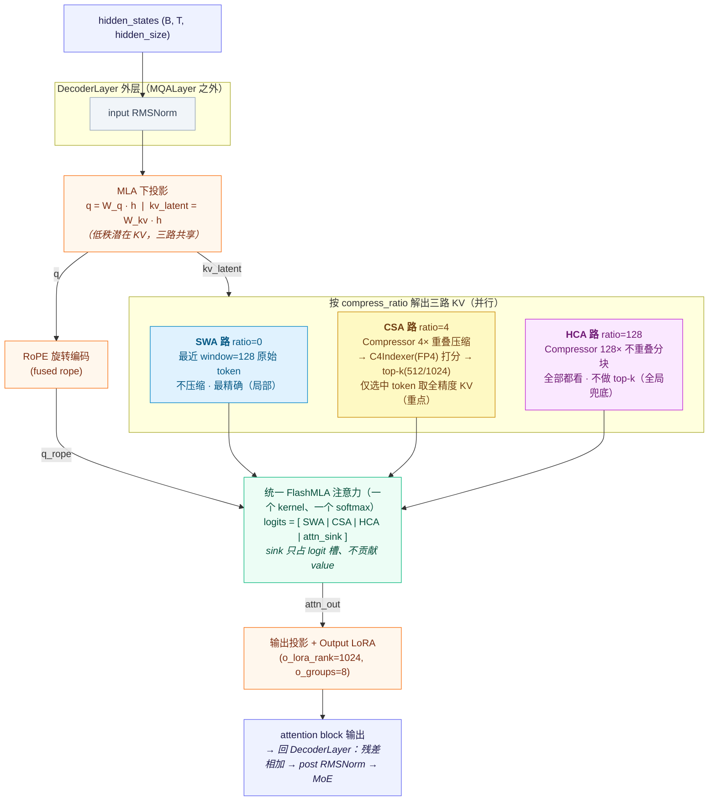

# DeepSeek-V4-Pro 注意力变体（DSv4：滑窗 + CSA + HCA）原理详解

> 本文承接 [`NSA_DSA.md`](./NSA_DSA.md)，讲清 SGLang 中 **DeepSeek-V4-Pro（代码中称 DSv4）**
> 注意力的**原理**。核心结论：DSv4 在 V3.2 DSA「闪电索引器 + top-k 单分支」之上，重新引入了
> **压缩**与**滑窗**，做成三路互补的注意力——
>
> - **SWA**（滑动窗口）：看最近的、最精确的局部；
> - **CSA**（Compressed Sparse Attention，压缩稀疏注意力）：**适度压缩 4× + 稀疏选 top-k**，精挑历史重点；
> - **HCA**（Heavy Compression Attention，重度压缩注意力）：**重度压缩 128× + 全部都看**，提供全局兜底。
>
> 三路再加一个 sink（注意力汇聚点）在同一个 softmax 里融合。CSA / HCA 是 DSv4 代码里的**官方术语**
> （`dsv4/compressor.py:86`：*"DSV4 supports CSA(4x) and HCA(128x) only"*），分别对应代码中以
> `c4_` / `c128_` 前缀出现的两套缓存。
>
> 本文先讲原理（§1–§5），把代码细节集中到「实现备注」（§6）与参考表（§10）。所有涉及代码的
> 描述都附 `文件路径:行号`，凡属论文层面的对照会明确标注。

## 目录

1. [演进：从 V3.2 单分支回到多路](#1-演进从-v32-单分支回到多路)
2. [为什么要分级压缩：单一策略的两难](#2-为什么要分级压缩单一策略的两难)
3. [CSA：压缩稀疏注意力的原理](#3-csa压缩稀疏注意力的原理)
4. [HCA：重度压缩注意力的原理](#4-hca重度压缩注意力的原理)
5. [三路 + sink 如何在一个 softmax 里融合](#5-三路--sink-如何在一个-softmax-里融合)
6. [实现备注（代码层面）](#6-实现备注代码层面)
7. [与 V3.2 DSA / 原始 NSA 的对照](#7-与-v32-dsa--原始-nsa-的对照)
8. [注意力之外的 DSv4 架构差异](#8-注意力之外的-dsv4-架构差异)
9. [局限与权衡](#9-局限与权衡)
10. [参考实现位置](#10-参考实现位置)
11. [附录 A：DSv4 多路注意力数值示例](#附录-adsv4-多路注意力数值示例)

---

## 1. 演进：从 V3.2 单分支回到多路

回顾 `NSA_DSA.md`：原始 NSA 论文设计了「压缩 + 选择 + 滑窗」三分支；DeepSeek-V3.2 的 DSA 把它
砍成单分支——只保留「闪电索引器打分 + top-k 选择」，去掉压缩与滑窗。

DSv4 又把压缩与滑窗加了回来，形成 **SWA + CSA + HCA** 三路。与原始 NSA 的相似在于「信息构成」
重新覆盖了局部 / 重点 / 全局三类；不同在于 DSv4 不做三分支门控加权，而是把三路的 key 拼进
**同一个 softmax** 一次算完（§5）。

---

## 2. 为什么要分级压缩：单一策略的两难

长上下文 decode 的根本矛盾是：**历史 token 太多，全看太贵，但又不能漏掉重要的。** 若只用一种
压缩策略，必然陷入两难：

- **压得轻**（如 4:1）：细节保留得好，但压完 token 数仍多，全看依然贵；要降本就得 top-k 截断，
  而一旦截断，**没被选中的区域就彻底看不见了**。
- **压得重**（如 128:1）：token 数少到可以全看，但 128 个糊成 1 个，**细节全丢**，只剩大概轮廓。

DSv4 的解法是不二选一，而是让两级压缩各司其职，再用滑窗补最近的精确信息：**CSA 负责"重点看清"，
HCA 负责"全局不漏"，SWA 负责"最近最准"。**

---

## 3. CSA：压缩稀疏注意力的原理

> 关键词：**适度压缩（4×）+ 精挑细选（top-k）**

1. **适度压缩**：把历史 KV 每 4 个聚合成 1 个「压缩 token」。聚合不是简单平均，而是按重要性
   加权（online softmax-pool），所以 4:1 压缩后仍保留相当细节。CSA 的压缩窗口是**重叠滑动**的
   （overlap，`dsv4/compress_hip.py:118` 标注 *"CSA (overlap=True)"*），相邻压缩 token 覆盖范围
   有交叠，避免硬切边界丢信息。

2. **稀疏选择**：用轻量的「闪电索引器」给这些 4× 压缩 token 快速打分，只挑出最重要的
   top-512（或 1024）个，**只在被选中的 token 上做全精度注意力**。

3. **角色**：CSA 是**「重点检索」**——在保留细节的粒度上，精准地把历史里真正相关的几段拎出来
   看清楚，对应原始 NSA 的「选择分支」。

代价：被 top-k 截断的区域看不到。这正是需要 HCA 兜底的原因。

---

## 4. HCA：重度压缩注意力的原理

> 关键词：**重度压缩（128×）+ 全部都看**

1. **重度压缩**：每 128 个 token 聚合成 1 个，压缩比极高。与 CSA 不同，HCA 的窗口是**不重叠的
   分块**（non-overlap，`dsv4/compress_hip.py:368` 标注 *"non-overlap (HCA, ratio=128)"*），
   干净地把整段历史切成少量大块。

2. **不选择、全稠密**：因为 128:1 压完后 token 数已极少（128K 上下文只剩约 1K 个），**不需要
   top-k，直接全看**，开销依然很低。

3. **角色**：HCA 是**「全局概览」**——用极少量重度压缩 token 覆盖**整个**历史，保证「哪里都看
   得到一点」，不会因 CSA 的 top-k 截断而漏掉某个区域，对应原始 NSA 的「压缩分支」。

代价：粒度粗、细节糊；但它的任务本就是兜底全局，不负责看细节。

---

## 5. 三路 + sink 如何在一个 softmax 里融合

把三路放在一起，分工就清楚了。类比读一本很厚的书：

| 路 | 压缩 | 选择 | 类比 | 负责 |
|----|------|------|------|------|
| **SWA 滑窗** | 不压 | 最近 128 | 正在读的这几页 | 局部，最清晰 |
| **CSA** | 4×（重叠） | top-512/1024 | 翻回去精读几个关键章节 | 重点，较清晰 |
| **HCA** | 128×（不重叠） | 全看 | 扫一遍全书目录 | 全局，模糊但不漏 |

- **SWA** 保证最近内容看得最清；
- **CSA** 保证重要历史片段被精准放大；
- **HCA** 保证整个历史都有粗略印象、不留盲区。

三者覆盖「局部精确 / 重点细看 / 全局兜底」三个层次，又都很便宜。**关键：DSv4 把三路的 key
拼进同一个 softmax**（外加一个 sink logit 稳定数值），由一个 FlashMLA kernel 一次算完——而不是
像原始 NSA 那样三分支各自 softmax 再门控加权。数值演示见[附录 A](#附录-adsv4-多路注意力数值示例)。

**复杂度直觉**：一次 decode 的全精度 key 数约为 $\underbrace{128}_{\text{SWA}} +
\underbrace{512}_{\text{CSA top-k}} + \underbrace{n/128}_{\text{HCA}}$。前两项是常数，第三项随
上下文 $n$ 线性但被 128 倍压缩。代价是多一次闪电索引器的廉价打分与压缩器的池化——这就是 DSv4
在保留三类信息的同时，把长上下文 decode 的注意力访存压到近似常数的原理。

---

## 5.5 一个 DSv4 attention block 的完整结构图

把前面 §3–§5 的所有部件串起来，一个完整的 DSv4 注意力块（代码中的 `MQALayer`，
`models/deepseek_v4.py:262`）的数据流如下。整体仍是「MLA 下投影 → 三路取 KV → 统一 softmax →
输出投影」，三路并行准备 key/value，最终拼进同一个 FlashMLA kernel。

读图要点：

- **共享潜在 KV**：三路并不各自存一份完整 KV，而是共享 MLA 的低秩潜在向量 `kv_latent`，
  各路只是用不同的 `compress_ratio`（0 / 4 / 128）从中解出对应粒度的 key/value（§6 术语映射表）。
- **三路并行、softmax 统一**：虚线框内的 SWA / CSA / HCA 是**并行准备 key/value**，但**不各自
  做 softmax**——它们的 logits 连同 sink 一起进同一个 FlashMLA kernel 归一化（§5、附录 A）。
- **CSA 是唯一带"选择"的路**：只有它经过 `C4Indexer` 打分 + top-k 截断；SWA 固定取最近窗口、
  HCA 压完直接全看，都没有选择步骤。
- **block 边界**：本图聚焦注意力块本身（`MQALayer`）；其外层的 input/post RMSNorm、残差相加与
  MoE 属于 `DeepseekV4DecoderLayer`（`models/deepseek_v4.py:1016`），图中以灰字标注衔接关系。

---

## 6. 实现备注（代码层面）

> 本节是给读代码的人看的索引，原理已在 §2–§5 讲完，可跳过。

**术语映射**：注意力前向 `forward`（`deepseek_v4_backend.py:1165`）接收
`compress_ratio ∈ {0, 4, 128}`，对应三套缓存（`metadata.py:44` 定义 `c4_`/`c128_` 前缀）：

| 本文术语 | `compress_ratio` | 代码前缀 | 页大小（`page_size=256` 下） |
|---------|-----------------|---------|------|
| SWA | 0（C1，原始 token） | `swa_` / `c1_` | 256 |
| CSA | 4 | `c4_` | 64 |
| HCA | 128 | `c128_` | 2 |

- **元数据**：`DSV4AttnMetadata`（`:106`）按级别维护 `c1_/c4_/c128_flashmla_metadata`（`:133`），
  由 `get_flashmla_metadata(compress_ratio)`（`:141`）分派。`page_size==256` 是硬约束
  （`metadata.py:142`）；CSA top-k 限定 `c4_sparse_topk in (512, 1024)`（`:309`）。
- **压缩器**：`dsv4/compressor.py`、`compressor_v2.py`、`fused_compress_triton.py`、
  `compress_hip.py`。online softmax-pool 见 `compressor_v2.py:50`；压缩 token 用独立 RoPE
  （`compress_rope_theta=40000`，`configs/deepseek_v4.py:104`），RoPE 位置
  `= seq_len - compress_ratio`（`compressor_v2.py:317`）。**CSA indexer 只挂在
  `compress_ratio==4` 的层**（`model_config.py:154`），逐层压缩比由 `compress_ratios` 配置决定。
- **闪电索引器（FP4）**：DSv4 把索引器 KV 从 V3.2 的 FP8 进一步压到 **FP4（E2M1）+ UE8M0 微缩放**
  （`dsv4/fp4_indexer.py`，128 维→64 字节 + 4 字节 scale；开关 `--enable-deepseek-v4-fp4-indexer`，
  `server_args.py:819`）。打分走 FP8 paged MQA logits + `topk_transform_512`（`indexer.py`）。
- **统一前向**：`forward`（`:1165`）一次把 `swa_k_cache` + `extra_k_cache`（CSA 稀疏 / HCA 全部）
  + `attn_sink`（`:1246` 断言必需）喂给 `flash_mla_with_kvcache`（`:1292`）；大 batch 变长 prefill
  走 `_forward_prefill_sparse`（`:1314`）+ `flash_mla_sparse_fwd`。索引最后一维需对齐 64（`:1251`）。
- **decode 索引打包**：`dsv4/unified_kv_kernels/paged_decode_indices.py` 把三路统一打包为
  `swa_/csa_/hca_indices`（ragged，每路长度分别为 SWA 窗口、`min(committed, index_topk)`、HCA 全部）。
- **识别与注册**：`is_deepseek_v4`（`model_config.py:118`，架构白名单，不依赖 `index_topk`）；
  backend 注册名 `"dsv4"`（`attention_registry.py:127`，CUDA→`DeepseekV4AttnBackend`，
  HIP→`DeepseekV4HipRadixBackend`），废弃别名 `"compressed"`（`server_args.py:188`）。

---

## 7. 与 V3.2 DSA / 原始 NSA 的对照

| 维度 | 原始 NSA（论文） | V3.2 DSA（SGLang `nsa/`） | **DSv4（SGLang `dsv4/`）** |
|------|-----------------|--------------------------|---------------------------|
| 滑窗（局部） | 有 | **无** | **有，SWA window=128** |
| 选择（重点） | 有（top-k 块） | 有（top-k 位置，page_size=1） | **有，CSA = 4× 压缩 + top-512/1024** |
| 压缩（全局） | 有（粗粒度块） | **无** | **有，HCA = 128× 重度压缩，稠密** |
| 融合方式 | 三分支**门控加权求和** | 单分支（无融合） | **单 FlashMLA kernel 内统一 softmax**（含 sink） |
| 索引器精度 | — | FP8 | **FP4（E2M1）+ UE8M0 微缩放** |
| 压缩粒度 | 单一块大小 | — | **两级：CSA 4× 与 HCA 128×** |
| 与 MLA 关系 | 独立设计 | 叠加在 MLA 之上 | 叠加在 MLA 之上（沿用潜在 KV） |

要点：DSv4 在「信息构成」上回归 NSA 三类（局部/重点/全局），但**融合方式仍是 DSA 式的单 kernel
稀疏注意力**，而非论文的门控加权——所以它既不是纯 NSA，也不是纯 V3.2 DSA。

---

## 8. 注意力之外的 DSv4 架构差异

为完整理解 DSv4-Pro，以下是与注意力强耦合但严格说不属于「注意力分支」的几处改动（简述）：

- **Output LoRA**：配置含 `o_lora_rank=1024`、`o_groups=8`（`configs/deepseek_v4.py:100`），
  即输出投影也做低秩分组（V3 系列只有 `q_lora_rank`/`kv_lora_rank`）；头维也变大
  （`qk_nope_head_dim=448`、`v_head_dim=512`）。
- **MHC / hc_head（LM-head mixer）**：`layers/mhc_head.py` 把 `(T, hc_mult, hidden_size)` 的
  `hc_mult` 个候选经 RMSNorm + Linear + sigmoid 门控加权求和成 `(T, hidden_size)`，每次前向在最后
  一个 PP rank 触发一次。超参 `n_hash_layers=3`、`hc_mult=4`、`hc_sinkhorn_iters=20`。
- **MoE 路由差异**：`scoring_func="sqrtsoftplus"`（`configs/deepseek_v4.py:90`），训练时**不做
  group limiting**；`model_config.py:274`-`283` 强制 `topk_group == n_group` 走未分组的
  sqrtsoftplus 路径（注释警告：分组实现只支持 sigmoid 打分，误入会静默损坏专家权重）。
- **FP4/MXFP4 专家**：`is_fp4_experts`（`model_config.py:260`）经 `try_detect_fp4_experts`
  探测权重 dtype，自动判定路由专家是 MXFP4 打包还是转换后的 FP8。

---

## 9. 局限与权衡

- **强依赖 MLA + FlashMLA**：统一前向建立在 `flash_mla_with_kvcache` / `flash_mla_sparse_fwd`
  之上，SM120 另有专门路径（`:1272`）。脱离 MLA 潜在 KV 无法使用。
- **多套页语义并存**：`page_size==256` 硬编码，索引最后一维必须对齐 64；SWA=256、CSA=64、
  HCA=2、稀疏 page_size=1 多套语义共存，对元数据正确性要求极高。
- **元数据复杂度高**：相比 V3.2 单分支，DSv4 要同时维护三路 FlashMLA 调度元数据、稀疏页索引、
  压缩计划（`DSV4AttnMetadata` 字段众多，`:106`-`:328`），CUDA graph 切换逻辑也更繁重。
- **CSA 非全层**：只有 `compress_ratio==4` 的层做稀疏选择（`model_config.py:154`），其余层靠
  SWA + HCA 覆盖，层间行为不一致，调试需对照 `compress_ratios`。
- **必须为 DSv4 训练**：索引器、压缩器、MHC head、sqrtsoftplus 路由都是可学习/训练耦合模块，
  不能免训练加到现成模型上。
- **代码新、形状假设多**：大量 `assert`（如 `c4_sparse_topk in (512,1024)`、`page_size==256`）
  表明实现对配置组合敏感，超出验证过的组合可能直接断言失败。

---

## 10. 参考实现位置

| 模块 | 文件路径 |
|------|---------|
| 模型识别 / 超参 / FP4 专家 | `python/sglang/srt/configs/model_config.py`（`is_deepseek_v4` `:118`） |
| DSv4 配置类 / FP4 探测 | `python/sglang/srt/configs/deepseek_v4.py` |
| backend 总入口与统一前向（CUDA） | `python/sglang/srt/layers/attention/deepseek_v4_backend.py` |
| backend（HIP / ROCm） | `python/sglang/srt/layers/attention/deepseek_v4_backend_hip_radix.py` |
| 压缩器（CSA/HCA，online softmax-pool） | `dsv4/compressor.py`、`compressor_v2.py`、`fused_compress_triton.py`、`compress_hip.py` |
| FP4 闪电索引器 | `dsv4/fp4_indexer.py`、`dsv4/indexer.py` |
| 三路索引统一打包 | `dsv4/unified_kv_kernels/paged_decode_indices.py` |
| 元数据 / 术语定义 | `dsv4/metadata.py`、`dsv4/metadata_kernel.py` |
| 索引器 KV 量化 / 反量化 | `dsv4/quant_k_cache.py`、`dsv4/dequant_k_cache.py`、`dsv4/index_buf_accessor.py` |
| MHC / hc_head（LM-head mixer） | `python/sglang/srt/layers/mhc_head.py` |
| backend 注册 | `python/sglang/srt/layers/attention/attention_registry.py`（`:127`） |
| 启动参数 / 默认值 hook | `python/sglang/srt/server_args.py`、`python/sglang/srt/arg_groups/deepseek_v4_hook.py` |

---

## 附录 A：DSv4 多路注意力数值示例

为直观理解 §5 的「SWA + CSA + HCA 三路如何在**同一 softmax** 里融合」，下面用一个**可以从头算到尾**的
极小规模例子完整演示。设当前 decode 一个新 query，历史序列长度 $n = 8$（位置 $0\dots7$），单头，
头维 $d = 2$。为方便手算，本附录所有数都取得很整。

### A.0 原始输入数据

历史 8 个 token 的（全精度）key / value 向量如下——这是后续一切计算的**唯一原始数据**，三路都从它派生：

| 位置 $i$ | $0$ | $1$ | $2$ | $3$ | $4$ | $5$ | $6$ | $7$ |
|---------|-----|-----|-----|-----|-----|-----|-----|-----|
| key $k_i$ | $[0.2,0.0]$ | $[0.4,0.2]$ | $[0.1,0.5]$ | $[0.1,0.7]$ | $[0.3,0.6]$ | $[0.2,0.9]$ | $[1.0,0.0]$ | $[0.7,0.7]$ |
| value $v_i$ | $[2,1]$ | $[4,2]$ | $[1,6]$ | $[0,8]$ | $[3,7]$ | $[2,9]$ | $[10,0]$ | $[8,8]$ |
| 索引权重 $w_i$ | $0.1$ | $0.2$ | $0.3$ | $0.4$ | $0.5$ | $1.5$ | — | — |

当前 query 取 $q = [1,\ 0]$，缩放因子 $\sqrt d = \sqrt 2 \approx 1.414$。三路分工（与 §5 一致）：

| 路 | 压缩比 | 提供的 key | 说明 |
|----|-------|-----------|------|
| SWA 滑窗 | 0 | 位置 $\{6, 7\}$ 的原始 KV | 最近窗口（真实 window=128，此处缩成 2） |
| CSA 稀疏 | 4 | $0\dots7$ 压成 2 个 token，索引器选 top-1 | 适度压缩 + 精挑 |
| HCA 压缩 | 128 | $0\dots5$ 重度压成 1 个 token $c$ | 重度压缩，全看不选择 |

> 说明：为让三路 key 互不重复、便于区分贡献，本例让 SWA 取最近的 $\{6,7\}$，而 CSA/HCA 只压缩较早的
> $0\dots5$（真实实现中各路覆盖范围按页对齐，会有重叠，这里简化）。

### A.1 SWA 路：直接取原始 KV，无需计算

滑窗不压缩，直接把最近窗口内位置 $6,7$ 的原始 key/value 原样拿来：

$$
k_6=[1.0,\ 0.0],\ v_6=[10,\ 0]; \qquad k_7=[0.7,\ 0.7],\ v_7=[8,\ 8].
$$

### A.2 HCA 路：重度压缩（online softmax-pool）的逐步计算

HCA 把位置 $0\dots5$ 这 6 个 token **加权聚合成 1 个**压缩 token $c$。聚合不是普通平均，而是按
索引权重 $w_i$ 做 **softmax 加权池化**（即 §6 提到的 online softmax-pool）。

**第 1 步：对权重做 softmax，得到每个 token 的聚合占比。** 先取指数（保留 3 位小数）：

$$
e^{0.1}=1.105,\ e^{0.2}=1.221,\ e^{0.3}=1.350,\ e^{0.4}=1.492,\ e^{0.5}=1.649,\ e^{1.5}=4.482.
$$

求和：$Z = 1.105+1.221+1.350+1.492+1.649+4.482 = 11.299$。归一化得权重 $p_i = e^{w_i}/Z$：

$$
p_0=0.098,\ p_1=0.108,\ p_2=0.119,\ p_3=0.132,\ p_4=0.146,\ p_5=0.397.
$$

（注意位置 5 权重最大，聚合后它的贡献占比最高，约 $40\%$。）

**第 2 步：用 $p_i$ 加权求和 key/value，得到压缩 token $c$。** 以 value 第 1 维为例：

$$
v_c^{(1)} = 0.098\cdot2 + 0.108\cdot4 + 0.119\cdot1 + 0.132\cdot0 + 0.146\cdot3 + 0.397\cdot2 = 2.07.
$$

同理逐维算完得：

$$
k_c \approx [0.30,\ 0.62], \qquad v_c \approx [2.07,\ 6.50].
$$

这一个 $c$ 就代表了「位置 $0\dots5$ 的全局概貌」——粒度粗，但一个都没漏。

### A.3 CSA 路：先压缩成 2 个，再用索引器选 top-1

**第 1 步：压缩。** CSA 压缩比为 4，把 $0\dots5$（演示里取 6 个，凑成 2 组）每 3 个压成 1 个压缩 token：

- $a_0$ 由位置 $\{0,1,2\}$ 聚合，$a_1$ 由位置 $\{3,4,5\}$ 聚合。简单起见这里用**组内均值**近似（真实仍是
  加权池化）：

$$
k_{a_0}=\tfrac{1}{3}([0.2,0]+[0.4,0.2]+[0.1,0.5])=[0.233,\ 0.233],\quad v_{a_0}=\tfrac13([2,1]+[4,2]+[1,6])=[2.33,\ 3.00];
$$
$$
k_{a_1}=\tfrac{1}{3}([0.1,0.7]+[0.3,0.6]+[0.2,0.9])=[0.200,\ 0.733],\quad v_{a_1}=\tfrac13([0,8]+[3,7]+[2,9])=[1.67,\ 8.00].
$$

**第 2 步：索引器打分（轻量、低维）。** 闪电索引器用一套**独立的**索引 query $q_{idx}=[2,\ 1]$ 对两个压缩
token 的 key 打分（点积，不缩放）：

$$
s(a_0)=q_{idx}\!\cdot\! k_{a_0}=2\times0.233+1\times0.233=0.699,
$$
$$
s(a_1)=q_{idx}\!\cdot\! k_{a_1}=2\times0.200+1\times0.733=1.133.
$$

**第 3 步：取 top-1。** $s(a_1)=1.133 > s(a_0)=0.699 \Rightarrow$ 选中 $a_1$，丢弃 $a_0$。
（真实 DSv4 中 `index_topk=512`，这里缩成 1。）CSA 最终只贡献一个 key：$k_{a_1}=[0.200,\ 0.733]$，
$v_{a_1}=[1.67,\ 8.00]$。

> 关键：索引打分用的是 $q_{idx}$（索引器的低维 FP4 投影，**只为「在压缩 token 里选谁」**），
> 与下面 A.4 真正算注意力用的 $q$ 是**两套不同的 Q**——这与 V3.2 DSA「索引器轻量打分、选中后才用全精度」
> 一脉相承（见 `NSA_DSA.md` 附录 A）。

### A.4 汇总三路 key/value，并计算注意力打分

现在把三路最终提供的 key/value 收齐，用**注意力 query** $q=[1,0]$ 算打分 $q\!\cdot\!k/\sqrt2$：

| 来源 | key $k$ | value $v$ | 点积 $q\!\cdot\!k$ | 打分 $q\!\cdot\!k/\sqrt2$ |
|------|---------|-----------|--------|------|
| SWA 位 6 | $[1.0,\ 0.0]$ | $[10,\ 0]$ | $1.000$ | $0.707$ |
| SWA 位 7 | $[0.7,\ 0.7]$ | $[8,\ 8]$ | $0.700$ | $0.495$ |
| HCA 压缩 $c$ | $[0.30,\ 0.62]$ | $[2.07,\ 6.50]$ | $0.300$ | $0.212$ |
| CSA 选中 $a_1$ | $[0.20,\ 0.73]$ | $[1.67,\ 8.00]$ | $0.200$ | $0.141$ |
| sink | （仅占一个 logit 槽，无 value） | — | — | $0$（设其 logit=0） |

打分只用了 key 的第 1 维（因为 $q=[1,0]$），例如 HCA：$q\!\cdot\!k_c = 1\times0.30+0\times0.62 = 0.30$，
除以 $\sqrt2$ 得 $0.212$。

### A.5 统一 softmax（关键：三路 + sink 一起归一化）

**第 1 步：对 5 个 logit 取指数。**

$$
e^{0.707}=2.028,\ e^{0.495}=1.640,\ e^{0.212}=1.236,\ e^{0.141}=1.151,\ e^{0}=1.000.
$$

**第 2 步：求和。** $Z = 2.028+1.640+1.236+1.151+1.000 = 7.055$。

**第 3 步：归一化得注意力权重 $\alpha$。**

$$
\alpha = \Big[\tfrac{2.028}{7.055},\ \tfrac{1.640}{7.055},\ \tfrac{1.236}{7.055},\ \tfrac{1.151}{7.055},\ \tfrac{1.000}{7.055}\Big]
= [0.287,\ 0.232,\ 0.175,\ 0.163,\ 0.142].
$$

最后一个 $0.142$ 是 sink 的权重——它**只参与归一化、稀释其他权重以稳定数值**，但**不贡献 value**。

### A.6 加权求和得到输出

用前 4 个权重对各自 value 加权求和（sink 跳过）：

$$
\text{out} = 0.287[10,0] + 0.232[8,8] + 0.175[2.07,6.50] + 0.163[1.67,8.00].
$$

逐维计算：

$$
\text{out}^{(1)} = 0.287\cdot10 + 0.232\cdot8 + 0.175\cdot2.07 + 0.163\cdot1.67 = 2.87+1.86+0.36+0.27 = 5.36,
$$
$$
\text{out}^{(2)} = 0.287\cdot0 + 0.232\cdot8 + 0.175\cdot6.50 + 0.163\cdot8.00 = 0+1.86+1.14+1.30 = 4.30.
$$

$$
\boxed{\ \text{out} \approx [5.36,\ 4.30]\ }
$$

可以看到结果由「最近、打分最高的 SWA 位 6」主导（贡献了 $2.87$ 的第 1 维），同时 CSA/HCA 也把历史信息
按权重掺了进来——这正是三路互补、单 softmax 融合的效果。

### A.7 与原始 NSA 的对比

差异一目了然：NSA 让三分支**各自做 softmax 再门控加权**

$$
o = g_w\, o_{win} + g_c\, o_{cmp} + g_s\, o_{sel},
$$

需要算 3 次 softmax 再学 3 个门控系数 $g$；而 DSv4 把三路 key 拼进**同一个 softmax**（外加 sink logit
稳定数值），由 FlashMLA **一次算完**（即上面 A.5–A.6 的单次归一化），既省了门控参数，也省了多次 softmax。
