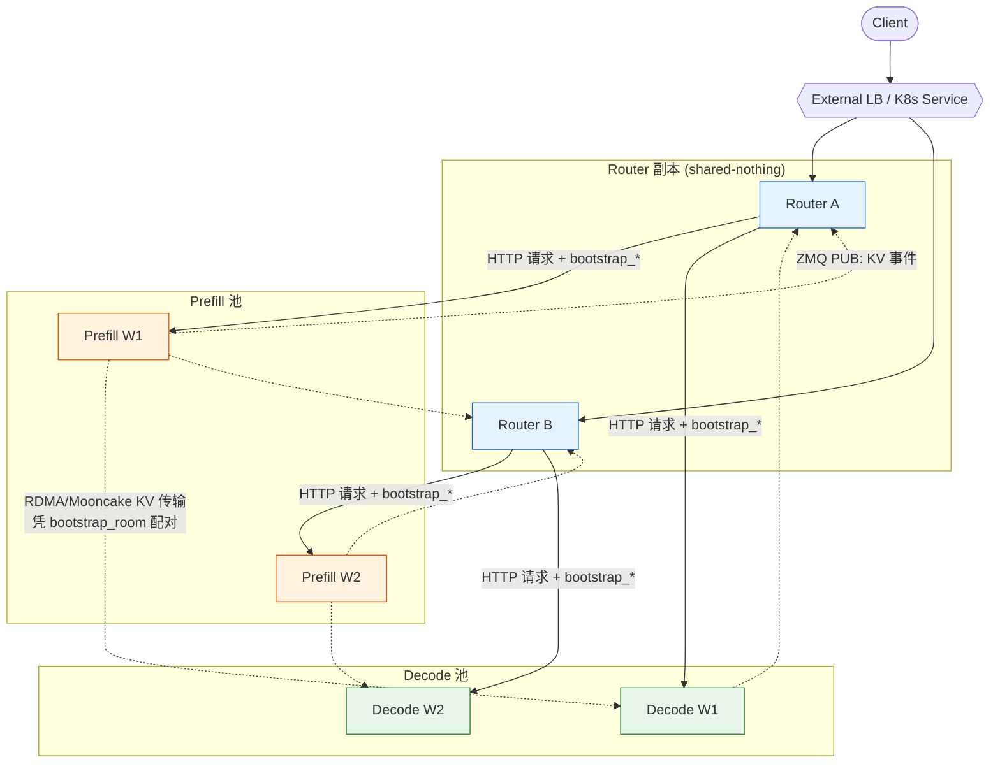
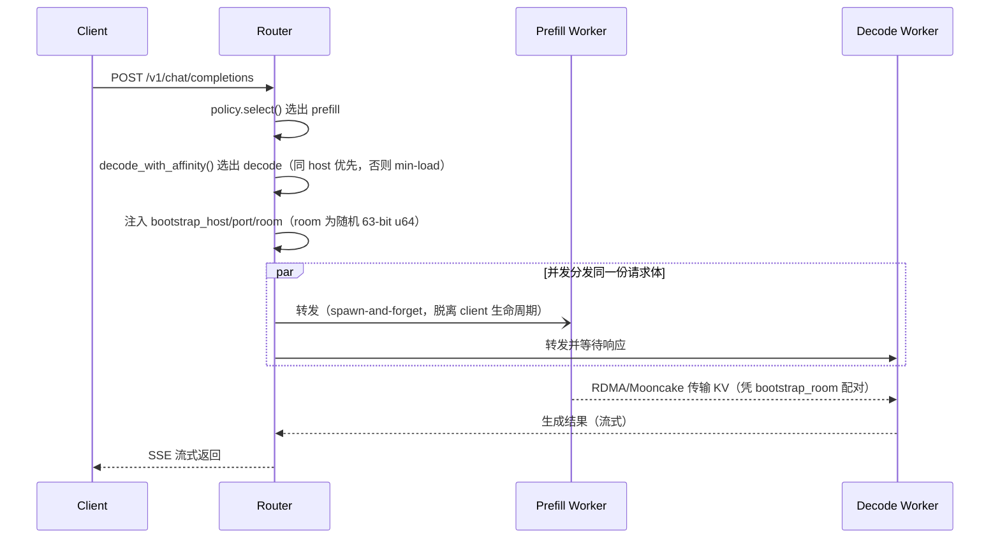
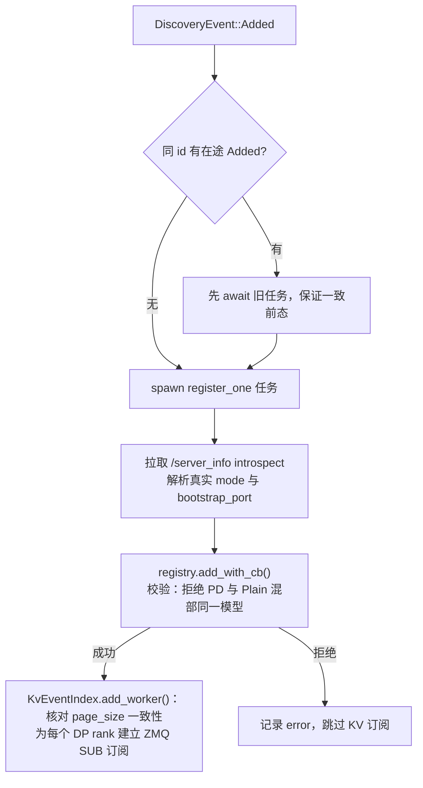
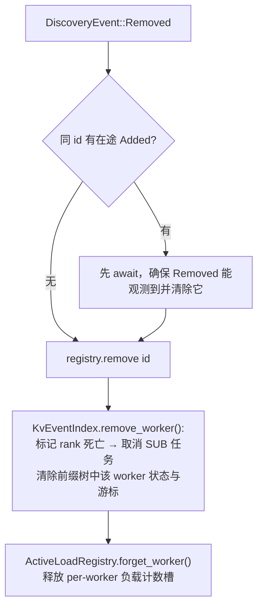
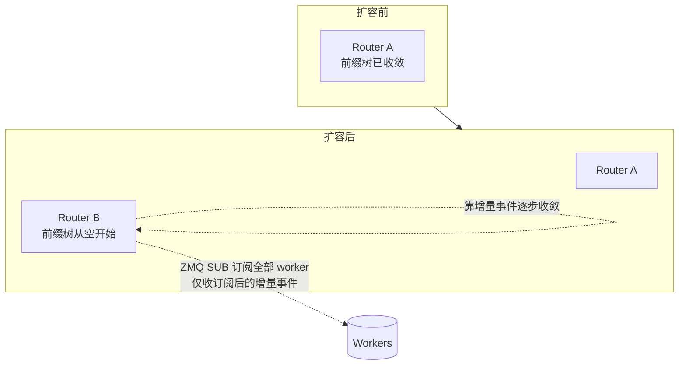

# SGLang Router：PD 分离部署架构与节点增删流程

本文说明由 `sgl-router`（Rust 实现）负责路由的 **Prefill/Decode（PD）分离** 部署架构，
并逐一梳理 **router 节点增删** 与 **worker 节点增删** 的处理流程，最后对系统鲁棒性做综合评估。

> 代码位置：`experimental/sgl-router/src/`。文中引用的关键模块：
> `server/routes/chat.rs`（PD 分发）、`workers/manager.rs`（增删事件处理）、
> `workers/registry.rs`（worker 注册表）、`policies/kv_events/`（KV 事件订阅与前缀树）、
> `health/circuit_breaker.rs`（熔断）、`discovery/`（服务发现）。

---

## 1. 总体架构

Router 本身**不做推理**，只负责把 OpenAI 兼容请求分发给后端 SGLang worker，
并反向订阅 worker 的 KV 缓存事件以支持缓存感知路由（cache-aware）。

三类实体的关系：

- **Router → Worker**：单向转发 HTTP 请求。
- **Worker → Router**：通过 ZMQ PUB/SUB 单向推送 KV 事件；worker **不感知具体是哪个 router**。
- **Router ↔ Router**：**shared-nothing**，副本间不通信、不共享状态，各自订阅同一批 worker、各自维护前缀树并独立收敛。
- **Worker ↔ Worker**：仅 PD 分离时，prefill 通过 RDMA/Mooncake 把 KV 直传给 decode，凭 `bootstrap_room` 配对。

### 1.1 PD 请求分发流程

对 PD 分离部署，router 为每个请求选出一对 `(prefill, decode)` 后端，注入 3 个扁平字段
（`bootstrap_host` / `bootstrap_port` / `bootstrap_room`）后，把**同一份请求体**并发发给两侧。

要点：

- **prefill 采用 spawn-and-forget**：prefill 请求脱离 client 连接生命周期，避免 client 断连时
  引擎 NIXL/RDMA 拆链竞态导致 KV block 引用泄漏（对齐 Dynamo / llm-d / aibrix 的实现）。
- **decode 侧同步等待**并把结果流回 client。
- worker 的 `WorkerMode`（Plain/Prefill/Decode）与 `bootstrap_port` 以各 worker `/server_info`
  自述为准，而非仅靠发现后端的标签猜测。

---

## 2. Worker 节点增删流程

### 2.1 事件来源

发现后端（K8s EndpointSlice / static-urls 等）产生 `DiscoveryEvent`，经 mpsc 送到
`workers/manager.rs` 的事件循环：

- `Added(WorkerSpec)` — 新 worker 可用
- `Removed { id }` — worker 离开
- `ModeChanged { id, mode }` — 仅 K8s PD 标签翻转时（少见）

### 2.2 Worker 新增

关键行为：

- **introspect 覆盖发现标签**：`/server_info` 权威，纠正后端对 mode/bootstrap_port 的初始猜测。
- **混部校验**：同一模型下 PD（prefill/decode）与 plain 混部会被拒绝（`MixedPdAndPlain`），拒绝时注册表不被修改。
- **block_size 一致性**：第一个 worker 确立 `page_size`，后续 worker 必须一致，否则拒绝该 worker——
  否则 router 与引擎会对同一 prompt 算出不同 block hash，静默摧毁缓存感知质量。
- **KV 订阅仅增量**：ZMQ SUB 只能收到订阅后的事件，**没有历史回放**（尽管 worker 侧 `ZmqEventPublisher`
  自带 replay buffer + ROUTER socket，router 目前未使用）。

### 2.3 Worker 删除

关键行为：

- **先标记死亡再取消订阅**：mpsc 中残留的事件会被 live-set 校验过滤，不会再写入树。
- **幂等**：对未知 worker 的 Removed 是 no-op；仅记录告警。
- **在途 guard 不失效**：正在处理的请求的 LoadGuard 正常 drop，不会因节点摘除而中断。

### 2.4 熔断（运行期健康）

除了发现层的增删，`health/circuit_breaker.rs` 在**请求粒度**做快速隔离：

- 连续失败达阈值（默认 3）→ Open，将该 worker 移出候选集。
- 冷却期（默认 30s）后 → HalfOpen，放一个探测请求；成功恢复 Closed，失败重新 Open。
- 枚举候选用非侵入的 `would_allow()`，探测名额在真正分发时才占用。

> K8s e2e 用激进配置（阈值 1、冷却 5s），让正在终止的 pod 的 connection-refused 立即被摘除。

---

## 3. Router 节点增删流程

Router 是 **shared-nothing 软状态** 副本，位于外部 LB / K8s Service 之后。

### 3.1 Router 新增（扩容）

1. 新 router 启动 → 读 `/readyz` 就绪后，LB 开始给它导流。
2. 它独立向所有 worker 建立 ZMQ SUB 订阅，本地 `HashTree` **从空开始**。
3. 由于 SUB 无历史回放，历史前缀需靠订阅后的增量事件（store/evict）逐步重建：
   **高频热点前缀恢复快，长尾恢复慢**。
4. 过渡期内落到新 router 的请求，缓存感知命中率偏低，会退回 min-load —— 这是冷启动的瞬时抖动，非永久损失。

> 由于副本间零耦合，扩容无需主从选举 / 一致性协议，可在 K8s 中随意扩缩容。

### 3.2 Router 删除（缩容 / 故障）

1. LB 通过 readiness/liveness 探针或连接失败将其摘除，流量转移到其余副本。
2. 该 router 的本地前缀树、负载计数随进程退出而丢弃——**无共享状态需要清理**。
3. 其余副本不受影响（它们各自持有完整订阅与独立收敛的树）。
4. 注意：router 关闭**不**保护在途的 prefill spawn 任务；`AppContext` 拆除时这些任务会被中断
   （client 断连保护与进程关闭保护是两回事）。

---

## 4. 鲁棒性综合评估

| 维度 | 现状 | 评价 |
|------|------|------|
| Router 水平扩展 | shared-nothing、软状态、无主从 | 强：可任意扩缩容，无一致性协议开销 |
| Router 单点故障 | 副本独立，LB 摘除即转移 | 强：单副本挂掉不影响其余副本与 worker |
| Worker 增删 | 发现事件驱动 + introspect + 幂等清理 | 强：注册/摘除路径有序、幂等、在途请求不受损 |
| 请求级容错 | 熔断（Open/HalfOpen）+ 失败摘除 | 中上：能快速隔离坏 worker 并自动探测恢复 |
| PD KV 传输 | prefill spawn-and-forget，避免拆链竞态 | 中上：避免 client 断连引发的 KV 泄漏 |
| 配置一致性 | page_size / PD 混部启动即校验 | 强：错误配置 fail-fast，不静默降级质量 |
| 缓存冷启动（新 router） | 树从空开始，仅增量、无回放 | **弱点**：扩容/重启后短期 cache hit 下降 |
| PD 失败传播 | 无 prefill 快速失败看门狗 | **弱点**：prefill 5xx 时 client 需等 decode 侧 bootstrap_room 超时（约 30-60s） |
| 事件顺序/乱序 | 按 (worker,rank) 保序 + 游标过滤陈旧批次 | 强：跨 rank/worker 不保序，消费方不依赖全局序 |

### 主要优势

- **零协调的水平扩展**：router 副本之间完全解耦，天然适配 K8s 弹性伸缩，无脑扩缩容即可。
- **有序且幂等的成员变更**：worker 增删路径对在途事件、重复事件、乱序事件都有防护（先标记死亡、await 在途 Added、live-set 过滤）。
- **fail-fast 的配置校验**：block_size 不一致、PD/plain 混部在注册期直接拒绝，避免静默的质量劣化。
- **多层容错**：发现层（增删）+ 熔断层（请求粒度）+ LB 层（探针）三级隔离故障。

### 主要弱点与改进方向

1. **新 router 缓存冷启动**（最突出）
   - 现象：新副本上线 / 重启后本地前缀树为空，缓存感知路由短期失效，集群 cache hit 下降。
   - 改进：利用 worker 侧已存在的 replay buffer（`ZmqEventPublisher` 的 ROUTER socket），
     订阅前先请求一次历史回放来 bootstrap 本地树；或增加 router 间树快照同步；或 LB 层给新副本预热窗口逐步导流。

2. **PD prefill 失败无快速反馈**
   - 现象：prefill 端 5xx 时，client 需等 decode 侧 `bootstrap_room` 超时才失败，体感延迟高。
   - 改进：用 `tokio::sync::watch` 在 prefill 失败时通知 decode 侧快速失败（若 telemetry 显示确有影响）。

3. **router 关闭不保护在途 prefill**
   - 现象：滚动升级 / 缩容时正在传输 KV 的 prefill 任务可能被中断。
   - 改进：优雅关闭时对在途 PD 任务设置排空窗口。

### 结论

整体系统在 **成员变更（增删）** 与 **副本扩展** 维度鲁棒性很好：无共享状态、有序幂等、fail-fast 校验、
多层容错。主要短板集中在 **缓存状态的冷启动收敛**（新 router 树为空）和 **PD 失败的快速反馈**，
两者都不影响正确性，只影响过渡期的性能表现，且都有明确、低侵入的改进路径。

