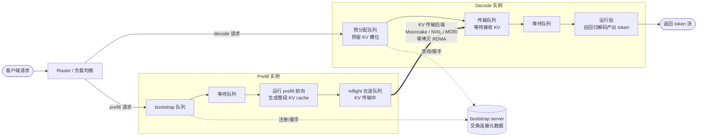
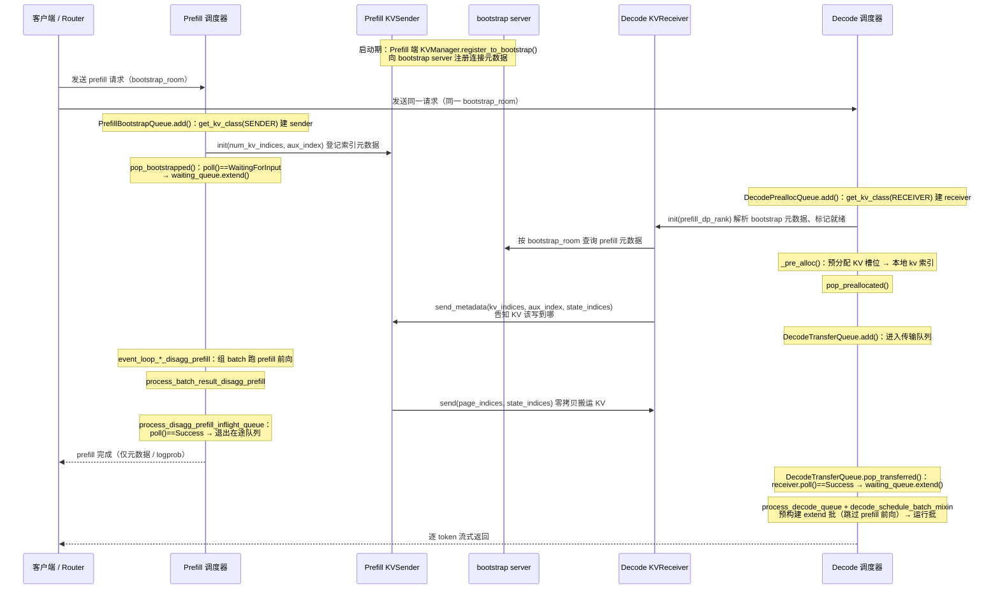
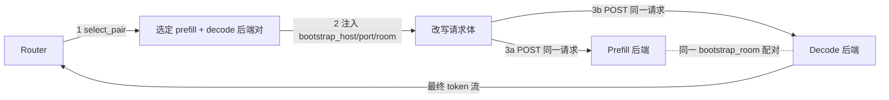

# srt/disaggregation

## 目录用途
本目录实现 SGLang 的 PD 分离（Prefill/Decode Disaggregation）架构：把请求的预填充（prefill）与解码（decode）阶段拆分到不同的服务实例上运行，并通过可插拔的 KV 传输后端在两端之间搬运 KV cache。该目录顶层放置 prefill/decode 两端的请求生命周期调度逻辑、KV 传输的通用工具与抽象，以及面向多模态的 EPD（Encode-Prefill-Decode）编码服务；各 KV 传输后端实现位于子目录中。

## 整体架构与数据流

PD 分离把一个请求的两个阶段拆到不同实例：**Prefill 实例**负责一次性的预填充前向、产出整段 prompt 的 KV cache；**Decode 实例**负责自回归解码。两端之间通过 **bootstrap server** 交换连接元数据，再由**可插拔的 KV 传输后端**（Mooncake / NIXL / MORI 等）以零拷贝方式把 KV cache 从 prefill 侧搬到 decode 侧。

### 组件与数据流

### 请求生命周期时序

下图把两端调度器 Mixin、队列类与 `KVSender`/`KVReceiver` 的具体方法串起来（`P*`=prefill 侧，`D*`=decode 侧）：

**关键类与方法（对照上图）**

- **Prefill 端**（`prefill.py`）：
  - `PrefillBootstrapQueue.add()` → `get_kv_class(KVClassType.SENDER)` 创建 `req.disagg_kv_sender`，并调用 `sender.init(num_kv_indices, aux_index)`。
  - `PrefillBootstrapQueue.pop_bootstrapped()`：轮询 `sender.poll()`，握手完成的请求移入 `waiting_queue`。
  - `SchedulerDisaggregationPrefillMixin.event_loop_normal/overlap_disagg_prefill()`：组 batch 跑前向；`process_batch_result_disagg_prefill()` 之后由 `sender.send(page_indices, state_indices)` 搬运 KV。
  - `process_disagg_prefill_inflight_queue()`：轮询 `sender.poll()`，`Success` 后退出在途队列并回客户端。
- **Decode 端**（`decode.py`）：
  - `DecodePreallocQueue.add()` → `get_kv_class(KVClassType.RECEIVER)` 创建 `kv_receiver`（封装进 `DecodeRequest`），调用 `receiver.init(prefill_dp_rank)`。
  - `DecodePreallocQueue._pre_alloc()`：预分配 KV 槽位得到本地 kv 索引；`pop_preallocated()` 里调用 `receiver.send_metadata(kv_indices, aux_index, state_indices)` 通知 prefill 写入位置，随后 `DecodeTransferQueue.add()`。
  - `DecodeTransferQueue.pop_transferred()`：轮询 `receiver.poll()`，`Success` 的请求移入 `waiting_queue`。
  - `SchedulerDisaggregationDecodeMixin.process_decode_queue()` / `event_loop_normal/overlap_disagg_decode()`：借助 `decode_schedule_batch_mixin` 预构建 extend 批并进入运行批解码。

### 关键数据流节点

- **bootstrap_room**：请求在 prefill/decode 两端共享的关联 ID，两侧凭它在 bootstrap server 上配对，建立点对点的 KV 传输通道。
- **谁发起、谁登记**：decode 端先预分配 KV 槽位并把本地 kv 索引通过 `send_metadata` 告知 prefill 端（数据该写到哪）；prefill 端算完 KV 后据此 `send()` 到对端指定位置。
- **状态锚点**：传输进度由 `KVPoll` 状态机驱动（Bootstrapping → WaitingForInput → Transferring → Success/Failed），两端各自 `poll()` 推进队列流转。
- **免二次 prefill**：decode 端收到完整 KV 后，用 `decode_schedule_batch_mixin` 预构建 extend 批——跳过 prefill 前向、只填充元数据，直接进入解码。
- **并行维度影响**：MLA（KV 跨 TP 共享）与 MHA（每 rank 独立 K/V）、TP/PP/DP 会影响 KV 的内存布局与传输时的切分/重切分（见 `common` 的暂存缓冲）。

### PD Router 逻辑

> Router 本身不在本目录：生产版是 `sgl-model-gateway`（Rust）实现的高性能路由，支持多种负载均衡策略；调试版是纯 Python 的 `sgl-model-gateway/bindings/python/src/sglang_router/mini_lb.py`（`MiniLoadBalancer`，仅支持 random 策略）。下面以 mini_lb 为例说明 PD 编排逻辑——生产 router 的核心编排一致，仅在策略上更丰富。

router 对每个请求做三件事：

1. **选后端对（`select_pair`）**：各选一个 prefill、decode 后端（mini_lb 为随机）；prefill 后端同时携带其 `bootstrap_port`。
2. **注入 bootstrap 元数据**：从 prefill 后端 URL 解析出 `bootstrap_host`，连同 `bootstrap_port` 与随机生成的 `bootstrap_room`（63-bit）写入请求体；批请求为每个样本单独生成 `bootstrap_room`。
3. **双端 fan-out**：把同一改写后的请求**同时** POST 给 prefill 和 decode 两个后端（`asyncio.gather`）。两端凭相同的 `bootstrap_room` 在 bootstrap server 上配对，建立点对点 KV 通道。

响应处理：

- prefill 端先返回（它只算 KV、不产出正文），router 仅取其元数据；**正文来自 decode 端**，返回给客户端的是 decode 端的响应（流式则透传 decode 的 SSE chunk）。
- `return_logprob` 时，把 prefill 的 `input_token_logprobs` 合并进 decode 结果——因为 prompt 段的 logprob 只有 prefill 端有。

DP（数据并行）路由（`--test-external-dp-routing`）：router 先经 `/server_info` 探测两端 DP size，再为请求注入 `routed_dp_rank`；decode 请求额外带 `disagg_prefill_dp_rank`，告知它对应的 prefill DP rank，确保 KV 从正确的 prefill DP 分片取得。

#### 负载均衡策略

生产版 `sgl-model-gateway` 通过 `--policy` 选择负载均衡策略（默认 `cache_aware`）。可用策略见 `router_args.py` 的 `_POLICY_CHOICES` 与 Rust 侧 `policies/factory.rs`：

| 策略 | 说明 | 关键参数 |
| --- | --- | --- |
| `cache_aware`（默认） | 缓存感知路由：用近似前缀树跟踪各 worker 已缓存的 prompt 前缀，优先把相同前缀的请求发往已缓存该前缀的 worker（提升 radix cache 命中率）；命中率不足或负载失衡时回退到负载均衡。 | `cache_threshold`、`balance_abs_threshold`、`balance_rel_threshold`、`eviction_interval_secs`、`max_tree_size` |
| `prefix_hash` | 按 prompt 前若干 token 做哈希路由，让相同前缀稳定落到同一 worker；`load_factor` 控制单 worker 负载上限、超限则外溢。 | `prefix_token_count`、`load_factor` |
| `consistent_hashing` | 一致性哈希：worker 增减时仅少量键重新映射，路由稳定。 | — |
| `power_of_two` | 随机抽两个 worker，选当前负载更低者（P2C），以低开销逼近最小负载。 | `load_check_interval_secs` |
| `round_robin` | 轮询，依次分发。 | — |
| `random` | 随机选择（MiniLB 唯一支持的策略）。 | — |
| `bucket` | 按负载分桶并周期性调整桶边界来均衡。 | `balance_abs_threshold`、`balance_rel_threshold`、`bucket_adjust_interval_secs` |
| `manual` | 手动/显式路由键分配，新键按 `assignment_mode`（`random`/`min_load`/`min_group`）落位，空闲键超时驱逐。 | `assignment_mode`、`max_idle_secs`、`eviction_interval_secs` |

PD 模式下 `--policy` 同时作用于 prefill 与 decode，可用 `--prefill-policy` / `--decode-policy` 分别覆盖——例如 prefill 侧用 `cache_aware` 提升前缀命中、decode 侧用 `power_of_two` 均衡解码负载。MiniLB 仅支持 `random`，其余策略均需生产版 router。

## 文件清单
| 文件 | 说明 |
| --- | --- |
| `decode.py` | Decode 端请求生命周期管理：预分配队列、传输队列、等待队列与运行批，以及 Decode 端调度器 Mixin、Req-to-token 池等。 |
| `decode_hicache_mixin.py` | Decode 端 HiCache 集成 Mixin：把前缀匹配结果转成 `DecodePrefixMatch`、发起 L3 预取，并驱动 L2/L3→L1 的本地恢复状态机（PENDING/READY/FAILED）。 |
| `decode_kvcache_offload_manager.py` | `DecodeKVCacheOffloadManager`，管理 Decode 端 KV cache 的卸载（offload）生命周期与操作。 |
| `decode_schedule_batch_mixin.py` | `ScheduleBatchDisaggregationDecodeMixin`，为 ScheduleBatch 提供预构建 extend 批（跳过 prefill 前向、仅填充元数据）的能力。 |
| `prefill.py` | Prefill 端请求生命周期管理：bootstrap 队列、等待队列、在途（inflight）队列，以及 Prefill 端调度器 Mixin。 |
| `utils.py` | PD 分离通用工具：`DisaggregationMode`/`TransferBackend`/`KVClassType` 枚举、元数据缓冲与索引分配器、轮询归约、KV 页索引换算、后端类工厂 `get_kv_class` 等。 |
| `kv_events.py` | KV cache 事件定义与发布：BlockStored/BlockRemoved 等事件、ZMQ 事件发布器及发布器工厂。 |
| `encode_server.py` | 多模态 EPD 编码服务：`MMEncoder` 编码器、编码进程启动与基于 FastAPI 的服务入口。 |
| `encode_receiver.py` | 编码结果接收端：嵌入数据结构、HTTP/gRPC 多模态接收器及其工厂 `create_mm_receiver`。 |
| `encode_grpc_server.py` | 基于 gRPC 的编码服务实现，用于多模态输入的编码（EPD 模式）。 |

## 子目录
| 子目录 | 说明 |
| --- | --- |
| `base` | KV 传输的抽象基类（Manager/Sender/Receiver/BootstrapServer 与 KVArgs/KVPoll）。 |
| `common` | 各后端共享的通用实现：CommonKV 系列、bootstrap 服务、异构 TP 暂存缓冲与工具。 |
| `mooncake` | 基于 Mooncake Transfer Engine 的 KV 传输后端。 |
| `nixl` | 基于 NIXL 的 KV 传输后端。 |
| `mori` | 基于 MORI IO 引擎的 KV 传输后端。 |
| `ascend` | 昇腾（Ascend）平台的 KV 传输后端，复用 Mooncake 实现。 |
| `fake` | 仅用于 warmup、不做真实 KV 传输的伪后端。 |

## 学习计划

面向想吃透本目录的读者，按「概念 → 抽象 → 通用实现 → 具体后端 → 端到端生命周期 → 进阶专题」的顺序推进。每个阶段给出目标、建议阅读顺序与自测问题，可按需跳过已熟悉的部分。

### 前置知识
- **PD 分离动机**：为什么把 prefill（计算密集、一次性）与 decode（访存密集、自回归）拆到不同实例，各自独立扩缩容以提升整体吞吐。
- **KV cache 基础**：KV cache 的形状与内存布局（layer_first / page_first / page_first_direct）、page 概念、token↔page 索引换算。
- **并行维度**：TP（张量并行）、PP（流水线并行）、DP（数据并行）在 KV 布局与 key 命名上的影响；MLA（KV 跨 TP 共享）与 MHA（每 rank 独立 K/V）的区别。
- **RDMA/零拷贝传输**：为什么要按 (指针, 字节数) 注册缓冲区，以及传输引擎（Mooncake / NIXL / MORI）扮演的角色。

### 阶段一：整体架构与数据流（约 0.5 天）
- **目标**：建立「一个请求如何跨 prefill/decode 两实例流动」的全局心智模型。
- **阅读顺序**：本 README → `utils.py`（`DisaggregationMode` / `TransferBackend` / `KVClassType` 枚举、`get_kv_class` 工厂、页索引换算）。
- **自测**：一个请求从进入 prefill 到在 decode 产出首 token，KV cache 在何时、经由谁、搬到哪里？bootstrap server 在其中起什么作用？

<b>参考答案</b>（KV cache 端到端流转 & bootstrap server 作用）

**前提：一个请求被「一分为二」**
Router 为请求生成共享的 `bootstrap_room`（63-bit 随机数），把**同一请求**同时 POST 给 prefill 与 decode 两个实例；两端凭相同的 `bootstrap_room` 配对。

**时间线（谁搬、何时、搬到哪）**

1. **Decode 端先「备好落点」**（注意：不是 prefill 先动）
   - `DecodePreallocQueue.add()` 创建 `KVReceiver`，`receiver.init()` 去 **bootstrap server** 查询 prefill 的连接元数据。
   - `_pre_alloc()` 在 **decode 本地显存**预分配 KV 槽位，得到本地 kv 索引。
   - `pop_preallocated()` 调用 `receiver.send_metadata(kv_indices, ...)`，把「KV 该写到 decode 的哪个显存地址」告知 prefill。
2. **Prefill 端算 KV**
   - `event_loop_*_disagg_prefill` 组 batch 跑一次 prefill 前向，产出整段 prompt 的 KV cache（存于 prefill 本地显存）。
3. **搬运：prefill → decode**
   - `process_batch_result_disagg_prefill` 之后，`sender.send(page_indices, state_indices)` 发起传输。
   - **实际搬运由 KV 传输后端完成**（Mooncake / NIXL / MORI），走 **RDMA 零拷贝**，直接从 prefill 显存写入第 1 步中 decode 预留的显存地址。
   - prefill 端 `process_disagg_prefill_inflight_queue()` 轮询 `sender.poll()`，`Success` 后退出在途队列，prefill 只回元数据（正文来自 decode）。
4. **Decode 端接收并解码出首 token**
   - `DecodeTransferQueue.pop_transferred()` 轮询 `receiver.poll()`，`Success` → 请求进 `waiting_queue`。
   - `decode_schedule_batch_mixin` **预构建 extend 批**：KV 已在本地显存，**跳过 prefill 前向、只填元数据**，直接进运行批解码产出首 token。

**bootstrap server 的作用**：它是「连接元数据交换所」，**不搬运任何 KV 数据**。
- 启动期：prefill 端 `KVManager.register_to_bootstrap()` 注册自己的连接元数据（地址/端口/并行拓扑）。
- 请求期：decode 端凭 `bootstrap_room` 查询对应 prefill 的元数据，建立点对点 RDMA 通道。
- 一句话：**bootstrap server 负责握手/牵线（控制面），真正的 KV 搬运走 RDMA 后端（数据面），二者分离**。

**核心记忆点**：落点由 **decode 先备并主动告知**；搬运由 **prefill 发起、RDMA 后端执行**；bootstrap server 只管**握手牵线**不碰数据。

### 阶段二：KV 传输抽象层（约 0.5 天）
- **目标**：掌握所有后端都要实现的统一接口契约。
- **阅读顺序**：`base/conn.py`（`KVArgs` 参数含义、`KVPoll` 状态机、`BaseKVManager/Sender/Receiver/BootstrapServer`）→ `base/README_zh.md`。
- **自测**：`BaseKVSender.poll()` 的 5 个状态如何流转？`KVArgs` 里的 `kv_item_lens` / `state_types` / `mla_compression_ratios` 分别解决什么问题？Sender 与 Receiver 各自负责传输的哪一半？

### 阶段三：后端共享实现（约 1 天）
- **目标**：理解各后端复用的通用逻辑，避免逐个后端重复啃。
- **阅读顺序**：`common/conn.py`（CommonKV 系列）→ `common/staging_buffer.py` 与 `common/staging_handler.py`（异构 TP 暂存缓冲）→ `common/utils.py` → `common/README_zh.md`。
- **自测**：当 prefill 与 decode 两侧 `attn_tp_size` 不同时，暂存缓冲（staging buffer）如何完成 KV 的重切分？

### 阶段四：具体传输后端（按需选读，约 1 天）
- **目标**：至少精读一个真实后端，理解抽象接口如何落地为零拷贝传输。
- **建议主线**：`mooncake/conn.py` + `mooncake/utils.py`（最完整，含握手、缓冲注册、分块发送）。
- **对照阅读**：`nixl/conn.py`、`mori/conn.py`（不同传输引擎的实现差异）；`ascend/`（NPU 平台、复用 Mooncake）；`fake/conn.py`（最简实现，适合先看以建立骨架认知）。
- **自测**：以 `fake` 为对照，Mooncake 后端在 `init`/`send`/`poll` 中额外做了哪些真实工作？

### 阶段五：端到端请求生命周期（约 1.5 天，重点）
- **目标**：把抽象与后端串成 prefill/decode 两端完整的调度流程。
- **阅读顺序**：
  1. `prefill.py`（bootstrap 队列 → 等待队列 → inflight 队列，Prefill 端调度器 Mixin）。
  2. `decode.py`（预分配队列 → 传输队列 → 等待队列 → 运行批，Decode 端调度器 Mixin、Req-to-token 池）。
  3. `decode_schedule_batch_mixin.py`（如何预构建 extend 批、跳过 prefill 前向仅填元数据）。
- **自测**：decode 端收到 KV 后，如何在不重新 prefill 的情况下拼出可直接解码的 batch？请求在两端各经历哪些队列、各队列的准入条件是什么？

### 阶段六：进阶专题（按兴趣选读）
- **HiCache 与 PD 结合**：`decode_hicache_mixin.py`（前缀匹配 → L3 预取 → L2/L3→L1 本地恢复状态机，`HiCacheRestoreGatedKVReceiver` 如何把 `KVPoll.Success` 门控在恢复完成之后）。建议先读同仓 `mem_cache/` 的 HiCache 三级缓存资料再看本文件。
- **KV cache 卸载**：`decode_kvcache_offload_manager.py`。
- **事件与可观测性**：`kv_events.py`（BlockStored/BlockRemoved 事件、ZMQ 发布器）。
- **多模态 EPD**：`encode_server.py` → `encode_receiver.py` → `encode_grpc_server.py`（Encode-Prefill-Decode 三段式，编码服务如何把嵌入结果传给 prefill）。

### 学习建议
- **带着数据流读代码**：始终追问「这段 KV/state 现在在哪、下一步搬到哪、谁触发」。
- **善用状态机**：`KVPoll` 与 HiCache 恢复状态机（PENDING/READY/FAILED）是理解异步流程的锚点。
- **先骨架后细节**：先用 `fake` 后端跑通概念，再深入 Mooncake 的真实传输细节。
- **对照并行维度**：遇到 key 命名、缓冲切分时，回到 MLA/MHA、TP/PP/DP 的区别去理解。
