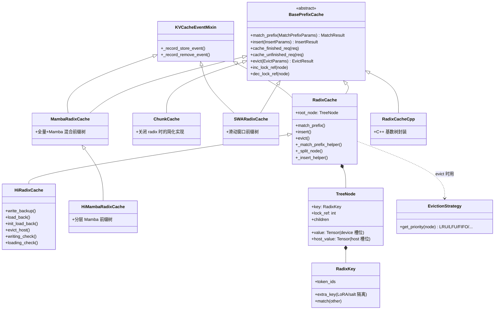
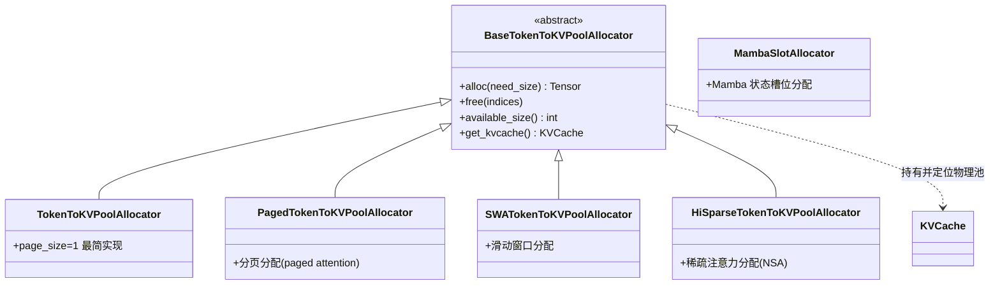
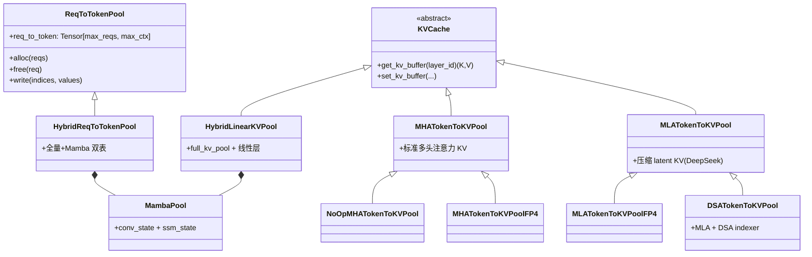
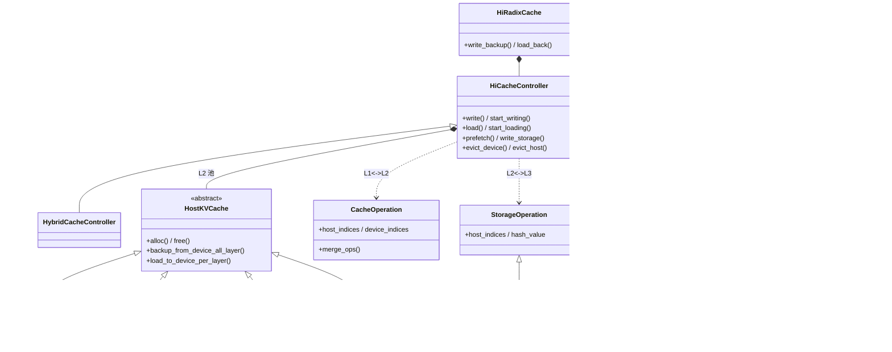
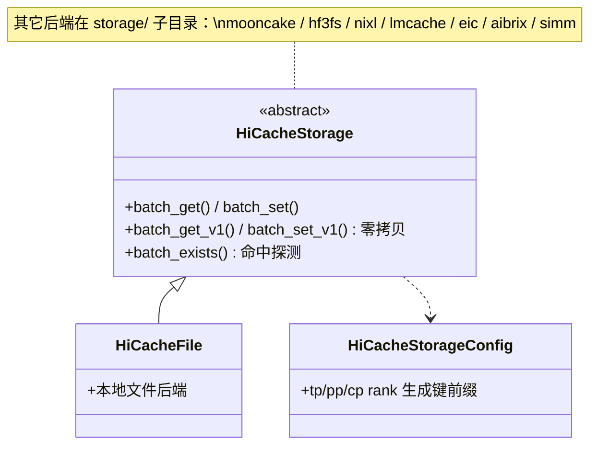
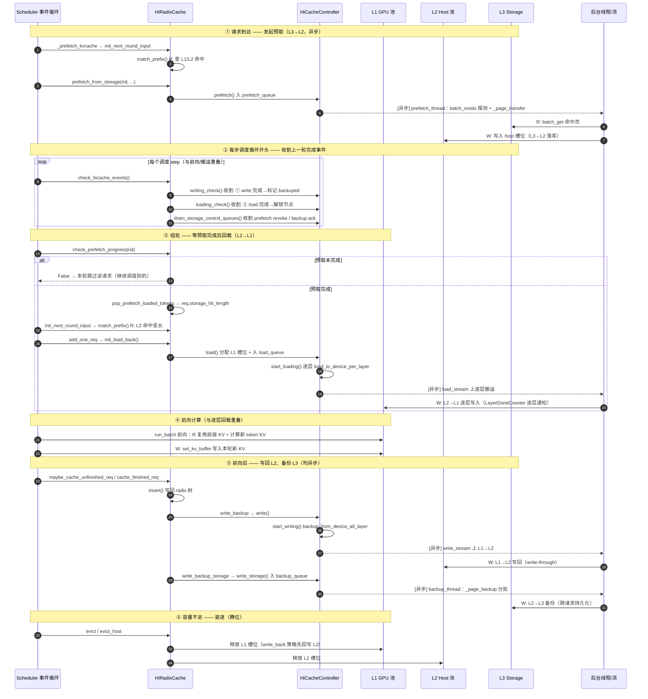

# srt/mem_cache

## 目录用途

KV cache 与内存/前缀缓存管理的核心模块。包含两级内存池（请求到 token、token 到 KV 索引）、各类前缀缓存（RadixCache、ChunkCache、混合/SWA/Mamba 变体）、淘汰策略、分层（HiCache）存储与多模态缓存。为推理调度提供前缀复用、显存分配与分层卸载能力。

## 核心能力总览

> 本节按「该模块要做成哪几件事」做纲领性审计（按能力归类，而非按文件），并标注每项的**重要性**（对正确性/性能/显存的影响）与**复杂性**（实现与维护难度），均分 高 / 中 / 低 三档。具体实现文件见下方「文件清单」与「子目录」。


| #  | 核心能力                                     | 主要承载                                                                                                                                              | 重要性 | 复杂性 | 说明                                                                                                                                                               |
| -- | -------------------------------------------- | ----------------------------------------------------------------------------------------------------------------------------------------------------- | ------ | ------ | ------------------------------------------------------------------------------------------------------------------------------------------------------------------ |
| 1  | **两级内存池（物理 KV 存储）**               | `memory_pool.py`（`ReqToTokenPool`、各类 `KVCache`：MHA/MLA/NSA/Hybrid/DoubleSparse）、`deepseek_v4_memory_pool.py`                                   | 高     | 高     | 真正持有 GPU 上的 KV 张量，是显存占用的主体。`ReqToTokenPool`（请求→token）与 token→KV 索引两级映射是全模块的物理基础，各注意力变体的布局差异大。                |
| 2  | **KV 索引分配/回收**                         | `allocator/`（`base.py`、`token.py`、`paged.py`、`swa.py`、`mamba.py`、`hisparse.py`）、`triton_ops/allocator.py`                                     | 高     | 高     | 在内存池上分配/释放 token 的 KV slot（含 paged 分页），用 Triton 核加速。分配正确性直接关系显存安全与不串数据，是最易出越界/泄漏的地方。                           |
| 3  | **前缀缓存（RadixCache 前缀复用）**          | `radix_cache.py`、`base_prefix_cache.py`、`chunk_cache.py`、`unified_radix_cache.py`、`radix_cache_cpp.py` + `cpp_radix_tree/`                        | 高     | 高     | prefix cache 命中决定能省多少重复 prefill，是吞吐的关键。基数树的 match/insert/evict/lock 语义复杂，且有 Python 与 C++ 两套实现。                                  |
| 4  | **淘汰策略**                                 | `evict_policy.py`                                                                                                                                     | 高     | 中     | LRU/LFU/FIFO/MRU/FILO/Priority 等优先级计算，决定显存紧张时驱逐谁；与前缀树的锁定/引用计数耦合。                                                                   |
| 5  | **分层缓存（HiCache：device/host/storage）** | `hiradix_cache.py`、`hicache_storage.py`、`memory_pool_host.py`、`hybrid_cache/`、`storage/`（各后端）                                                | 高     | 高     | 把 KV 在 GPU→CPU→外部存储间分层卸载与预取，扩展可缓存容量。涉及异步搬运、预取事件、多种外部后端（hf3fs/mooncake/nixl/lmcache/eic/aibrix/simm），复杂度最高之一。 |
| 6  | **混合架构 KV 缓存（SWA / Mamba / 全量）**   | `swa_memory_pool.py`、`swa_radix_cache.py`、`base_swa_memory_pool.py`、`mamba_radix_cache.py`、`hi_mamba_radix_cache.py`、`unified_cache_components/` | 中     | 高     | 针对滑动窗口注意力（SWA）、Mamba 混合层等非标准 KV 结构的专用池与基数树；组件化（`unified_cache_components/`）抽象出 full/swa/mamba/tree 组件。                    |
| 7  | **稀疏注意力 KV 管理（NSA / Quest）**        | `hisparse_memory_pool.py`、`sparsity/`（`core/`、`backend/`、`algorithms/`）                                                                          | 中     | 高     | 稀疏注意力场景下的设备 KV 池与主机分层映射、稀疏算法（DeepSeek DSA、Quest）与协调器；与稀疏选择逻辑强耦合。                                                        |
| 8  | **多模态嵌入缓存**                           | `multimodal_cache.py`                                                                                                                                 | 中     | 低     | 按哈希缓存图像等多模态嵌入（`MultimodalCache`/`MultiModalStaticCache`），避免重复编码。                                                                            |
| 9  | **会话感知缓存**                             | `session_aware_cache.py`                                                                                                                              | 中     | 中     | 面向会话/流式请求的缓存包装与`SessionSlot` 管理，支撑有状态多轮复用。                                                                                              |
| 10 | **构造/注册/事件等基础设施**                 | `cache_init_params.py`、`kv_cache_builder.py`、`registry.py`、`events.py`、`common.py`、`utils.py`、`mmap_allocator.py`                               | 中     | 中     | 集中构造参数、按配置组装 KV 缓存、缓存类型注册、KV 事件、通用 Triton 工具等支撑设施。                                                                              |
| 11 | **缓存清空运维**                             | `flush_cache.py`                                                                                                                                      | 低     | 低     | 命令行向运行中服务发送`/flush_cache` 清空 KV 缓存。                                                                                                                |

**审计结论**：

- **完整性（能力维度）**：上述 1–5 为核心主链（物理存储 → 分配 → 前缀复用 → 淘汰 → 分层），6–7 为架构特化，8–11 为横切/支撑，能力覆盖完整。
- **准确性修正（文件清单与实际代码的偏差）**：当前「文件清单/子目录」表**缺失**多个已存在的文件与目录，建议补充——
  - 顶层文件：`unified_radix_cache.py`、`deepseek_v4_memory_pool.py`、`deepseek_v4_compress_state.py`、`base_swa_memory_pool.py`、`kv_cache_builder.py`、`registry.py`、`events.py`、`mmap_allocator.py`；
  - 子目录：`allocator/`（分配器已从单文件 `allocator.py` 拆为子目录）、`triton_ops/`（Triton 核集中目录）、`unified_cache_components/`（full/swa/mamba/tree 组件化）；
  - `storage/` 下后端实际包含 `hf3fs`、`mooncake_store`、`nixl`、`lmcache`、`eic`、`aibrix_kvcache`、`simm`、`file` 及 `backend_factory.py`，比表中列举更全。
  - ⚠️ 注意：文件清单里的 `allocator.py` 在当前代码中已是 `allocator/` 子目录（基类 `base.py` + `token/paged/swa/mamba/hisparse` 等），描述需相应更新。

## 文件清单


| 文件                        | 说明                                                                                                         |
| --------------------------- | ------------------------------------------------------------------------------------------------------------ |
| allocator.py                | token 到 KV 索引的分配器基类及`TokenToKVPoolAllocator`/`PagedTokenToKVPoolAllocator`，含 Triton 分配核函数。 |
| base_prefix_cache.py        | 前缀缓存抽象基类`BasePrefixCache` 及统一参数/结果 dataclass（match/insert/evict/lock 等）。                  |
| cache_init_params.py        | `CacheInitParams` 数据类，集中传递构造前缀缓存所需的全部参数。                                               |
| chunk_cache.py              | `ChunkCache`：RadixCache 关闭时用于分块预填充的简化缓存实现。                                                |
| common.py                   | 前缀缓存通用工具，含`write_req_to_token_pool_triton` 等 Triton 核与 Mamba 状态常量。                         |
| evict_policy.py             | 淘汰策略`EvictionStrategy`：LRU/LFU/FIFO/MRU/FILO/Priority 等优先级计算。                                    |
| flush_cache.py              | 命令行脚本，向运行中的服务发送`/flush_cache` 请求清空 KV 缓存。                                              |
| hi_mamba_radix_cache.py     | `HiMambaRadixCache`：带分层存储的 Mamba 混合 KV 基数树缓存。                                                 |
| hicache_storage.py          | 分层存储抽象`HiCacheStorage`、配置类与本地文件后端 `HiCacheFile`，含哈希工具。                               |
| hiradix_cache.py            | `HiRadixCache`：在 `RadixCache` 基础上叠加主机内存/外部存储分层卸载与预取。                                  |
| hisparse_memory_pool.py     | `HiSparseNSATokenToKVPool`：稀疏注意力场景下的 NSA 设备 KV 池与主机分层映射。                                |
| mamba_radix_cache.py        | 管理混合（全量+Mamba）KV cache 的基数树，含`TreeNode`、`LRUList`、`MambaRadixCache`。                        |
| memory_pool.py              | 内存池核心：`ReqToTokenPool`、各类 `KVCache`（MHA/MLA/NSA/Hybrid/DoubleSparse 等）物理 KV 存储。             |
| memory_pool_host.py         | 主机端 KV 池`HostKVCache` 及 MHA/MLA/Mamba/NSA 变体，负责设备与主机间分层搬运。                              |
| multimodal_cache.py         | 多模态嵌入缓存`MultimodalCache`/`MultiModalStaticCache`，按哈希缓存图像等嵌入。                              |
| radix_cache.py              | 前缀缓存核心`RadixCache`、`TreeNode`、`RadixKey` 等基数树实现。                                              |
| radix_cache_annotated_zh.py | `radix_cache.py` 的带详细中文注释学习副本，逻辑一致，仅供阅读理解。                                          |
| radix_cache_cpp.py          | `RadixCacheCpp`：基于 C++ 基数树实现的 `BasePrefixCache` 封装。                                              |
| session_aware_cache.py      | `SessionAwareCache`：面向会话/流式请求的缓存包装，管理 `SessionSlot`。                                       |
| swa_memory_pool.py          | 滑动窗口注意力内存池`SWAKVPool` 及分配器 `SWATokenToKVPoolAllocator`。                                       |
| swa_radix_cache.py          | 管理混合（全量+SWA）KV cache 的基数树缓存。                                                                  |
| utils.py                    | 通用工具：MLA KV buffer 读写 Triton 核、自定义内存池初始化、bigram key 转换等。                              |

## 子目录


| 子目录         | 说明                                                                     |
| -------------- | ------------------------------------------------------------------------ |
| cpp_radix_tree | C++ 实现的基数树及其 Python 绑定。                                       |
| hybrid_cache   | 混合缓存的分层缓存控制器。                                               |
| sparsity       | 稀疏注意力（Quest/DeepSeek NSA 等）算法、后端适配与协调器。              |
| storage        | HiCache 分层存储后端（hf3fs、mooncake、nixl、lmcache、eic、aibrix 等）。 |

> 提示：`allocator/`（分配器子目录：`base.py` / `token.py` / `paged.py` / `swa.py` 等）与 `triton_ops/`（含分配核函数 `allocator.py`）也是本目录的重要子目录，详见上方「核心能力总览」的准确性修正。下方学习计划以最新代码为准。

---

## 模块深入学习计划

> 定位：本计划是仓库总学习计划 `docs/sglang_learning_plan_zh.md` 中**阶段 3（KV 缓存与内存管理）**的细化展开。它承接 `managers` 目录学习计划 [子阶段 D 的「衔接」说明](../managers/README_zh.md)——调度侧只「申请/释放」KV，**真正怎么分配、怎么复用前缀、怎么淘汰，全在本目录**。建议在已读懂 Scheduler 组批逻辑（managers 子阶段 C/D）之后开始。
>
> 节奏：约 **1.5–2 周**，每天 1.5–2 小时；分 5 个子阶段（A–E，E 选学）。每个子阶段统一按**阅读 → 动手打点 → 自检 → 产出物**四步推进。所有行号对应当前 `main` 代码，随版本演进可能漂移，以实际 `grep` 为准。

### 先建立总览：三层抽象（一张图串起本目录）

本目录所有文件都可归入**三层**，自底向上（与上方「核心能力总览」的能力 1–3 对应）：

```
┌─────────────────────────────────────────────────────────────┐
│  第 3 层：前缀缓存 / 复用与淘汰（BasePrefixCache 抽象）          │
│    RadixCache（基数树前缀匹配）/ ChunkCache（关闭 radix 时）    │
│    + 变体：SWA / Mamba-Hybrid / HiRadix（分层）               │
│    职责：match_prefix 复用历史 KV、insert 归还、evict 淘汰      │
└───────────────▲─────────────────────────────────────────────┘
                │ 命中前缀 → 复用已有 KV 槽位；未命中 → 申请新槽位
┌───────────────┴─────────────────────────────────────────────┐
│  第 2 层：两级分配（谁占哪个槽位）                               │
│    ReqToTokenPool：req_idx → 该请求各 token 的 KV 槽位下标     │
│      （req_to_token 张量，形状 [max_reqs, max_context_len]）  │
│    TokenToKVPoolAllocator：管理「空闲 KV 槽位下标」的池子       |
│      （alloc 取下标 / free 还下标，page_size=1 或分页）         │
└───────────────▲─────────────────────────────────────────────┘
                │ 槽位下标 → 定位物理显存
┌───────────────┴─────────────────────────────────────────────┐
│  第 1 层：物理 KV 存储（真正的显存张量）                          │
│    KVCache：MHA / MLA / NSA / Hybrid / DoubleSparse 等       │
│      （[num_slots, num_heads, head_dim] 级别的大张量）         │
│    MambaPool：Mamba 的 conv_state + ssm_state 状态池          │
└─────────────────────────────────────────────────────────────┘
```

**一句话理解三者关系**：第 3 层决定「这段 token 要不要复用、复用多少」，第 2 层把「逻辑 token 位置」翻译成「物理槽位下标」，第 1 层是槽位真正对应的显存。Scheduler 持有的三个成员——`tree_cache`（第 3 层）、`req_to_token_pool` + `token_to_kv_pool_allocator`（第 2 层）——正是这三层的入口。

### 模块核心类图（分层，覆盖全部类）

> 下面用 5 张分层类图刻画本模块的核心类及其关系（继承 `<|--`、组合/持有 `*--`、依赖 `..>`）。只保留核心功能与关键方法，省略参数细节。**按上文三层 + HiCache 分层 + 存储后端**组织，逐层看即可。

**① 第 3 层：前缀缓存（`BasePrefixCache` 家族）**



**② 第 2 层：KV 索引分配器（`BaseTokenToKVPoolAllocator` 家族）**



**③ 第 1 层：物理 KV 存储（device / L1，`KVCache` 家族 + 两级映射池）**



**④ HiCache 分层搬运（控制器 + host 池 L2 + 操作/事件类）**



**⑤ 第 L3 层：外部存储后端（`HiCacheStorage` 家族）**



> **读图提示**：①→②→③ 是自顶向下的三层主链（前缀缓存 → 分配器 → 物理池）；④ 是 `HiRadixCache` 在其上叠加的分层搬运（持有 `HiCacheController`，后者连接 L2 `HostKVCache` 与 L3 `HiCacheStorage`）；⑤ 是可插拔的外部存储后端。变体（SWA/Mamba/NSA/FP4）都以「继承基类」的方式接入，不改变主链结构。

---

### 子阶段 A：两级内存池与分配器（第 1–2 天）

**目标**：搞清「逻辑 token 位置 → 物理 KV 槽位」这条映射链，理解 page_size 的含义。


| 阅读                 | 关键类/函数（行号）                                                                                                                                                 |
| -------------------- | ------------------------------------------------------------------------------------------------------------------------------------------------------------------- |
| `memory_pool.py`     | `ReqToTokenPool`(`:209`)、`alloc`(`:243`)/`free`(`:270`)/`write`(`:237`)；`KVCache`(`:849`) 抽象与 `MHATokenToKVPool`(`:945`)（看 `get_kv_buffer`/`set_kv_buffer`） |
| `allocator/base.py`  | `BaseTokenToKVPoolAllocator`(`:27`) 接口（`alloc`/`free`/`available_size`）                                                                                         |
| `allocator/token.py` | `TokenToKVPoolAllocator`(`:28`)（page_size=1，最简单）                                                                                                              |
| `allocator/paged.py` | `PagedTokenToKVPoolAllocator`(`:98`)（分页分配，与 paged attention 对应）                                                                                           |

**核心函数代码（按阅读顺序）**

① `ReqToTokenPool.alloc` —— 第 1 级映射的申请。本质是从 `free_slots` 切走 `need_size` 个空闲行号，写回到每个 `req.req_pool_idx`；已有下标的请求（chunked 续写）复用旧槽位不重复申请：

```243:268:python/sglang/srt/mem_cache/memory_pool.py
    def alloc(self, reqs: list[Req]) -> Optional[List[int]]:
        # Indices of reqs that already have a req_pool_idx and will reuse
        # their existing slot (e.g. chunked prefill continuing across chunks).
        reusing = [i for i, r in enumerate(reqs) if r.req_pool_idx is not None]
        # ... assert reusing 合法性 ...
        need_size = len(reqs) - len(reusing)
        if need_size > len(self.free_slots):
            return None
        select_index = self.free_slots[:need_size]
        self.free_slots = self.free_slots[need_size:]
        offset = 0
        for r in reqs:
            if r.req_pool_idx is None:
                r.req_pool_idx = select_index[offset]
                offset += 1
        return [r.req_pool_idx for r in reqs]
```

② `ReqToTokenPool.write` —— 把「该请求第 i 个 token 落在哪个 KV 槽位」写进二维表 `req_to_token[req_idx, token_pos] = kv_slot`，这就是两级映射的「桥」：

```237:238:python/sglang/srt/mem_cache/memory_pool.py
    def write(self, indices, values):
        self.req_to_token[indices] = values
```

③ `TokenToKVPoolAllocator.alloc` —— 第 2 级映射（page_size=1 最简版）：从 `free_pages` 头部切走 `need_size` 个 KV 槽位下标，不够则返回 `None`（触发上层淘汰）：

```55:64:python/sglang/srt/mem_cache/allocator/token.py
    def alloc(self, need_size: int):
        if self.need_sort and need_size > len(self.free_pages):
            self.merge_and_sort_free()
        if need_size > len(self.free_pages):
            return None
        select_index = self.free_pages[:need_size]
        self.free_pages = self.free_pages[need_size:]
        return select_index
```

④ `TokenToKVPoolAllocator.free` —— 归还 KV 槽位下标（`need_sort` 时先入 `release_pages` 延迟排序），与 `alloc` 成对：

```66:76:python/sglang/srt/mem_cache/allocator/token.py
    def free(self, free_index: torch.Tensor):
        if free_index.numel() == 0:
            return
        if self.is_not_in_free_group:
            if self.need_sort:
                self.release_pages = torch.cat((self.release_pages, free_index))
            else:
                self.free_pages = torch.cat((self.free_pages, free_index))
        else:
            self.free_group.append(free_index)
```

> 阅读顺序串联：`alloc`(①) 拿到 req 行号 → 前向时 `write`(②) 把每个 token 指向 `alloc`(③) 分到的 KV 槽位 → 请求结束 `free`(④) 还回 KV 槽位、`ReqToTokenPool.free` 还回 req 行号。先看 `token.py`（page_size=1）再看 `paged.py`（分页只是把「下标」换成「页 + 页内偏移」）。

- **动手打点**：在 `ReqToTokenPool.alloc`/`free` 与分配器 `alloc`/`free` 打点，发一条请求观察 req 槽位与 KV 槽位下标如何成对申请/归还。
- **自检**：① 为什么要「两级」映射，而不是 req 直接指向显存？（提示：变长序列 + 前缀共享需要 token 粒度的间接层）② `page_size=1` 与分页分配的区别是什么，分页解决了什么碎片化问题？
- **产出物**：一张「req_idx → token 槽位 → 物理显存」的映射示意图（参考下图）。

#### 映射示意图：req_idx → token 槽位 → 物理显存

```
                          ① ReqToTokenPool.alloc                 ③ TokenToKVPoolAllocator.alloc
                          （切走空闲 req 行号）                   （切走空闲 KV 槽位下标）
                                  │                                        │
  请求 A (req_pool_idx=0)         ▼                                        ▼
  ┌───────────────────────────────────────────────┐        ┌──────────────────────────────────┐
  │   第 2 级表：req_to_token                       │        │  free_pages（空闲 KV 槽位下标池） │
  │   形状 [max_reqs, max_context_len]，dtype=int32 │        │  [ 102, 103, 104, ... 已被切走 ]  │
  │                                                 │        └──────────────────────────────────┘
  │            token_pos →   0    1    2    3       │
  │          ┌───────────┬────┬────┬────┬────┐      │  ② write: req_to_token[0, 0:4] = [100,101,102,103]
  │  req_idx │  0  (A)   │100 │101 │102 │103 │──────┼──────────────┐
  │     ↓    ├───────────┼────┼────┼────┼────┤      │              │ 槽位下标 = 物理显存的「行号」
  │          │  1  (B)   │100 │101 │ 50 │ 51 │      │              │ （A、B 前缀共享 → 共用 100/101）
  │          ├───────────┼────┼────┼────┼────┤      │              ▼
  │          │  2  (空闲) │ .. │ .. │ .. │ .. │      │   ┌────────────────────────────────────────┐
  │          └───────────┴────┴────┴────┴────┘      │   │  第 1 级：KVCache 物理显存大张量          │
  └─────────────────────────────────────────────────┘   │  形状 [num_slots, num_heads, head_dim]   │
                                                          │  slot 100 → [■■■ K/V 向量 ■■■]           │
   说明：                                                 │  slot 101 → [■■■ K/V 向量 ■■■]           │
   • req_idx 由 ReqToTokenPool 管理（哪条请求占哪一行）   │  slot 102 → [■■■ K/V 向量 ■■■]           │
   • token 槽位下标由 TokenToKVPoolAllocator 管理         │  slot 103 → [■■■ K/V 向量 ■■■]           │
     （哪个逻辑 token 落在哪个物理 slot）                 │  ... 通过 set_kv_buffer / get_kv_buffer  │
   • 前缀复用：A、B 共享前缀 → req_to_token 里指向同一 slot│  ...   读写第 axis-0 维的对应行           │
                                                          └────────────────────────────────────────┘
```

> 读图顺序对应上面的核心函数：① `ReqToTokenPool.alloc` 拿到 `req_idx`（表的「行」）→ ③ `TokenToKVPoolAllocator.alloc` 拿到「KV 槽位下标」→ ② `write` 把下标填进 `req_to_token[req_idx, token_pos]`（建立两级映射的桥）→ KVCache 用该下标作为物理大张量的第 0 维行号读写真正的 K/V。**两级**的价值正在于：变长序列与前缀共享（如图中 A、B 共用 slot 100/101）都在「token 槽位」这一间接层完成，物理显存按 slot 复用而无需为每条请求单独拷贝。

---

### 子阶段 B：RadixCache 前缀缓存核心（第 3–5 天）★ 本目录核心

**目标**：吃透基数树如何做前缀匹配复用，这是 SGLang「自动前缀缓存」的根。


| 阅读                          | 关键类/函数（行号）                                                                                                                                                                  |
| ----------------------------- | ------------------------------------------------------------------------------------------------------------------------------------------------------------------------------------ |
| `base_prefix_cache.py`        | `BasePrefixCache`(`:210`) 抽象接口、`MatchResult`(`:154`)、各 params/result dataclass（统一契约）                                                                                    |
| `radix_cache.py`              | `RadixKey`(`:56`)、`match`(`:158`)；`TreeNode`(`:222`)；`RadixCache`(`:285`)、`match_prefix`(`:358`)、`insert`(`:418`)、`cache_unfinished_req`(`:485`)、`cache_finished_req`(`:438`) |
| `radix_cache.py`              | 内部：`_match_prefix_helper`(`:643`)、`_split_node`(`:669`)、`_insert_helper`(`:699`)                                                                                                |
| `radix_cache_annotated_zh.py` | `radix_cache.py` 的逐行中文注释学习副本，对照阅读                                                                                                                                    |

**核心函数代码（按阅读顺序）**

① `match_prefix` —— 入口：把请求 token 序列对齐 page 后调 `_match_prefix_helper` 沿树下行，返回命中的 KV 索引张量与终止节点。`extra_key`（LoRA / 采样 salt 等）参与命名空间隔离，是「不串数据」的关键：

```395:416:python/sglang/srt/mem_cache/radix_cache.py
        key = params.key
        key, _ = key.maybe_to_bigram_view(self.is_eagle)
        if self.disable or len(key) == 0:
            return self._empty_match_result
        key = key.page_aligned(self.page_size)
        if len(key) == 0:
            return self._empty_match_result
        value, last_node = self._match_prefix_helper(self.root_node, key)
        if value:
            value = torch.cat(value)
        else:
            value = self._empty_match_result.device_indices
        return MatchResult(
            device_indices=value,
            last_device_node=last_node,
            last_host_node=last_node,
            best_match_node=last_node,
        )
```

② `insert` —— 把一段 (key, value=KV索引) 写入树，内部交给 `_insert_helper`（在公共前缀处复用、在分叉处 `_split_node`），返回已存在的前缀长度 `prefix_len`：

```418:436:python/sglang/srt/mem_cache/radix_cache.py
    def insert(self, params: InsertParams) -> InsertResult:
        if self.disable:
            return InsertResult(prefix_len=0)
        key = params.key
        value = params.value
        # ... bigram / page 对齐, value 截断到 len(key) ...
        prefix_len = self._insert_helper(self.root_node, key, value, priority, chunked)
        return InsertResult(prefix_len=prefix_len)
```

③ `cache_finished_req` —— 请求完成时的写回：取该请求已提交的 KV 索引 → `insert` 回树 → 把「树里已存在的重复前缀」对应的 KV 槽位 `free` 掉（树已持有一份引用，避免重复占用）：

```438:476:python/sglang/srt/mem_cache/radix_cache.py
    def cache_finished_req(self, req: Req, is_insert: bool = True):
        """Cache request when it finishes."""
        # ...
        kv_committed_len = req.pop_committed_kv_cache()
        token_ids = (req.origin_input_ids + req.output_ids)[:kv_committed_len]
        kv_indices = self.req_to_token_pool.req_to_token[
            req.req_pool_idx, : len(token_ids)
        ]
        radix_key = RadixKey(...).page_aligned(self.page_size)
        values = kv_indices[: len(radix_key)].to(dtype=torch.int64, copy=True)
        if is_insert:
            result = self.insert(InsertParams(key=radix_key, value=values, ...))
            # Free the duplicates that were already in the tree
            self.token_to_kv_pool_allocator.free(
                kv_indices[req.cache_protected_len : result.prefix_len]
            )
        else:
            self.token_to_kv_pool_allocator.free(
                kv_indices[req.cache_protected_len : key_len]
            )
```

> 阅读顺序串联：先看 `match_prefix`(①) 理解「查命中」，再看 `insert`(②) 理解「写回 + 节点分裂」，最后 `cache_finished_req`(③)/`cache_unfinished_req` 把前两者串进请求生命周期。读完主流程再下钻内部 helper：`_match_prefix_helper`(`:643`) → `_split_node`(`:669`) → `_insert_helper`(`:699`)。

- **动手打点**：发送两条**共享前缀**的请求，在 `match_prefix`(`:358`) 打印命中长度、在 `_split_node`(`:669`) 观察节点何时分裂；对比 `cache_unfinished_req`（运行中续写）与 `cache_finished_req`（完成归还）两条写回路径。
- **自检**：① 基数树为什么用「节点分裂」而非简单哈希表来存前缀？② `cache_unfinished_req` 与 `cache_finished_req` 分别在请求生命周期的哪个时刻被调用，写回的内容有何不同？
- **产出物**：一棵小规模 RadixTree 的演化图（插入 2–3 条共享前缀请求后的树形）。
- **衔接**：调度侧如何调用 `match_prefix` 改变排队顺序，见 managers 子阶段 D 的 `_compute_prefix_matches`。

---

### 子阶段 C：淘汰策略与引用计数（第 6–7 天）

**目标**：理解显存满时「淘汰谁」，以及运行中的 KV 如何被「保护」不被误淘汰。


| 阅读              | 关键类/函数（行号）                                                                                                                         |
| ----------------- | ------------------------------------------------------------------------------------------------------------------------------------------- |
| `radix_cache.py`  | `evict`(`:558`)、`inc_lock_ref`(`:587`)、`dec_lock_ref`(`:602`)、`evictable_size`(`:623`)、`protected_size`(`:626`)、`_delete_leaf`(`:771`) |
| `evict_policy.py` | `EvictionStrategy`：LRU/LFU/FIFO/MRU/FILO/Priority 的优先级计算                                                                             |

**核心函数代码（按阅读顺序）**

① `evict` —— 显存紧张时按淘汰策略优先级建小顶堆，从「可淘汰叶子」中弹出最该淘汰的节点：`free` 其 KV → `_delete_leaf` 删节点 → 若父节点变叶且未被锁定则继续入堆。注意只动 `evictable_leaves`，被锁路径不参与：

```558:585:python/sglang/srt/mem_cache/radix_cache.py
    def evict(self, params: EvictParams) -> EvictResult:
        if self.disable:
            return EvictResult()
        start_time = time.perf_counter()
        num_tokens = params.num_tokens
        leaves = list(self.evictable_leaves)
        eviction_heap = [
            (self.eviction_strategy.get_priority(node), node) for node in leaves
        ]
        heapq.heapify(eviction_heap)
        num_evicted = 0
        while num_evicted < num_tokens and len(eviction_heap):
            _priority, x = heapq.heappop(eviction_heap)
            self.token_to_kv_pool_allocator.free(x.value)
            num_evicted += len(x.value)
            self._delete_leaf(x)
            if len(x.parent.children) == 0 and x.parent.lock_ref == 0:
                new_priority = self.eviction_strategy.get_priority(x.parent)
                heapq.heappush(eviction_heap, (new_priority, x.parent))
            self._record_remove_event(x)
        self.update_eviction_metrics(num_evicted, start_time)
        return EvictResult(num_tokens_evicted=num_evicted)
```

② `inc_lock_ref` —— 请求命中前缀后，从命中节点一路向 root 把整条路径 `lock_ref += 1`，并把这段大小从 `evictable_size_` 移入 `protected_size_`，从而「保护」运行中 KV 不被 `evict` 误删：

```587:600:python/sglang/srt/mem_cache/radix_cache.py
    def inc_lock_ref(self, node: TreeNode) -> IncLockRefResult:
        if self.disable:
            return IncLockRefResult(delta=0)
        delta = 0
        while node != self.root_node:
            if node.lock_ref == 0:
                self.evictable_size_ -= len(node.key)
                self.protected_size_ += len(node.key)
                delta -= len(node.key)
            node.lock_ref += 1
            self._update_leaf_status(node)
            node = node.parent
        return IncLockRefResult(delta=delta)
```

③ `dec_lock_ref` —— 与 ② 对称：请求结束后沿路径 `lock_ref -= 1`，最后一个引用释放时把大小从 `protected_size_` 移回 `evictable_size_`，重新变得可淘汰：

```602:621:python/sglang/srt/mem_cache/radix_cache.py
    def dec_lock_ref(
        self, node: TreeNode, params: Optional[DecLockRefParams] = None
    ) -> DecLockRefResult:
        if self.disable:
            return DecLockRefResult(delta=0)
        delta = 0
        while node != self.root_node:
            if node.lock_ref == 1:
                self.evictable_size_ += len(node.key)
                self.protected_size_ -= len(node.key)
                delta += len(node.key)
            node.lock_ref -= 1
            self._update_leaf_status(node)
            # ... root 校验 ...
            node = node.parent
        return DecLockRefResult(delta=delta)
```

> 阅读顺序串联：先看 `inc_lock_ref`(②)/`dec_lock_ref`(③) 这对「锁/解锁」理解 `evictable_size_` 与 `protected_size_` 的此消彼长，再看 `evict`(①) 就能明白为什么它只敢动 `evictable_leaves`。优先级如何算，最后看 `evict_policy.py` 的 `get_priority`。

- **动手打点**：把 KV 池调小、灌入超过容量的请求，在 `evict`(`:558`) 打印每次淘汰的节点与释放的 token 数；在 `inc_lock_ref`/`dec_lock_ref` 观察运行中请求如何锁住其前缀路径。
- **自检**：① `evictable_size` 与 `protected_size` 的区别是什么？为什么正在运行的请求路径不能被淘汰？② LRU 在基数树上是如何实现的（叶子节点的时间戳 / `_update_leaf_status`(`:781`)）？
- **产出物**：「引用计数 + 淘汰」要点笔记，说明锁引用如何与 PrefillAdder 的 token 预算配合避免淘汰命脉 KV。

---

### 子阶段 D：HiCache 分层存储（第 8–9 天）

**目标**：理解 device→host→storage 的多级卸载，以及预取/回写如何与调度异步重叠。


| 阅读                  | 关键类/函数（行号）                                                                                                                                                                         |
| --------------------- | ------------------------------------------------------------------------------------------------------------------------------------------------------------------------------------------- |
| `hiradix_cache.py`    | `HiRadixCache`(`:72`)（继承 `RadixCache`）、`write_backup`(`:759`)、`load_back`(`:1141`)、`init_load_back`(`:1213`)、`evict_host`(`:1106`)、`writing_check`(`:907`)/`loading_check`(`:942`) |
| `memory_pool_host.py` | `HostKVCache` 及 MHA/MLA/Mamba/NSA 变体（设备↔主机搬运）                                                                                                                                   |
| `hicache_storage.py`  | `HiCacheStorage` 抽象、`HiCacheFile` 本地后端、哈希工具                                                                                                                                     |
| `storage/` 子目录     | 了解各外部后端入口即可（hf3fs / mooncake / nixl / lmcache 等）                                                                                                                              |

**核心函数代码（按阅读顺序）**

① `write_backup` —— 设备 → 主机的「写回/卸载」：通过 `cache_controller.write` 把节点 KV 异步搬到 host，host 满则先 `evict_host` 腾空再重试；成功后记录 `host_value` 并 `inc_lock_ref` 保护到写完。注意「连续前缀」不变式（父未备份则跳过）：

```759:789:python/sglang/srt/mem_cache/hiradix_cache.py
    def write_backup(self, node: TreeNode, write_back=False) -> int:
        # Backup invariant: backed-up nodes must form a contiguous prefix.
        if not write_back and (
            node.parent != self.root_node and not node.parent.backuped
        ):
            return 0
        host_indices = self.cache_controller.write(
            device_indices=node.value, node_id=node.id, **self._get_extra_pools(),
        )
        if host_indices is None:
            self.evict_host(len(node.value))
            host_indices = self.cache_controller.write(
                device_indices=node.value, node_id=node.id, **self._get_extra_pools(),
            )
        if host_indices is not None:
            node.host_value = host_indices.clone()
            self._track_write_through_node(node, len(node.key))
            if not write_back:
                self.inc_lock_ref(node)
        else:
            return 0
        return len(host_indices)
```

② `load_back` —— 主机 → 设备的「拉回」：收集被淘汰链上待加载节点，`inc_lock_ref` 保护祖先；`cache_controller.load` 拉回 KV，GPU 不够则先 `evict` 再重试；最后把 device 索引回填到各节点 `value`：

```1141:1182:python/sglang/srt/mem_cache/hiradix_cache.py
    def load_back(
        self, node: TreeNode, mem_quota: Optional[int] = None
    ) -> Optional[torch.Tensor]:
        last_hit_node = node
        nodes_to_load = []
        while node.evicted:
            assert node.backuped, "No backup available on evicted nodes"
            nodes_to_load.insert(0, node)
            node = node.parent
        else:
            ancester_node = node
        result = self.inc_lock_ref(ancester_node)  # protect ancestors
        host_indices = torch.cat([n.host_value for n in nodes_to_load])
        # ... 太小 / 超配额则跳过 ...
        device_indices = self.cache_controller.load(
            host_indices=host_indices, node_id=last_hit_node.id, **self._get_extra_pools(),
        )
        if device_indices is None:
            self.evict(EvictParams(num_tokens=len(host_indices)))  # 腾 GPU 再试
            device_indices = self.cache_controller.load(...)
        self.dec_lock_ref(ancester_node)
        # ... 回填 node.value / 记录事件 ...
```

③ `init_load_back` —— 调度侧入口：命中节点若已被淘汰到 host，则调用 `load_back` 把它拉回 GPU，并返回可直接复用的 device 索引。这是「命中 host 缓存」与前向之间的桥：

```1213:1230:python/sglang/srt/mem_cache/hiradix_cache.py
    def init_load_back(
        self,
        params: InitLoadBackParams,
    ):
        last_node = params.best_match_node
        mem_quota = params.mem_quota
        if last_node.evicted:
            loading_values = self.load_back(last_node, mem_quota)
            if loading_values is not None:
                return loading_values, last_node
            while last_node.evicted:
                last_node = last_node.parent
        return (...)
```

> 阅读顺序串联：`init_load_back`(③) 是上层入口（命中 host → 决定是否拉回），它调用 `load_back`(②)；写方向独立看 `write_backup`(①)。两条方向都靠 `inc_lock_ref`/`dec_lock_ref` 在搬运期间锁住节点，与子阶段 C 的引用计数一脉相承。容量不足时双向都会触发淘汰（`evict_host` / `evict`）。

- **动手打点**：开启 HiCache（`--enable-hierarchical-cache`），灌入超过显存的前缀，在 `write_backup`/`load_back` 打点，观察 KV 被卸载到 host 再被命中拉回的过程。
- **自检**：① 三级（device/host/storage）各自的容量与带宽特征，决定了什么数据放哪一级？② 写回（write_through/write_back）与预取（prefetch/load_back）为什么必须异步，它们如何与调度事件循环配合（呼应 managers 的 `hicache_consumer_index`）？
- **产出物**：device/host/storage 三级搬运的数据流图，标注同步点与异步事件（见下图）。

#### 数据流图：device / host / storage 三级搬运

下图串起三级之间的双向搬运，并标注**同步点**（🔒，主调度线程与搬运线程/流之间必须等待或加锁的地方）与**异步事件**（⚡，跨 CUDA stream 或跨线程的非阻塞事件/队列）。所有行号对应当前 `cache_controller.py` / `hiradix_cache.py`。

```
                        主调度线程（Scheduler event loop）
                                    │
        ┌───────────────────────────┼────────────────────────────┐
        │ 写方向（backup / 卸载）     │  读方向（prefetch / 拉回）    │
        ▼                           │                             ▼
┌───────────────────┐               │                 ┌───────────────────────┐
│ write_backup       │               │                 │ init_load_back        │
│ (hiradix:759)      │               │                 │ (hiradix:1213)        │
│  🔒 inc_lock_ref   │               │                 │  🔒 inc_lock_ref 保护 │
│     锁住节点直到写完│               │                 │     祖先链直到拉回完成 │
└─────────┬─────────┘               │                 └───────────┬───────────┘
          │ controller.write 入 write_queue             load_back(hiradix:1141)
          │ （非阻塞，仅登记）                            │ controller.load 入 load_queue
          ▼                                              ▼
┌──────────────────────────────┐            ┌──────────────────────────────┐
│ start_writing (cc:895)       │            │ start_loading (cc:984)       │
│  merge_ops 合并整批           │            │  ⚡ update_producer 取逐层事件│
│  ⚡ write_stream（专用流）    │            │  ⚡ load_stream（专用流）     │
│  start_event.record()(cc:910)│            │  start_event.record()(cc:998)│
│  🔒 start_event.wait(stream) │            │  🔒 start_event.wait(stream) │
│      让写流等起点对齐         │            │      让载流等起点对齐         │
└─────────┬────────────────────┘            └───────────┬──────────────────┘
          │ D2H：backup_from_device_all_layer            │ H2D：load_to_device_per_layer
          │ （kernel/JIT，见 transfer.cu）               │ （逐层，边搬边可用）
          ▼                                              ▼
   ┌────────────┐   D2H 搬运    ┌────────────┐  H2D 搬运   ┌────────────┐
   │  DEVICE    │ ────────────▶ │   HOST     │ ──────────▶ │  DEVICE    │
   │ (GPU KV池) │               │ (CPU KV池) │  ◀───┐      │ (GPU KV池) │
   └────────────┘               └─────┬──────┘      │      └────────────┘
                                      │ prefetch    │ 逐层完成即通知：
                                      │ (host←L3)   │ ⚡ producer_event.complete(i)
                                      ▼             │    (cc:1018) → LayerDoneCounter
                          ┌───────────────────────┐ │    消费方按层 index 边到边算
                          │ backup_thread /        │ │
                          │ prefetch_thread(后台)  │ │
                          │  ⚡ prefetch_queue      │ │
                          │  ⚡ backup_queue        │ │
                          │  🔒 storage_hit_query   │ │
                          │     跨 rank all_reduce  │ │
                          │     取 MIN 对齐命中页数 │ │
                          └───────────┬───────────┘ │
                                      │ host↔storage │
                                      ▼             │
                                ┌────────────┐      │
                                │  STORAGE   │──────┘
                                │ (L3 外部)  │
                                │ file/mooncake/nixl/...
                                └────────────┘

  完成回收（两个方向对称）：
    ⚡ finish_event.record()          写/载流上登记完成事件（cc:923 / 1031）
    ⚡ ack_write_queue / ack_load_queue  回执入队，主线程轮询
    🔒 writing_check (hiradix:907)    query() 事件完成 → dec_lock_ref 解锁节点
    🔒 loading_check (hiradix:942)    同上，载入完成后解锁并回填 node.value
```

**关键点速记**：

- **🔒 同步点**：① `inc_lock_ref` / `dec_lock_ref`：搬运期间锁住节点，防止被 `evict` 误删（与子阶段 C 一脉相承）；② `start_event.wait(stream)`：让专用搬运流与控制器流对齐起点；③ `writing_check` / `loading_check`：主线程用 `event.query()`（非阻塞查询）确认完成后才解锁，是「异步搬运」与「同步调度」的交界；④ storage 命中查询后跨 rank `all_reduce` 取 MIN，保证各 rank 预取页数一致。
- **⚡ 异步事件**：① 写/载各有**专用 CUDA stream**（`write_stream` / `load_stream`），与主计算流并发以隐藏拷贝延迟；② `start_event` / `finish_event` 标记一批搬运的起止，配合 `ack_*_queue` 让主线程「发起后不等待、稍后再收割」；③ `LayerDoneCounter` + `producer_event.complete(i)`：H2D **逐层**完成即通知消费方，使「回载」与「计算」按层流水线重叠；④ `prefetch_thread` / `backup_thread` 两个后台线程经 `prefetch_queue` / `backup_queue` 与主线程解耦，独立推进 host↔storage IO。
- **三级容量/带宽**：DEVICE（小、最快、直接算）→ HOST（大、较慢、L2 缓冲）→ STORAGE（最大、最慢、跨机持久化）。数据「热」则上移、「冷」则下沉，异步搬运把慢速 IO 藏在计算之后。

#### 放大：host ↔ storage（L2 ↔ L3）子流程

上图把 L2↔L3 折叠成一个「后台线程」框。这里展开它的两条方向。**与 L1↔L2 的本质区别**：L1↔L2 是 **GPU kernel** 在 CUDA stream 上做离散 gather/scatter；而 L2↔L3 是 **CPU 后台线程**调用存储后端 IO（文件 / mooncake / nixl / eic / …），**不涉及 GPU**，按页哈希键（key）读写。

```
                    主调度线程（Scheduler / HiRadixCache）
        ┌─────────────────────────────┴──────────────────────────────┐
        │ 备份方向（backup: L2 → L3）        预取方向（prefetch: L3 → L2）│
        ▼                                                              ▼
┌──────────────────────────┐                      ┌──────────────────────────────┐
│ write_backup_storage      │                      │ query_storage_hit_length      │
│ (hiradix:923)             │                      │ (hiradix:1359)                │
│  · 若节点被分裂→沿链拼接   │                      │  · 构造「只查询」探测 operation│
│    还原入队时刻数据        │                      │  🔒 _all_reduce_attn_groups   │
│  · prefix_keys 锚定链顶    │                      │     跨 rank 取 MIN 命中长度    │
│  · node.protect_host()🔒  │                      │  · 命中<阈值 → 不预取          │
└────────────┬─────────────┘                      └───────────────┬──────────────┘
             │ controller.write_storage(hiradix→cc:1343)          │ prefetch_from_storage(hiradix:1620)
             │  ⚡ 入 backup_queue（非阻塞）                        │  · protect_host()🔒 + host 池 alloc
             ▼                                                    │  · host 满→evict_host→尽力而为缩短
┌──────────────────────────┐                      │  ⚡ 入 prefetch_queue（非阻塞）
│ backup_thread_func(cc:1483)│                     ▼
│  后台 CPU 线程             │      ┌──────────────────────────────────────┐
│  循环取 backup_queue       │      │ prefetch_thread_func (cc:1290)         │
│  🔒 backup_skip:           │      │  后台 CPU 线程，循环取 prefetch_queue  │
│     MLA 仅 rank0 实写      │      │  ① _storage_hit_query (cc:1257)        │
└────────────┬─────────────┘      │     逐页链式哈希 + batch_exists 探测   │
             │ _page_backup(cc:1455)│    （命中必须连续，断则止）            │
             ▼                     │  🔒 all_reduce 取 MIN 对齐命中页数     │
┌──────────────────────────┐      │  ② 命中<阈值 → revoke + 归还 host 内存 │
│ _page_backup 分批写出      │      │  ③ 命中≥阈值 → 裁剪到命中范围          │
│  每批 STORAGE_BATCH_SIZE   │      │     ⚡ 投入 prefetch_buffer            │
│  page_set_func:            │      └───────────────┬──────────────────────┘
│   · zero_copy: 后端直接从   │                     │ prefetch_io_aux_func（IO 辅助线程）
│     host 槽位读(batch_set_v1)│                    ▼
│   · generic: 取页再batch_set│      ┌──────────────────────────────────────┐
│  · draft 页尽力随写         │      │ _page_transfer (cc:1190)               │
│  · completed_tokens 累加    │      │  分批 L3→L2：batch_get 到 host 槽位    │
└────────────┬─────────────┘      │  · draft 页尽力随读                     │
             │                    │  · increment(完成 token，可提前终止)   │
             ▼ host↔storage IO    └───────────────┬──────────────────────┘
        ┌────────────┐   写 (set)                 │ 读 (get)
        │  STORAGE   │ ◀──────────────────────────┘
        │ (L3 外部)  │ ──────────────────────────▶  写回 HOST(L2) 命中页
        │ file/mooncake/nixl/eic/simm/...          （按 host_indices 落位）
        └────────────┘

  完成回收：
    备份：⚡ ack_backup_queue(cc:1498) → 主线程收割 → node.release_host()🔒 解除保护
    预取：⚡ check_prefetch_progress → _insert_helper_host 把「仅 L2 存在」的前缀登记进树
          （新建 value=None、host_value=命中数据 的节点，发 store(CPU) 事件）
```

**L2↔L3 关键点**：

- **谁在搬**：`backup_thread` / `prefetch_thread` 两个**守护 CPU 线程**（`_start_storage_threads` 启动），另有 `prefetch_io_aux_thread` 专做预取 IO，与主调度线程用 `backup_queue` / `prefetch_queue` / `prefetch_buffer` 解耦。**全程不碰 GPU**。
- **按 key 而非 index**：L3 用**逐页链式哈希 key**（`_storage_hit_query`，每页哈希依赖上一页）作为存储键；命中必须是**连续前缀**，一旦某批未全命中即停止。
- **🔒 同步点**：① `protect_host()` / `release_host()`：备份/预取期间保护 host 节点不被 `evict_host` 回收；② 命中长度跨 rank `all_reduce` 取 MIN（备份查询与预取查询各一次），保证各 rank 一致；③ MLA 模型 `backup_skip` 只让 rank0 实际写出（KV 按 rank 复制，避免重复写）。
- **⚡ 异步事件**：`backup_queue` / `prefetch_queue`（主线程→后台线程，非阻塞入队）、`prefetch_buffer`（预取主线程→IO 辅助线程）、`ack_backup_queue`（后台→主线程回执）。
- **零拷贝 vs 通用**：`page_set_func` / `page_get_func` 在 attach 后端时按能力选择——零拷贝版（`batch_set_v1` / `batch_get` 直接读写 host 池槽位）或通用版（先 `get_data_page` 取出再 `batch_set`）。
- **尽力而为**：预取 host 内存不足时会 `evict_host` 后按可用空间**缩短预取长度**；命中不足阈值则 `revoke` 并归还预分配内存；draft（投机解码）KV 页随目标页尽力而为地一起读写，失败静默跳过、不影响主流程。
- **落树**：预取到 host 的数据经 `_insert_helper_host`（`hiradix:1692`）登记为**「仅 L2 存在」的节点**（`value=None`、`host_value` 有数据），并发 `store(CPU)` 事件；之后若被命中，再经前述 L1↔L2 的 H2D 回载路径拉回 device。

#### L2 ↔ L3 触发条件（backup 与 prefetch 分别在什么时候发生）

上面讲了「怎么搬」，这里补齐「什么时候搬」——两个方向各由不同的时机触发。

**备份方向（backup：L2 → L3，把 host 上的前缀写到外部存储）**

| 触发点 | 时机 | 关键约束 |
| ------ | ---- | -------- |
| 节点在 host 完成写回后 | L1→L2 的 `write_backup` 让节点获得 `host_value`（host 上有了备份），HiRadixCache 进一步把它排队写往 L3 | 只有 host 上已存在的页才可能被写到 L3（backup 是「host→storage」，前置是 D2H 已完成） |
| 连续前缀不变式 | 只有当**父节点也已备份**时，本节点才允许写出 | 保证 L3 上的前缀链从链顶到当前页连续（`prefix_keys` 锚定链顶） |
| `write_storage` 入队 | 满足条件的节点 KV 经 `controller.write_storage` 非阻塞入 `backup_queue`，由 `backup_thread` 后台实际写盘 | `node.protect_host()` 锁住 host 节点直到写完，防止被 `evict_host` 中途回收 |

触发的**本质动机**：把「host 上有、但可能很快被 host 淘汰」的前缀持久化到 L3，从而在 host 淘汰后仍可跨请求复用（扩大有效缓存容量、防丢）。

跳过 backup 的情况：① 父节点未备份（破坏连续前缀）→ 直接返回 0；② MLA 模型的 `backup_skip`——KV 在各 rank 完全相同，只让 rank0 实际写出，其余 rank 跳过重复写。

**预取方向（prefetch：L3 → L2，把外部存储的前缀拉回 host）**

| 触发点 | 时机 | 关键约束 |
| ------ | ---- | -------- |
| 新请求前缀匹配后 | radix 树在 device/host 都没能把前缀匹配到底，但 `query_storage_hit_length`（`hiradix:1359`）发现 L3 上还有更长的连续前缀 | 命中必须是**从头连续前缀**，用逐页链式哈希 key 探测（`_storage_hit_query`），断则止 |
| 命中长度达阈值 | 只有 L3 命中长度 ≥ 阈值才真正发起预取；跨 rank `all_reduce` 取 **MIN** 对齐命中页数后再决策 | 命中 < 阈值 → 不预取（`revoke` 并归还预分配的 host 内存），避免小碎片搬运不划算 |
| `prefetch_from_storage` 入队 | 达标后 `protect_host()` + host 池 `alloc`，经 `prefetch_queue` 交给 `prefetch_thread` 后台拉取 | host 内存不足时先 `evict_host`，再按可用空间**缩短**预取长度（尽力而为） |

触发的**本质动机**：新请求命中了历史请求留在 L3 的前缀，但 host（L2）上已经没有了 → 从 L3 拉回 host，供后续 H2D 回载到 device 复用，避免重新 prefill 重算。

**一句话对照**：
- **backup（L2→L3）** 由「host 上出现了新的、满足连续前缀的备份节点」触发 → 目的是**防丢/扩容**；
- **prefetch（L3→L2）** 由「新请求的前缀在 L3 命中、但 host 上缺失」触发 → 目的是**跨请求复用/避免重算**。
- 两者都：按页链式哈希 key 组织、要求前缀连续、用 `protect_host` 保护搬运期间的 host 节点、跨 rank 取 MIN 对齐。

#### 时序图：一条请求在 HiCache 下的方法调用与多级缓存读写时机

> 从**单条请求被调度**的视角，串起它触发的全部缓存方法调用，标注**三级缓存的读（R）/写（W）时机**与**哪些步骤和调度/前向重叠**。行号对应 `scheduler.py` / `schedule_policy.py` / `hiradix_cache.py` / `cache_controller.py`。图中 `[异步]` 表示发起后不阻塞、由后台线程/专用 stream 推进，主调度循环继续跑别的请求。



**读写时机与重叠速记**：

| 阶段 | 缓存动作 | 方向 | 同步性 | 与什么重叠 |
| --- | --- | --- | --- | --- |
| ① 请求到达 | `match_prefix` 查命中 + `prefetch` | 读 L1/L2；L3→L2 写 | 预取**异步**（后台线程） | 与其它请求的调度/前向重叠 |
| ② 每步开头 | `check_hicache_events` 收割 | —— | 非阻塞 `event.query()` | 是「异步搬运」与「同步调度」的交界 |
| ③ 组批 | `check_prefetch_progress` + `init_load_back`→`load` | L2→L1 写 | 回载**异步**（`load_stream` 逐层） | H2D 逐层与**前向逐层计算**流水线重叠 |
| ④ 前向 | `get/set_kv_buffer` | 读复用 + 写新 KV | 同步（主计算流） | 与 ③ 的逐层回载、④ 的搬运重叠 |
| ⑤ 前向后 | `write_backup`→`write`（L1→L2）+ `write_storage`（L2→L3） | 写 L2、写 L3 | 均**异步**（`write_stream` / `backup_thread`） | 与下一步的前向/调度重叠 |
| ⑥ 容量不足 | `evict` / `evict_host` | 释放 L1/L2 | 同步 | 组批前按需触发 |

**三个关键「异步重叠」点**（HiCache 隐藏延迟的核心）：

1. **预取 vs 调度**（①→③）：请求刚到就异步发起 L3→L2 预取，主循环继续调度别的请求；等真正要组批时才用 `check_prefetch_progress` 检查是否就绪，就绪前该请求被跳过——**存储 IO 延迟被其它请求的处理时间掩盖**。
2. **回载 vs 前向**（③↔④）：`load` 在 `load_stream` 上**逐层**搬运，`LayerDoneCounter` 每层完成即通知，前向按层 `wait_until` 边到边算——**H2D 拷贝与计算流水线重叠**。
3. **写回/备份 vs 后续步**（⑤）：前向一算完就把 KV 异步写回 L2、备份到 L3（`write_stream` / `backup_thread`），主循环立刻进入下一步；完成事件在**后续某步**的 `check_hicache_events` 里被 `query()` 收割——**写延迟被后续计算掩盖**。

---

### 子阶段 E（选学）：变体缓存（第 10–11 天）

按所用模型/特性挑 1–2 个深入，其余了解入口即可：


| 变体                  | 入口文件                                                                                                             | 适用场景                                                      |
| --------------------- | -------------------------------------------------------------------------------------------------------------------- | ------------------------------------------------------------- |
| SWA（滑动窗口注意力） | `swa_memory_pool.py`、`swa_radix_cache.py`、`allocator/swa.py`                                                       | Gemma2 等局部注意力模型                                       |
| Mamba / 混合 KV       | `mamba_radix_cache.py`、`hi_mamba_radix_cache.py`、`MambaPool`(`memory_pool.py:279`)、`HybridReqToTokenPool`(`:547`) | Qwen3-Next、Nemotron-H 等混合模型（见 Glossary「Mamba」条目） |
| 稀疏注意力            | `sparsity/` 子目录、`hisparse_memory_pool.py`                                                                        | Quest / DeepSeek NSA                                          |
| 多模态嵌入缓存        | `multimodal_cache.py`                                                                                                | 图像/视频嵌入按哈希复用                                       |
| 会话感知缓存          | `session_aware_cache.py`                                                                                             | 有状态多轮会话                                                |
| C++ 基数树            | `radix_cache_cpp.py`、`cpp_radix_tree/`                                                                              | 追求极致 match/insert 性能                                    |

- **自检**：能说出所选变体「相比标准 RadixCache 多解决了什么约束」（如 SWA 只需保留窗口内 KV、Mamba 状态不可按 token 前缀截取）。
- **产出物**：所选变体的一页式「数据结构差异 + 适用场景」速记。

---

### 阶段自检清单（学完本目录应能回答）

1. 三层抽象各是什么、Scheduler 的哪三个成员对应它们？
2. 为什么需要「两级」内存池而非 req 直接指向显存？page_size 解决什么问题？
3. RadixCache 如何用基数树做前缀匹配？节点分裂发生在什么时候？
4. 运行中的请求 KV 如何被「锁住」不被淘汰？`evictable_size` vs `protected_size`？
5. HiCache 的 device/host/storage 三级如何异步搬运、与调度如何重叠？
6. 你所用模型的缓存变体（SWA/Mamba/NSA 等）相比标准 RadixCache 差在哪？

### 学习方法提示（针对本目录）

- **从一条请求的「缓存视角」读**：`match_prefix`（进来先查命中）→ 分配器 `alloc`（没命中的部分申请槽位）→ 前向写入 KV → `cache_unfinished_req`（续写回树）→ 完成 `cache_finished_req` → 显存紧张时 `evict`。这条链比按文件读高效得多。
- **善用带注释副本**：`radix_cache_annotated_zh.py` 是 `radix_cache.py` 的逐行中文注释学习副本，读子阶段 B 时对照。
- **打点优于猜测**：在 `match_prefix` / 分配器 `alloc`-`free` / `evict` 三处打点，最能看清缓存状态的流转。
- **联动 managers**：本目录是 managers 子阶段 D 的「下钻」；读不懂某个调用的上下文时，回到 Scheduler 看它在组批的哪一步调用了缓存。
