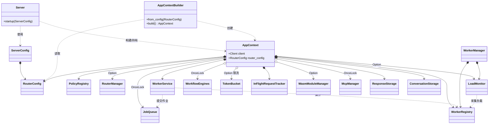
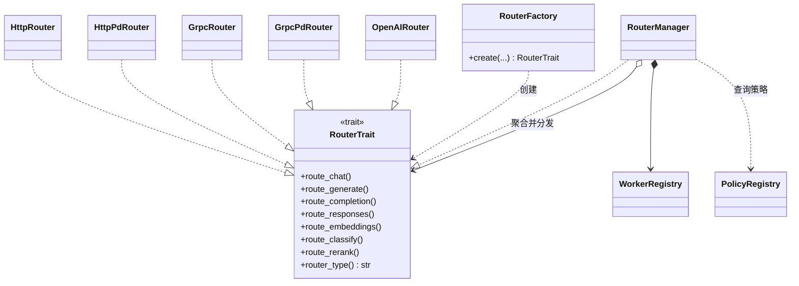
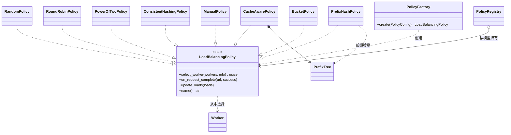
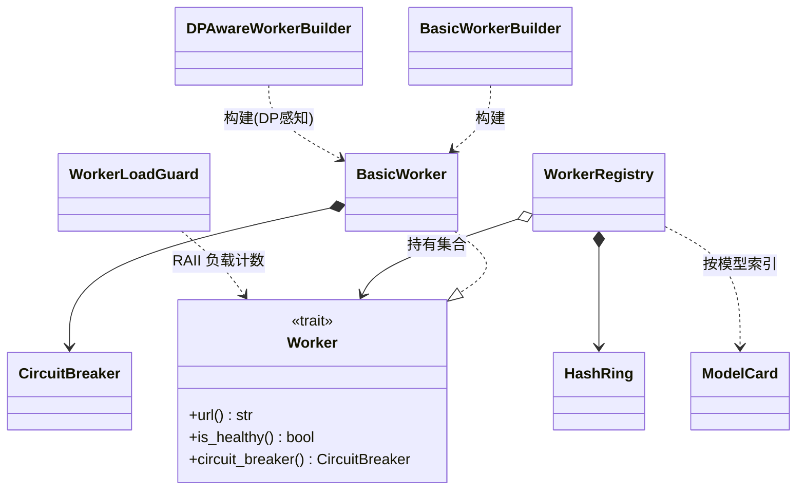
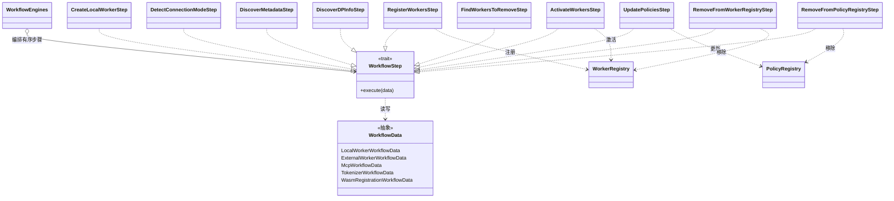
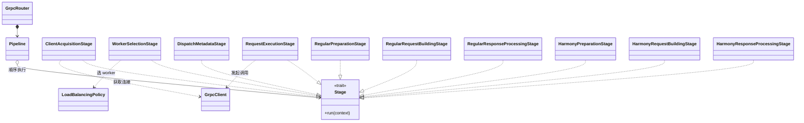

# SGL Model Gateway — 源码目录一览

本文件对 `src/` 目录下的所有代码文件做逐一说明，帮助快速定位与理解每个文件的职责。

> SGL Model Gateway（SMG）是一个基于 Rust 的高性能推理网关（路由器），支持常规路由、PD（Prefill-Decode）分离、多模型 IGW 网关、OpenAI 兼容协议、gRPC/HTTP 后端、Kubernetes 服务发现、WASM 插件、Mesh 集群等能力。

## 目录

- [顶层文件](#顶层文件)
- [config —— 配置](#config--配置)
- [core —— 核心抽象](#core--核心抽象)
- [core/steps —— 工作流步骤](#coresteps--工作流步骤)
- [core/steps/worker —— Worker 生命周期步骤](#coresteps​worker--worker-生命周期步骤)
- [policies —— 负载均衡策略](#policies--负载均衡策略)
- [routers —— 路由器实现](#routers--路由器实现)
- [routers/http —— HTTP 后端路由](#routershttp--http-后端路由)
- [routers/grpc —— gRPC 后端路由](#routersgrpc--grpc-后端路由)
- [routers/openai —— OpenAI 兼容路由](#routersopenai--openai-兼容路由)
- [routers 其他子模块](#routers-其他子模块)
- [observability —— 可观测性](#observability--可观测性)
- [wasm —— WebAssembly 插件](#wasm--webassembly-插件)
- [模块关系类图](#模块关系类图)

---

## 顶层文件

| 文件 | 说明 |
| --- | --- |
| `lib.rs` | crate 库入口。声明并重导出各顶层模块（`config`/`core`/`routers`/`policies`/`observability`/`wasm`/`server` 等），并把外部 crate（`smg_auth`、`openai_protocol`、`reasoning_parser`、`llm_tokenizer`、`tool_parser`）以别名对外暴露。 |
| `main.rs` | 二进制入口。基于 `clap` 定义命令行参数（Worker、路由策略、PD、服务发现、日志、指标、限流、重试、熔断、健康检查、分词器、后端、数据库、TLS、Tracing、鉴权、Mesh 等），解析并构建 `RouterConfig`/`ServerConfig`，启动 tokio 运行时与服务。 |
| `server.rs` | HTTP 服务器搭建与启动（`startup`）。注册路由端点、中间件、Prometheus、服务发现、优雅关闭、Mesh 服务等，是应用运行时的编排中枢。 |
| `app_context.rs` | 应用级共享上下文（`AppContext`）。持有配置、Worker 注册表、策略注册表、客户端、分词器、工作流引擎等全局依赖，供各路由器共享。 |
| `middleware.rs` | Axum 中间件：请求 ID 注入、并发/限流、鉴权、CORS、超时、日志追踪等横切逻辑。 |
| `service_discovery.rs` | Kubernetes 服务发现。基于标签选择器监听 Pod 变化，动态注册/摘除 Worker（含 PD 与 IGW 模式、bootstrap 端口注解等）。 |
| `version.rs` | 版本信息（版本号、构建元数据），供 `--version` / `--version-verbose` 输出。 |

---

## config —— 配置

| 文件 | 说明 |
| --- | --- |
| `config/mod.rs` | 配置模块入口，重导出 `builder`/`types`，定义 `ConfigError` 与 `ConfigResult`。 |
| `config/types.rs` | 所有配置类型定义：`RouterConfig`、`RoutingMode`、`PolicyConfig`、`ConnectionMode`、重试/熔断/健康检查/分词器缓存/服务发现/指标/追踪/数据库（Oracle/Postgres/Redis）等配置结构与默认常量。 |
| `config/builder.rs` | `RouterConfig` 的 Builder 模式实现，提供链式 `maybe_*`/setter API 组装配置。 |
| `config/validation.rs` | 配置校验逻辑，检查字段合法性与配置项之间的兼容性。 |

---

## core —— 核心抽象

| 文件 | 说明 |
| --- | --- |
| `core/mod.rs` | 核心模块入口，重导出 Worker、错误、熔断、任务队列、模型卡、重试、Worker 管理/注册/服务等常用类型。 |
| `core/worker.rs` | `Worker` trait 及 `BasicWorker` 实现，定义连接模式、健康状态、负载守卫（`WorkerLoadGuard`）、运行时类型、Worker 类型等核心抽象。 |
| `core/worker_builder.rs` | `BasicWorkerBuilder`、`DPAwareWorkerBuilder`，用于构造普通与数据并行感知的 Worker。 |
| `core/worker_registry.rs` | `WorkerRegistry` Worker 注册表，管理 Worker 集合、按模型/类型索引，并维护一致性哈希环 `HashRing`。 |
| `core/worker_manager.rs` | `WorkerManager` 与 `LoadMonitor`，负责 Worker 生命周期编排、周期性负载采集与健康检查调度。 |
| `core/worker_service.rs` | `WorkerService`，封装对外的 Worker 增删改查等服务接口。 |
| `core/model_card.rs` | `ModelCard` 与 `ProviderType`，描述模型元数据（模型 ID、类型、提供方等）。 |
| `core/model_type.rs` | 模型类型枚举与判定（如 chat/embedding/classify 等）。 |
| `core/circuit_breaker.rs` | 熔断器 `CircuitBreaker`、`CircuitBreakerConfig`、`CircuitState`，实现失败阈值、半开恢复、滑动窗口。 |
| `core/token_bucket.rs` | 令牌桶限流算法实现，用于按速率限制请求。 |
| `core/retry.rs` | 重试执行器 `RetryExecutor` 与可重试状态判定 `is_retryable_status`，含指数退避与抖动。 |
| `core/job_queue.rs` | 任务队列 `JobQueue`、`Job`、`JobQueueConfig`，用于异步作业排队与执行。 |
| `core/metrics_aggregator.rs` | 指标聚合器，汇总 Worker/请求相关运行指标。 |
| `core/error.rs` | 核心错误类型 `WorkerError` 与结果别名 `WorkerResult`。 |

### core/steps —— 工作流步骤

多步操作以“工作流引擎 + 步骤（Step）”方式组织，支持 Worker 注册/更新/删除、MCP、分词器、WASM 模块管理。

| 文件 | 说明 |
| --- | --- |
| `core/steps/mod.rs` | 步骤模块入口，重导出各类工作流构建函数、步骤类型与工作流数据结构。 |
| `core/steps/workflow_engines.rs` | `WorkflowEngines`，持有并调度各类工作流引擎。 |
| `core/steps/workflow_data.rs` | 各工作流的类型化数据载体（本地/外部 Worker、MCP、分词器、WASM 注册/移除等的输入输出上下文）。 |
| `core/steps/mcp_registration.rs` | MCP 服务器注册工作流：校验、连接、发现清单、注册等步骤。 |
| `core/steps/tokenizer_registration.rs` | 分词器注册/移除工作流：加载分词器、配置请求等步骤。 |
| `core/steps/wasm_module_registration.rs` | WASM 模块注册工作流：校验描述符/组件、加载字节、计算哈希、查重、注册。 |
| `core/steps/wasm_module_removal.rs` | WASM 模块移除工作流：查找待移除模块并移除。 |

#### core/steps/worker —— Worker 生命周期步骤

| 文件 | 说明 |
| --- | --- |
| `core/steps/worker/mod.rs` | Worker 步骤入口，重导出 external/local/shared 的工作流与步骤。 |
| `core/steps/worker/shared/mod.rs` | 共享步骤入口。 |
| `core/steps/worker/shared/register.rs` | `RegisterWorkersStep`：将 Worker 注册进注册表。 |
| `core/steps/worker/shared/activate.rs` | `ActivateWorkersStep`：激活 Worker（使其可参与路由）。 |
| `core/steps/worker/shared/update_policies.rs` | `UpdatePoliciesStep`：注册后更新相关策略。 |
| `core/steps/worker/external/mod.rs` | 外部 Worker（如 OpenAI 等托管后端）注册工作流入口。 |
| `core/steps/worker/external/create_workers.rs` | `CreateExternalWorkersStep`：创建外部 Worker 实例。 |
| `core/steps/worker/external/discover_models.rs` | `DiscoverModelsStep`：从外部后端发现可用模型并归组为 ModelCard。 |
| `core/steps/worker/local/mod.rs` | 本地 Worker 注册/更新/删除工作流入口。 |
| `core/steps/worker/local/create_worker.rs` | `CreateLocalWorkerStep`：创建本地 Worker。 |
| `core/steps/worker/local/detect_connection.rs` | `DetectConnectionModeStep`：探测连接模式（HTTP/gRPC）。 |
| `core/steps/worker/local/discover_dp.rs` | `DiscoverDPInfoStep`：发现数据并行（DP）信息 `DpInfo`。 |
| `core/steps/worker/local/discover_metadata.rs` | `DiscoverMetadataStep`：发现 Worker 元数据（模型、能力等）。 |
| `core/steps/worker/local/submit_tokenizer_job.rs` | 提交分词器加载作业到任务队列。 |
| `core/steps/worker/local/find_worker_to_update.rs` | `FindWorkerToUpdateStep`：定位需更新的 Worker。 |
| `core/steps/worker/local/update_worker_properties.rs` | `UpdateWorkerPropertiesStep`：更新 Worker 属性。 |
| `core/steps/worker/local/update_policies_for_worker.rs` | `UpdatePoliciesForWorkerStep`：为指定 Worker 更新策略。 |
| `core/steps/worker/local/update_remaining_policies.rs` | `UpdateRemainingPoliciesStep`：更新其余相关策略。 |
| `core/steps/worker/local/find_workers_to_remove.rs` | `FindWorkersToRemoveStep`：定位需移除的 Worker。 |
| `core/steps/worker/local/remove_from_worker_registry.rs` | `RemoveFromWorkerRegistryStep`：从 Worker 注册表移除。 |
| `core/steps/worker/local/remove_from_policy_registry.rs` | `RemoveFromPolicyRegistryStep`：从策略注册表移除。 |

---

## policies —— 负载均衡策略

统一的 `LoadBalancingPolicy` trait，兼容常规单 Worker 选择与 PD 双 Worker 选择。

| 文件 | 说明 |
| --- | --- |
| `policies/mod.rs` | 策略模块入口，定义 `LoadBalancingPolicy` trait、`SelectWorkerInfo`、`CacheAwareConfig`/`BucketConfig` 及健康 Worker 过滤等辅助函数。 |
| `policies/factory.rs` | `PolicyFactory`：根据 `PolicyConfig` 创建对应策略实例。 |
| `policies/registry.rs` | `PolicyRegistry`：按模型维护策略实例，支持增删与查询。 |
| `policies/random.rs` | 随机策略 `RandomPolicy`。 |
| `policies/round_robin.rs` | 轮询策略 `RoundRobinPolicy`。 |
| `policies/power_of_two.rs` | Power-of-Two-Choices 策略 `PowerOfTwoPolicy`，基于负载择优。 |
| `policies/cache_aware.rs` | 缓存感知策略 `CacheAwarePolicy`，结合前缀树命中率与负载均衡阈值路由。 |
| `policies/prefix_hash.rs` | 前缀哈希策略 `PrefixHashPolicy`/`PrefixHashConfig`，按 token 前缀哈希提升缓存命中。 |
| `policies/consistent_hashing.rs` | 一致性哈希策略 `ConsistentHashingPolicy`，用于会话亲和。 |
| `policies/manual.rs` | 手动策略 `ManualPolicy`/`ManualConfig`，按路由键分配并支持空闲淘汰。 |
| `policies/bucket.rs` | 分桶策略 `BucketPolicy`，按桶做负载均衡调整。 |
| `policies/tree.rs` | 前缀匹配树实现（`PrefixMatchResult`），为缓存感知/前缀哈希提供数据结构。 |
| `policies/utils.rs` | 策略内部通用工具函数。 |

---

## routers —— 路由器实现

| 文件 | 说明 |
| --- | --- |
| `routers/mod.rs` | 路由器模块入口，定义统一的 `RouterTrait`（generate/chat/completion/responses/embeddings/classify/rerank 等路由方法），重导出各路由器。 |
| `routers/factory.rs` | `RouterFactory`：依据路由模式/后端类型创建具体路由器实例。 |
| `routers/router_manager.rs` | 路由器管理器，管理多路由器（多模型 IGW 场景）的注册、选择与分发。 |
| `routers/error.rs` | 路由层错误类型与错误响应转换。 |
| `routers/header_utils.rs` | HTTP 头处理工具（请求 ID、透传头、路由键等）。 |
| `routers/streaming_utils.rs` | 流式响应（SSE）通用工具。 |
| `routers/persistence_utils.rs` | 响应/会话持久化相关工具。 |
| `routers/mcp_utils.rs` | MCP（Model Context Protocol）相关通用工具。 |

### routers/http —— HTTP 后端路由

| 文件 | 说明 |
| --- | --- |
| `routers/http/mod.rs` | HTTP 路由子模块入口。 |
| `routers/http/router.rs` | 常规 HTTP 路由器，转发到基于 HTTP 的推理后端。 |
| `routers/http/pd_router.rs` | HTTP 模式下的 PD（Prefill-Decode）分离路由器。 |
| `routers/http/pd_types.rs` | PD 路由所需类型定义（bootstrap 信息等）。 |

### routers/grpc —— gRPC 后端路由

| 文件 | 说明 |
| --- | --- |
| `routers/grpc/mod.rs` | gRPC 路由入口，声明 client/common/harmony/regular/pipeline 等子模块，定义 `ProcessedMessages`。 |
| `routers/grpc/client.rs` | gRPC 客户端封装，供 core 与路由器复用。 |
| `routers/grpc/router.rs` | 常规 gRPC 路由器。 |
| `routers/grpc/pd_router.rs` | gRPC 模式下的 PD 分离路由器。 |
| `routers/grpc/pipeline.rs` | gRPC 请求处理流水线（串联各阶段 Stage）。 |
| `routers/grpc/context.rs` | gRPC 请求上下文。 |
| `routers/grpc/proto_wrapper.rs` | Proto 类型封装与转换辅助。 |
| `routers/grpc/utils.rs` | gRPC 通用工具函数。 |

#### routers/grpc/common —— 通用阶段与响应

| 文件 | 说明 |
| --- | --- |
| `routers/grpc/common/mod.rs` | 通用子模块入口（regular 与 harmony 共享）。 |
| `routers/grpc/common/response_collection.rs` | 响应收集（聚合多个 gRPC 流片段）。 |
| `routers/grpc/common/response_formatting.rs` | 响应格式化（转换为对外协议格式）。 |
| `routers/grpc/common/stages/mod.rs` | 通用流水线阶段入口。 |
| `routers/grpc/common/stages/client_acquisition.rs` | 阶段：获取 gRPC 客户端连接。 |
| `routers/grpc/common/stages/worker_selection.rs` | 阶段：调用策略选择目标 Worker。 |
| `routers/grpc/common/stages/dispatch_metadata.rs` | 阶段：构造分发所需元数据。 |
| `routers/grpc/common/stages/request_execution.rs` | 阶段：执行 gRPC 请求。 |
| `routers/grpc/common/stages/helpers.rs` | 阶段通用辅助函数。 |
| `routers/grpc/common/responses/mod.rs` | 通用 Responses API 处理入口。 |
| `routers/grpc/common/responses/context.rs` | Responses 处理上下文。 |
| `routers/grpc/common/responses/handlers.rs` | Responses 处理句柄/入口逻辑。 |
| `routers/grpc/common/responses/streaming.rs` | Responses 流式处理。 |
| `routers/grpc/common/responses/utils.rs` | Responses 处理工具函数。 |

#### routers/grpc/regular —— 常规模型处理

| 文件 | 说明 |
| --- | --- |
| `routers/grpc/regular/mod.rs` | 常规（非 harmony）分词器模型处理入口。 |
| `routers/grpc/regular/processor.rs` | 常规模型请求处理器。 |
| `routers/grpc/regular/streaming.rs` | 常规模型流式处理。 |
| `routers/grpc/regular/stages/mod.rs` | 常规流水线阶段入口。 |
| `routers/grpc/regular/stages/preparation.rs` | 阶段：请求预处理（通用）。 |
| `routers/grpc/regular/stages/request_building.rs` | 阶段：构建 gRPC 请求（通用）。 |
| `routers/grpc/regular/stages/response_processing.rs` | 阶段：响应处理（通用）。 |
| `routers/grpc/regular/stages/chat/*` | Chat 场景专用阶段：`preparation`（预处理）、`request_building`（请求构建）、`response_processing`（响应处理）、`mod.rs`（入口）。 |
| `routers/grpc/regular/stages/generate/*` | Generate 场景专用阶段：`preparation`、`request_building`、`response_processing`、`mod.rs`。 |
| `routers/grpc/regular/stages/embedding/*` | Embedding 场景专用阶段：`preparation`、`request_building`、`response_processing`、`mod.rs`。 |
| `routers/grpc/regular/stages/classify/*` | Classify 场景专用阶段：`response_processing`、`mod.rs`。 |
| `routers/grpc/regular/responses/mod.rs` | 常规模型 Responses API 入口。 |
| `routers/grpc/regular/responses/common.rs` | 常规 Responses 公共逻辑。 |
| `routers/grpc/regular/responses/conversions.rs` | Responses 类型转换。 |
| `routers/grpc/regular/responses/handlers.rs` | Responses 处理句柄。 |
| `routers/grpc/regular/responses/non_streaming.rs` | 非流式 Responses 处理。 |
| `routers/grpc/regular/responses/streaming.rs` | 流式 Responses 处理。 |

#### routers/grpc/harmony —— Harmony/GPT-OSS 处理

Harmony 协议采用 analysis/commentary/final 三通道方案，用于支持 GPT-OSS 类模型。

| 文件 | 说明 |
| --- | --- |
| `routers/grpc/harmony/mod.rs` | Harmony 处理入口与架构说明，重导出 detector/builder/parser/processor 等。 |
| `routers/grpc/harmony/detector.rs` | `HarmonyDetector`：判断模型是否为 Harmony 兼容。 |
| `routers/grpc/harmony/builder.rs` | `HarmonyBuilder`：将 Chat/Responses 请求编码为 input_ids。 |
| `routers/grpc/harmony/parser.rs` | `HarmonyParserAdapter`：将 output_ids 解析为三通道内容。 |
| `routers/grpc/harmony/processor.rs` | `HarmonyResponseProcessor`：处理 Harmony 响应（含 `ResponsesIterationResult`）。 |
| `routers/grpc/harmony/types.rs` | Harmony 共享类型（如 `HarmonyMessage`）。 |
| `routers/grpc/harmony/streaming.rs` | `HarmonyStreamingProcessor`：Harmony 流式处理。 |
| `routers/grpc/harmony/stages/mod.rs` | Harmony 流水线阶段入口。 |
| `routers/grpc/harmony/stages/preparation.rs` | 阶段：Harmony 请求预处理。 |
| `routers/grpc/harmony/stages/request_building.rs` | 阶段：Harmony 请求构建。 |
| `routers/grpc/harmony/stages/response_processing.rs` | 阶段：Harmony 响应处理。 |
| `routers/grpc/harmony/responses/mod.rs` | Harmony Responses API 入口。 |
| `routers/grpc/harmony/responses/common.rs` | Harmony Responses 公共逻辑。 |
| `routers/grpc/harmony/responses/execution.rs` | Harmony Responses 执行逻辑。 |
| `routers/grpc/harmony/responses/non_streaming.rs` | 非流式 Harmony Responses。 |
| `routers/grpc/harmony/responses/streaming.rs` | 流式 Harmony Responses。 |

### routers/openai —— OpenAI 兼容路由

支持流式/非流式响应、MCP 工具调用、响应存储与会话管理、多轮工具执行循环、SSE 流。

| 文件 | 说明 |
| --- | --- |
| `routers/openai/mod.rs` | OpenAI 兼容路由入口，重导出 `OpenAIRouter`。 |
| `routers/openai/router.rs` | `OpenAIRouter`：OpenAI 协议路由器主体。 |
| `routers/openai/provider.rs` | 后端提供方封装（如 OpenAI/Anthropic 上游调用）。 |
| `routers/openai/context.rs` | OpenAI 请求上下文。 |
| `routers/openai/responses/mod.rs` | Responses API 处理入口，重导出流式/非流式处理函数。 |
| `routers/openai/responses/non_streaming.rs` | 非流式响应处理 `handle_non_streaming_response`。 |
| `routers/openai/responses/streaming.rs` | 流式响应处理 `handle_streaming_response`。 |
| `routers/openai/responses/accumulator.rs` | 响应累加器，为持久化聚合流式片段。 |
| `routers/openai/responses/mcp.rs` | MCP 工具拦截与执行。 |
| `routers/openai/responses/tool_handler.rs` | 工具调用检测与处理（含 output index 重映射）。 |
| `routers/openai/responses/common.rs` | Responses 公共逻辑。 |
| `routers/openai/responses/utils.rs` | Responses 工具函数（SSE 解析/转发等）。 |

### routers 其他子模块

| 文件 | 说明 |
| --- | --- |
| `routers/mesh/mod.rs` | Mesh 集群管理路由入口。 |
| `routers/mesh/handlers.rs` | Mesh 集群管理 HTTP 处理器（节点管理、状态查询等）。 |
| `routers/conversations/mod.rs` | 会话管理模块入口。 |
| `routers/conversations/handlers.rs` | 会话 CRUD 的 HTTP 处理器，可被多种路由器复用。 |
| `routers/parse/mod.rs` | 解析模块入口，导出 `parse_function_call`、`parse_reasoning`。 |
| `routers/parse/handlers.rs` | 函数调用抽取与推理内容分离的解析处理器。 |
| `routers/tokenize/mod.rs` | 分词模块入口，导出分词/反分词与分词器管理接口。 |
| `routers/tokenize/handlers.rs` | 分词/反分词、分词器增删查等 HTTP 处理器。 |

---

## observability —— 可观测性

| 文件 | 说明 |
| --- | --- |
| `observability/mod.rs` | 可观测性模块入口（日志、指标、追踪）。 |
| `observability/logging.rs` | 日志初始化与配置（文本/JSON、级别、日志目录）。 |
| `observability/metrics.rs` | Prometheus 指标定义与导出（请求量、耗时、Worker 负载等）。 |
| `observability/gauge_histogram.rs` | 自定义 gauge 直方图指标实现。 |
| `observability/inflight_tracker.rs` | 在途（inflight）请求追踪器。 |
| `observability/events.rs` | 事件记录/上报。 |
| `observability/otel_trace.rs` | OpenTelemetry 链路追踪初始化与关闭（`is_otel_enabled`/`shutdown_otel`）。 |

---

## wasm —— WebAssembly 插件

| 文件 | 说明 |
| --- | --- |
| `wasm/mod.rs` | WASM 模块入口，重导出 `smg-wasm` crate 能力。 |
| `wasm/route.rs` | WASM 模块管理的本地 HTTP API 路由（依赖应用特定类型）。 |

---

> 说明：`examples/wasm/` 下为 WASM guest 插件示例（鉴权、日志、限流），不属于网关主源码 `src/`，故未在本表逐一列出。

---

## 模块关系类图

以下用 Mermaid 类图（`classDiagram`）刻画各核心类型/模块之间的关系。为便于阅读，按“聚合关系 / trait 实现 / 工作流 / 请求处理链路”拆分为多张图。

> 关系约定：`*-->` 组合/持有（含 `Arc` 强引用），`o-->` 弱聚合/可选持有（`Option`/`OnceLock`），`..>` 依赖（调用/使用），`..|>` 实现 trait，`<|--` 继承/特化。

### 1. 应用装配：AppContext 为核心枢纽

`AppContext` 由 `AppContextBuilder` 装配，聚合了配置、注册表、策略、存储、解析器、管理器等所有子系统，是全应用的共享依赖容器。



### 2. 路由器：RouterTrait 及其实现

所有路由器实现统一的 `RouterTrait`；`RouterManager` 既实现该 trait（对外统一入口），又聚合并分发给具体子路由器。`RouterFactory` 依据配置创建对应实现。



### 3. 负载均衡策略：LoadBalancingPolicy 及其实现

`PolicyRegistry` 按模型维护策略实例；`PolicyFactory` 依据 `PolicyConfig` 创建具体策略。缓存感知/前缀哈希策略依赖前缀匹配树 `tree`。



### 4. Worker 抽象与注册

`Worker` 为核心 trait，`BasicWorker` 是默认实现，经 Builder 构建；`WorkerRegistry` 持有 Worker 集合并维护一致性哈希环 `HashRing`；每个 Worker 内含熔断器。



### 5. 工作流引擎与步骤（Step）

多步操作以“工作流引擎 + 有序步骤”组织。各类 Step 实现共同的步骤接口，操作类型化的 WorkflowData，并作用于 `WorkerRegistry` / `PolicyRegistry` / `JobQueue`。



### 6. gRPC 请求处理流水线（Pipeline / Stage）

gRPC 路由采用流水线模式：`Pipeline` 串联多个 `Stage`，common 提供通用阶段，regular 与 harmony 分别提供各自的场景化阶段（chat/generate/embedding/classify）。



### 7. 整体请求处理时序（概览）

```mermaid
classDiagram
    class Server
    class Middleware
    class RouterManager
    class ConcreteRouter["具体 Router (Http/Grpc/OpenAI)"]
    class LoadBalancingPolicy
    class WorkerRegistry
    class Worker
    class Backend["推理后端 (SGLang/OpenAI...)"]

    Server ..> Middleware : 请求先过中间件
    Middleware ..> RouterManager : 分发
    RouterManager ..> ConcreteRouter : 按模型路由
    ConcreteRouter ..> LoadBalancingPolicy : 选择 worker
    LoadBalancingPolicy ..> WorkerRegistry : 读取候选
    WorkerRegistry o--> Worker
    ConcreteRouter ..> Worker : 转发请求
    Worker ..> Backend : 调用上游

