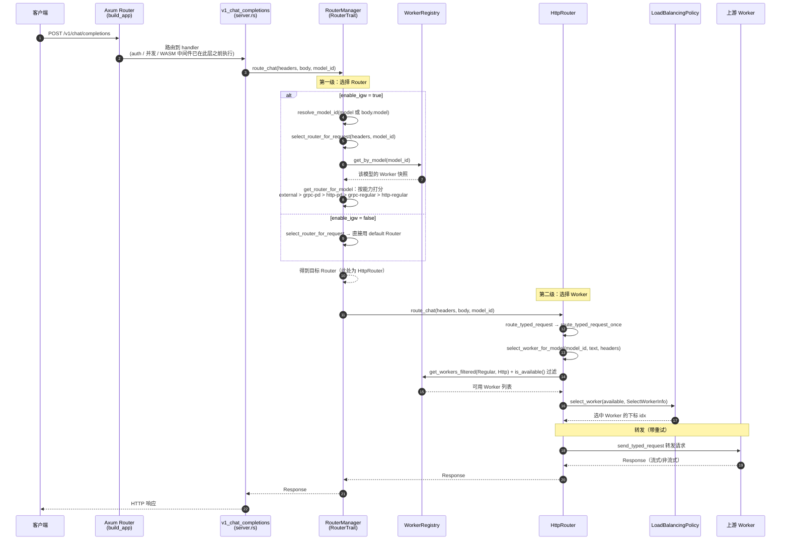

# SGLang Model Gateway 深度概念拆解

## 1. 第一性原理降维

### 1.1 Gateway 真正处理的不是 HTTP，而是"不可预知成本的有状态计算"

普通反向代理通常假设：

1. 请求成本大致相近；
2. 后端实例近似同质；
3. 请求完成后几乎不留下可复用状态；
4. 负载可以用连接数、QPS 或延迟近似衡量。

大模型推理几乎逐条违反这些假设。

一次请求的计算量近似为：

$$
C \approx C_{\text{prefill}}(L_{\text{in}}) + \sum_{t=1}^{L_{\text{out}}} C_{\text{decode}}(L_{\text{in}}+t)
$$

其中：

- $L_{\text{in}}$：输入 token 数；
- $L_{\text{out}}$：生成 token 数，通常事前未知；
- Prefill 偏计算密集；
- Decode 逐 token 执行，偏访存密集；
- KV Cache 会把请求历史绑定到特定实例或缓存节点。

因此，"一个请求"不是稳定的负载单位。两个 HTTP 请求的真实资源消耗可能相差数千倍。

---

### 1.2 核心矛盾：未来成本未知，但路由决策必须现在完成

Gateway 在请求到达时只能看到部分信息：

$$
I_0 = \{ L_{\text{in}}, \text{模型}, \text{优先级}, \text{实例状态}, \text{缓存提示} \}
$$

但真正需要优化的量包含未知变量：

$$
L_{\text{out}},\quad \text{未来到达},\quad \text{批组成},\quad \text{实例故障}
$$

路由问题本质上是一个在线调度问题：

$$
\min_{\pi} \left( \alpha \cdot \mathrm{TTFT} + \beta \cdot \mathrm{TPOT} + \gamma \cdot \text{排队时间} + \delta \cdot \text{失败率} \right)
$$

约束包括：

$$
\begin{aligned}
&\text{显存占用}_i \le M_i \\
&\text{运行中序列数}_i \le S_i \\
&\text{请求必须命中兼容的模型实例} \\
&\text{有收益时应保留会话/缓存亲和性}
\end{aligned}
$$

这里的关键不是"把流量平均分配"，而是：

> 在不知道请求最终会消耗多少资源的情况下，把它放到最可能较早完成、且最能复用已有状态的位置。

---

### 1.3 Gateway 的四层职责

可以把 SGLang Model Gateway 抽象为四个层次：

| 层次 | 输入 | 决策 | 解决的问题 |
|---|---|---|---|
| 协议层 | OpenAI 等 API 请求 | 解析、校验、转发、流式返回 | 客户端不感知后端拓扑 |
| 发现层 | 模型名、实例状态 | 选择可服务的实例集合 | 后端动态扩缩容与故障变化 |
| 调度层 | 队列、负载、缓存信息 | 选择目标实例或执行路径 | 避免排队失衡与缓存失配 |
| 可靠性层 | 超时、断连、实例失败 | 重试、摘除、降级 | 将局部故障隔离在服务端 |

其逻辑可以压缩为：

$$
\text{请求} \xrightarrow{\text{分类}} \text{候选集} \xrightarrow{\text{策略}} \text{目标实例} \xrightarrow{\text{代理}} \text{流式响应}
$$

所以它并不是模型计算引擎；它是位于客户端和计算引擎之间的**全局决策点**。

---

### 1.4 真正不可消除的物理限制

Gateway 无法突破以下限制：

**GPU 计算守恒**

若集群总有效算力为 $F$，请求总需求持续超过 $F$，任何路由策略都只能改变拥塞分布，不能消灭拥塞：

$$
\lambda \cdot E[C] \ge F \quad \Longrightarrow \quad E[W] \rightarrow \infty
$$

**KV Cache 的空间成本**

Transformer KV Cache 近似随并发序列和上下文长度线性增长：

$$
M_{\mathrm{KV}} \propto N_{\text{seq}} \cdot L \cdot N_{\text{layer}} \cdot D_{\text{kv}}
$$

Gateway 可以提高缓存命中率，但不能让缓存本身免费。

**信息不完备**

实例上报的负载在网络传输后已经是过去状态。设状态传播延迟为 $\Delta$，Gateway 实际看到的是：

$$
\hat S_i(t) = S_i(t - \Delta)
$$

当请求密度很高时，基于旧状态的"最优实例"可能已经成为新的热点。这是分布式调度的观测延迟，不是实现瑕疵。

---

## 2. 高阶结构化类比

### 2.1 最接近的成熟系统：NUMA 操作系统调度器

SGLang Model Gateway 与其说像传统负载均衡器，不如说更像一个面向 GPU 集群的 **NUMA 感知操作系统调度器**。

映射关系如下：

| 操作系统 | Model Gateway |
|---|---|
| 进程/线程 | 推理请求 |
| CPU 核心 | 模型服务实例 |
| 运行队列 | 实例等待队列 |
| 进程运行时间未知 | 输出 token 数未知 |
| CPU Cache / NUMA 本地内存 | Prefix Cache / KV Cache |
| CPU 亲和性 | 会话或前缀亲和性 |
| 上下文切换成本 | 缓存重算、跨节点传输成本 |
| 调度器 | 路由策略 |
| 进程迁移 | 请求重路由或重试 |
| CPU 热插拔 | 实例注册、下线与扩缩容 |

---

### 2.2 为什么"最空闲实例"未必是最佳实例

在 NUMA 系统中，把线程迁移到空闲 CPU 可能导致其工作集离开本地缓存，最终比留在略忙的 CPU 上更慢。

模型推理同理。设：

- 实例 $A$ 排队时间为 $Q_A$，缓存命中收益为 $H_A$；
- 实例 $B$ 排队时间为 $Q_B$，无缓存命中。

可以把目标成本近似写成：

$$
J_i = Q_i + C_i - H_i + R_i
$$

其中：

- $C_i$：预计计算成本；
- $H_i$：缓存复用节省的成本；
- $R_i$：失败、拥塞或通信风险成本。

即使：

$$
Q_A > Q_B
$$

只要：

$$
Q_A - H_A < Q_B - H_B
$$

选择更忙的 $A$ 仍然可能更优。

这揭示了 Gateway 与普通负载均衡器的根本差异：

> 普通负载均衡器主要优化"机器是否空闲"；模型网关还必须优化"有用状态在哪里"。

---

### 2.3 路由策略对应不同调度哲学

| 策略 | 等价调度思想 | 优点 | 根本缺陷 |
|---|---|---|---|
| 随机 | 随机调度 | 无状态、低开销 | 不利用任何负载信息 |
| 轮询 | 时间轮转 | 简单、长期请求数均衡 | 请求数均衡不等于计算量均衡 |
| 最少负载 | 最短队列 | 对突发流量更敏感 | 状态存在传播延迟 |
| 缓存感知 | NUMA/缓存亲和调度 | 降低重复 Prefill | 可能形成热点 |
| 一致性哈希 | 稳定亲和映射 | 拓扑变化时迁移较少 | 不天然感知实时负载 |
| 两次随机择优 | 随机抽样后择优 | 低观测成本下显著改善尾部负载 | 仍依赖负载指标质量 |

"最优策略"不存在于真空中。它取决于工作负载：

$$
\pi^* = f(\text{前缀重复度}, \text{请求方差}, \text{实例异构性}, \text{状态新鲜度}, \text{SLO})
$$

---

### 2.4 Gateway 是闭环控制器，而不是静态转发表

成熟 Gateway 的拓扑更接近反馈控制系统：

$$
\text{请求} \rightarrow \text{路由决策} \rightarrow \text{实例执行} \rightarrow \text{状态/延迟反馈} \rightarrow \text{更新决策}
$$

若状态采集过慢，控制器会滞后；若策略过度追逐"当前最空闲节点"，大量请求会同时涌向同一节点，产生振荡：

$$
A \text{ 空闲} \rightarrow \text{集中路由到 } A \rightarrow A \text{ 过载} \rightarrow \text{集中迁移到 } B \rightarrow B \text{ 过载}
$$

这与网络拥塞控制、分布式数据库副本选择、CPU 调度器的负载摆动具有相同拓扑结构。

---

## 3. 边界与对立面限定

### 3.1 与邻近概念的边界

| 系统 | 核心职责 | 是否执行模型计算 | 是否理解推理负载 |
|---|---|---:|---:|
| 四层负载均衡器（L4） | 按连接转发数据包 | 否 | 否 |
| 通用 API 网关 | 认证、限流、协议治理 | 否 | 通常否 |
| Kubernetes Service/Ingress | 服务发现与网络入口 | 否 | 否 |
| Model Gateway | 模型级路由、调度与故障隔离 | 否 | 是 |
| SGLang Runtime | 批处理、KV Cache、模型执行 | 是 | 是 |
| 集群编排器 | 启停实例、分配 GPU、扩缩容 | 间接 | 部分 |
| 模型注册表 | 管理模型版本和元数据 | 否 | 否 |

最关键的分界线是：

$$
\boxed{\text{Gateway 决定计算去哪里发生，Runtime 决定计算如何发生}}
$$

Gateway 不负责 CUDA Kernel、连续批处理（Continuous Batching）或注意力（Attention）执行；Runtime 也不应承担整个集群入口的全局流量治理。

---

### 3.2 它不是"更快的模型"

Gateway 能改善的主要是：

$$
T_{\text{total}} = T_{\text{gateway}} + T_{\text{queue}} + T_{\text{prefill}} + T_{\text{decode}} + T_{\text{network}}
$$

它主要影响：

- $T_{\text{queue}}$：避免请求进入错误队列；
- $T_{\text{prefill}}$：通过缓存亲和减少重复计算；
- 故障带来的额外等待；
- 集群整体利用率与尾延迟。

它通常不能直接降低：

- 单个 token 的 Kernel 执行时间；
- 模型参数读取量；
- 单实例的理论算力上限；
- 不可压缩的网络传输成本。

如果系统只有一个模型实例：

$$
|\text{Candidates}| = 1
$$

那么 Gateway 几乎没有调度空间，只剩协议代理、治理和故障处理价值，并会额外增加一跳延迟。

---

### 3.3 极限边界

**极端一：请求完全同质、无缓存复用**

若每个请求成本相等，实例完全同构，且不存在有价值的状态：

$$
C_j = C, \qquad H_{ij} = 0
$$

轮询已接近最优，复杂缓存感知调度只会增加控制成本。

**极端二：单个超长请求**

Gateway 可以决定把它放在哪里，却无法把一个不可拆分的长 Decode 请求自动变成多个独立并行请求。此时瓶颈在模型并行和执行引擎，而不在路由。

**极端三：所有实例同时满载**

当：

$$
\forall i,\quad \rho_i \ge 1
$$

路由问题退化为准入控制问题。正确动作应是排队上限、背压、拒绝、降级或扩容，而不是继续寻找"神奇的路由策略"。

**极端四：流式响应已经输出**

流式生成一旦向客户端提交 token，请求就难以透明迁移。若后端在中途失败，重试可能导致：

- 已输出内容重复；
- 重新生成结果不同；
- 首 token 延迟重新计算；
- 计费与用量统计不一致。

因此，流式请求的重试语义天然弱于普通幂等 HTTP 请求。

**极端五：路由状态严重过期**

若状态传播时间超过实例负载变化时间尺度：

$$
\Delta_{\text{state}} \gg \tau_{\text{load}}
$$

精细负载路由可能比随机选择更差，因为它会以高度确定的方式执行错误判断。

---

### 3.4 最危险的反模式

**反模式一：把请求数当作负载**

错误假设：

$$
\text{负载}_i = \text{请求数}_i
$$

但更合理的近似至少需要考虑：

$$
\text{负载}_i \approx aN_{\text{running}} + bN_{\text{queued}} + cT_{\text{input}} + dT_{\text{decode}} + eM_{\text{KV}}
$$

否则，一个处理数十个短请求的实例会被误认为比处理一个超长请求的实例更繁忙。

---

**反模式二：缓存亲和性绝对优先**

若所有相似前缀都被发送到同一实例：

$$
\arg\max_i H_i
$$

可能形成"缓存越热，流量越集中；流量越集中，缓存越热"的正反馈，最终把缓存优势转化为排队灾难。

正确目标不是最大化命中率，而是最小化总完成时间：

$$
\arg\min_i (Q_i + C_i - H_i)
$$

---

**反模式三：无限重试**

假设成功概率为 $p$，无限重试会使故障期间的期望请求放大量接近：

$$
A \approx 1 + r + r^2 + \cdots
$$

当重试比例 $r \rightarrow 1$ 时：

$$
A \rightarrow \infty
$$

这会把单实例故障放大为全局重试风暴。尤其对非幂等或已开始流式输出的请求，盲目重试还会破坏语义一致性。

---

**反模式四：让 Gateway 保存过多强状态**

如果所有会话映射、配额、缓存目录和实例状态都只存在于一个 Gateway 进程中，那么 Gateway 从"故障隔离层"变成"单点故障源"。

Gateway 的本地状态应尽可能满足：

- 可重建；
- 有界；
- 允许短暂不一致；
- 不成为业务事实的唯一副本。

---

**反模式五：忽略背压，只追求高 QPS**

在过载区继续接收请求，可能让吞吐量不升反降：

$$
\text{更多并发} \rightarrow \text{更大 KV 占用} \rightarrow \text{更差批处理质量} \rightarrow \text{更长延迟} \rightarrow \text{更多超时重试}
$$

Gateway 若只有路由、没有准入与背压，就只能均匀地制造雪崩。

---

## 4. 语义压缩与动机演进

### 4.1 前世：客户端直接连接单个模型服务

最初拓扑是：

$$
\text{客户端} \rightarrow \text{模型服务}
$$

它隐含三个假设：

1. 单实例足以承载负载；
2. 客户端知道实例地址；
3. 实例不会动态变化或失败。

当模型服务扩展到多实例后，这三个假设全部失效。

---

### 4.2 第一阶段：引入普通负载均衡

拓扑演化为：

$$
\text{客户端} \rightarrow \text{负载均衡器} \rightarrow \text{模型服务集群}
$$

它解决了：

- 单一入口；
- 基础服务发现；
- 连接分发；
- 简单故障摘除。

但它仍假设"HTTP 请求近似同质"。对模型推理，这会产生三个问题：

1. 短请求被长请求拖住；
2. 相同前缀被重复 Prefill；
3. 请求数均衡，但 token 工作量严重失衡。

---

### 4.3 第二阶段：从流量转发进化为模型感知调度

被推翻的关键假设是：

$$
\boxed{\text{请求数量可以代表负载}}
$$

新的认识是：

$$
\text{真实负载} = f(\text{token 数}, \text{生成阶段}, \text{队列状态}, \text{KV 占用}, \text{缓存位置})
$$

因此入口层需要理解模型、token、缓存与推理阶段，Gateway 由"网络组件"演化为"计算调度组件"。

---

### 4.4 第三阶段：从无状态副本选择进化为状态位置选择

进一步被推翻的假设是：

$$
\boxed{\text{所有健康实例都是等价的}}
$$

实际上，由于 Prefix Cache、KV Cache、会话上下文以及模型版本差异，实例具有位置相关价值：

$$
V(i,r) = -\text{排队成本}(i) + \text{缓存收益}(i,r) - \text{故障风险}(i)
$$

路由决策不再只是"谁有空"，而是：

> 哪个执行位置拥有当前请求最需要的状态，同时又没有因这些状态变成热点。

---

### 4.5 SGLang Model Gateway 的本质位置

它位于三个时间尺度之间：

| 时间尺度 | 系统 | 典型决策 |
|---|---|---|
| 微秒—毫秒 | Kernel / Runtime | 算子、批处理、显存访问 |
| 毫秒—秒 | Model Gateway | 路由、排队、重试、缓存亲和 |
| 秒—分钟 | 编排器（Orchestrator） | 扩缩容、部署、实例替换 |

Gateway 的价值来自中间尺度：

- Runtime 看得足够细，但通常只知道本实例；
- 编排器看得到全局，但反应过慢；
- Gateway 同时接近请求入口并观察多个后端，适合执行在线全局决策。

它不是简单地在 Runtime 前多加一层，而是在系统中补上此前缺失的控制回路。

---

## 核心本质结论

> **SGLang Model Gateway 的本质，是在每项任务的最终成本尚不可知、且可复用状态分散在不同机器上的条件下，决定下一项计算放在哪里，避免局部拥塞演化成全局浪费。**

---

# 两天源码学习计划

## 0. 学习目标与范围

### 0.1 两天后的“学完”标准

这里的“学完”不是记住全部 1,000 多行 README 或逐行读完所有源码，而是形成一个可用于开发、排障和评审的稳定心智模型。两天结束时，应能独立完成以下任务：

1. 不看源码画出普通 HTTP 请求的完整生命周期；
2. 在 5 分钟内定位请求入口、Worker 选择、上游转发、流式响应和资源释放代码；
3. 解释 `WorkerRegistry`、`PolicyRegistry`、`RouterManager` 的职责边界；
4. 对比 `random`、`round_robin`、`power_of_two`、`cache_aware`、`prefix_hash` 的状态、输入和适用负载；
5. 解释健康检查、熔断、重试、并发限制之间为何不能互相替代；
6. 解释 `WorkerLoadGuard`、`AttachedBody`、`BreakerTrackedStream` 如何覆盖普通响应、流式完成、上游错误和客户端断开；
7. 说明普通 HTTP、PD、gRPC、OpenAI 后端、IGW 五种路径的分叉点；
8. 收到一个“请求未到达预期 Worker”问题时，能给出按层排查顺序。

### 0.2 时间预算与取舍

按每天约 8 小时、总计 16 小时设计：

| 优先级 | 范围 | 两天内要求 |
|---|---|---|
| P0 | 启动组装、HTTP 主链路、Worker/Policy、流式生命周期 | 必须能复述并定位 |
| P1 | 控制面、可靠性、PD、IGW | 必须理解设计与关键分叉 |
| P2 | gRPC 流水线、OpenAI 后端、可观测性 | 理解入口和边界，不要求逐行掌握 |
| P3 | MCP、Conversation、WASM、Mesh HA、数据库存储、语言绑定 | 只建立地图，后续按任务深入 |

不要从 `main.rs` 第一行线性读到最后一行。主入口包含大量 CLI 字段，线性阅读会消耗时间，却不能建立请求生命周期。学习采用“双线闭环”：

- **纵向主链**：一条请求从入口走到 Worker，再回到客户端；
- **横向机制**：Worker、Policy、可靠性与控制面如何给主链提供决策状态。

---

## 1. 源码导航图

### 1.1 核心模块职责

| 模块 | 关键文件 | 核心问题 | 优先级 |
|---|---|---|---|
| 启动与配置 | `src/main.rs`、`src/config/types.rs`、`src/config/builder.rs`、`src/config/validation.rs` | 用户参数如何变成运行时对象？ | P0 |
| 服务组装 | `src/server.rs`、`src/app_context.rs` | Axum 路由、共享状态和后台任务如何组装？ | P0 |
| 路由抽象 | `src/routers/mod.rs`、`src/routers/factory.rs`、`src/routers/router_manager.rs` | 请求如何选择一种 Router？ | P0 |
| HTTP 数据面 | `src/routers/http/router.rs`、`src/routers/streaming_utils.rs`、`src/routers/header_utils.rs` | 请求如何选择 Worker、重试、转发并流式返回？ | P0 |
| Worker 模型 | `src/core/worker.rs`、`src/core/worker_builder.rs`、`src/core/worker_registry.rs` | 后端实例拥有哪些能力和动态状态？ | P0 |
| 策略系统 | `src/policies/mod.rs`、`src/policies/registry.rs`、`src/policies/factory.rs`、各策略实现 | 路由决策如何插件化？ | P0 |
| 可靠性 | `src/core/retry.rs`、`src/core/circuit_breaker.rs`、`src/core/token_bucket.rs`、`src/middleware.rs` | 故障与过载如何被限制？ | P1 |
| 控制面 | `src/core/worker_service.rs`、`src/core/job_queue.rs`、`src/core/steps/` | Worker 增删改如何异步执行并保持一致？ | P1 |
| PD 路由 | `src/routers/http/pd_router.rs` | Prefill 与 Decode 如何双路选择和合并？ | P1 |
| gRPC | `src/routers/grpc/` | 本地分词、解析和 gRPC Worker 调用如何组成流水线？ | P2 |
| OpenAI 后端 | `src/routers/openai/` | 外部 OpenAI 兼容服务如何保留协议和流语义？ | P2 |
| 可观测性 | `src/observability/` | 指标、日志、Trace 在哪些边界采样？ | P2 |

### 1.2 三个核心状态容器

| 类型 | 保存什么 | 不负责什么 |
|---|---|---|
| `AppContext` | Client、配置、Worker/Policy 注册表、存储、限流器、后台组件 | 不执行单次请求的路由算法 |
| `WorkerRegistry` | Worker 集合、按模型索引、类型索引、哈希环、健康检查入口 | 不决定采用哪种负载均衡策略 |
| `PolicyRegistry` | 默认策略、按模型策略、PD 的 Prefill/Decode 策略 | 不发送 HTTP/gRPC 请求 |
| `RouterManager` | Router 实例集合及 IGW 下的 Router 选择 | 不替代 Router 内部的 Worker 选择 |

要始终区分两级选择：

$$
\text{Request}
\xrightarrow{\text{RouterManager}}
\text{Router Type}
\xrightarrow{\text{Policy}}
\text{Worker}
$$

前者回答“走 HTTP、gRPC、PD 还是外部后端”，后者回答“同类候选 Worker 中选哪一个”。

### 1.3 普通 HTTP Chat 请求主链

阅读时在纸上或笔记中固定写出以下链路：

```text
main
  -> CliArgs::to_router_config
  -> server::startup
  -> AppContext::from_config
  -> RouterManager::from_config
  -> build_app
  -> v1_chat_completions
  -> RouterManager::route_chat
  -> Router::route_chat
  -> Router::route_typed_request
  -> RetryExecutor::execute_response_with_retry
  -> Router::route_typed_request_once
  -> Router::select_worker_for_model
  -> LoadBalancingPolicy::select_worker
  -> WorkerLoadGuard::new
  -> Router::send_typed_request
  -> reqwest 上游请求
  -> BreakerTrackedStream / AttachedBody
  -> 客户端
```

此链路中有四个必须识别的生命周期边界：

1. **进入 Gateway**：Axum handler 与中间件；
2. **决策完成**：Router 类型与 Worker 都已选定；
3. **上游已响应**：HTTP 状态已知，但流可能尚未完成；
4. **响应体结束或被丢弃**：此时才应释放流式请求占用的 Worker load。

---

## 2. 第一天：建立数据面主干

### 第 1 阶段（09:00—09:40）：从概念文档建立问题框架

**阅读材料**

- 本文第 1～4 部分；
- `README_zh.md` 的“概述”“架构速览”“特性亮点”“快速开始”；
- 暂时跳过安装细节、全部 CLI 参数和语言绑定。

**带着以下问题阅读**

1. 为什么 QPS 不能表示推理负载？
2. 为什么缓存命中与最短队列会发生冲突？
3. Gateway 能改变哪部分延迟，不能改变哪部分延迟？
4. 为什么 Gateway 更像 NUMA 调度器，而不只是反向代理？

**产出物**

手写一张四层图：协议层、发现层、调度层、可靠性层。每层只写“输入、状态、输出”三个字段。

**验收标准**

不看文档，用 3 分钟讲清：

> Gateway 不增加 GPU 算力，它通过减少错误排队、重复 Prefill 和故障放大来改善整体完成时间。

---

### 第 2 阶段（09:40—10:40）：启动链与对象装配

**按顺序阅读**

1. `Cargo.toml`：只看 package、lib/bin、核心依赖；
2. `src/main.rs`：跳到 `main`、`to_router_config`、`to_server_config`；
3. `src/config/types.rs`：定位 `RouterConfig`、`RoutingMode`、`PolicyConfig`；
4. `src/server.rs`：阅读 `ServerConfig` 和 `startup`；
5. `src/app_context.rs`：阅读 `AppContext`、`from_config` 和 Builder 的 `with_*` 顺序。

**重点理解**

`main.rs` 负责把外部参数变成配置；`AppContext` 负责把配置变成共享运行时组件；`server::startup` 负责启动后台任务、Router 和网络服务。这三者分别对应：

$$
\text{Input Normalization}
\rightarrow
\text{Dependency Construction}
\rightarrow
\text{Runtime Orchestration}
$$

**必须追踪的符号**

- `CliArgs::to_router_config`
- `RouterConfig::validate`
- `server::startup`
- `AppContext::from_config`
- `AppContextBuilder::from_config`
- `RouterManager::from_config`
- `server::build_app`

**产出物**

画对象依赖图，至少包含：

```text
AppState
  -> RouterTrait
  -> AppContext
       -> WorkerRegistry
       -> PolicyRegistry
       -> TokenizerRegistry
       -> LoadMonitor
       -> WorkerService
       -> JobQueue / WorkflowEngines
```

**验收问题**

1. 为什么 `JobQueue` 和 `WorkflowEngines` 使用 `OnceLock` 延迟填充？
2. 为什么 `AppState.router` 是 `Arc<dyn RouterTrait>` 而不是具体 Router？
3. `RoutingMode` 与 `ConnectionMode` 分别表达什么维度？

---

### 第 3 阶段（10:50—12:00）：HTTP 入口与 Router 两级选择

**按顺序阅读**

1. `src/server.rs::build_app`；
2. `src/server.rs::v1_chat_completions`；
3. `src/routers/mod.rs` 的 `RouterTrait`；
4. `src/routers/router_manager.rs::route_chat`；
5. `select_router_for_request`、`get_router_for_model`；
6. `src/routers/http/router.rs::route_chat`。

**重点理解**

- `/v1/chat/completions` 如何映射到 handler；
- auth、并发控制、WASM 等中间件位于哪一层；
- 非 IGW 模式为何总是走 default Router；
- IGW 模式如何根据 model 对应 Worker 的能力选择 Router；
- `RouterManager` 选择 Router，具体 Router 再选择 Worker。

**调用时序图**

从 HTTP 请求进入，到 `RouterManager` 选出 Router（第一级选择）、具体 Router 再选出 Worker（第二级选择），最后转发到上游的完整调用链如下：



> 关键点：**Router 选择 ≠ Worker 选择**。第一级由 `RouterManager` 依据「模型对应 Worker 的能力（连接模式/是否 PD/是否 External）」选出合适的 Router 类型；第二级才由具体 Router 内的负载均衡策略在可用 Worker 中选出实例。非 IGW 模式下第一级恒定走 default Router，仅保留第二级选择。

**产出物**

为以下两种配置各画一条分支：

1. `enable_igw=false + HTTP Regular`；
2. `enable_igw=true + 同时存在 HTTP Regular 和 gRPC PD Worker`。

**验收问题**

1. 多模型但请求未给 model 时，IGW 如何处理？
2. 为什么 Router 选择不能直接等同于 Worker 选择？
3. 外部 Provider、gRPC PD、HTTP PD、gRPC Regular、HTTP Regular 的选择优先级在哪里体现？

---

### 第 4 阶段（13:30—15:10）：Worker 抽象与注册表

**按顺序阅读**

1. `src/core/worker.rs`：
   - `Worker` trait；
   - `WorkerType`、`ConnectionMode`、`RuntimeType`；
   - `WorkerMetadata`；
   - `BasicWorker`；
   - `DPAwareWorker`；
2. `src/core/worker_builder.rs`；
3. `src/core/worker_registry.rs`：
   - `WorkerRegistry` 字段；
   - `register`、remove 路径；
   - `get_by_model`、`get_by_type`；
   - `get_hash_ring`；
   - `start_health_checker`。

**重点理解**

Worker 同时包含三类信息：

| 信息类别 | 例子 | 更新频率 |
|---|---|---|
| 静态能力 | URL、连接模式、Worker 类型、模型能力 | 注册时为主 |
| 动态状态 | healthy、load、processed count | 请求或探测时更新 |
| 可靠性状态 | Circuit Breaker | 请求结果驱动 |

`WorkerRegistry` 的读路径服务于高频请求，写路径服务于低频注册和发现。因此代码倾向于使用快照、`Arc` 与预计算哈希环，把成本从读路径转移到写路径。

**产出物**

制作一张“不变量表”：

- Worker 被注册后，哪些索引必须同步更新？
- Worker 被移除后，哪些快照/哈希环必须重建？
- Worker unhealthy 与 Circuit Open 有何不同？

**验收问题**

1. `is_healthy()` 与 `circuit_breaker().can_execute()` 为什么要同时检查？
2. `get_by_model` 为什么适合返回 `Arc<[Arc<dyn Worker>]>` 快照？
3. DP-aware Worker 为什么包装 Basic Worker，而不是复制完整实现？

---

### 第 5 阶段（15:20—16:40）：负载均衡策略系统

**按顺序阅读**

1. `src/policies/mod.rs`：`LoadBalancingPolicy`、`SelectWorkerInfo`；
2. `src/policies/factory.rs`；
3. `src/policies/registry.rs`；
4. `random.rs`、`round_robin.rs`；
5. `power_of_two.rs`；
6. `prefix_hash.rs`、`consistent_hashing.rs`；
7. `cache_aware.rs` 与 `tree.rs`；
8. `manual.rs`、`bucket.rs` 只读核心选择函数。

**建立策略比较矩阵**

| 策略 | 决策输入 | 内部状态 | 主要目标 | 主要风险 |
|---|---|---|---|---|
| Random | 候选 Worker | 无 | 极低开销、打散请求 | 不利用负载与缓存 |
| Round Robin | 候选 Worker | 原子游标 | 请求数长期均衡 | 请求成本差异被忽略 |
| Power of Two | 候选 Worker、负载采样 | Worker load 映射 | 低成本改善尾部拥塞 | 负载数据滞后或缺失 |
| Prefix Hash | token 前缀、哈希环 | 映射参数 | 稳定前缀亲和 | 热前缀形成热点 |
| Cache Aware | 请求文本、前缀树、Worker load | 前缀树 | 复用 KV/Prefix Cache | 状态和内存成本更高 |
| Manual | routing key/header | key 到 Worker 映射 | 显式会话亲和 | 映射陈旧、负载偏斜 |
| Bucket | PD 请求特征 | bucket 状态 | PD 场景分桶 | 适用范围较窄 |

**必须回答的统一接口问题**

- 为什么 `select_worker` 返回索引而不是 Worker？
- 哪些策略需要 `request_text`？
- 哪些策略依赖 `tokens` 或 `hash_ring`？
- `on_request_complete`、`update_loads`、`reset` 为何有默认空实现？

**产出物**

针对以下三种流量分别选策略并写出理由：

1. 请求成本相近、无共享前缀；
2. 大量相同 system prompt，输出长度差异中等；
3. 多租户会话必须稳定落到相同实例，但实例会动态扩缩容。

**验收标准**

能从统一目标函数解释策略权衡：

$$
J_i = Q_i + C_i - H_i + R_i
$$

而不是只背诵策略名字。

---

### 第 6 阶段（16:50—18:10）：请求转发、流式响应与 RAII

这是第一天最重要的源码阶段。

**按调用顺序阅读 `src/routers/http/router.rs`**

1. `route_typed_request`；
2. `RetryExecutor::execute_response_with_retry` 的调用点；
3. `route_typed_request_once`；
4. `select_worker_for_model`；
5. `send_typed_request`；
6. 流式与非流式两个响应分支。

随后阅读：

- `src/core/worker.rs::WorkerLoadGuard`；
- `src/core/worker.rs::AttachedBody`；
- `src/routers/streaming_utils.rs::BreakerTrackedStream`；
- `src/routers/header_utils.rs`。

**用四种终止方式验证生命周期**

| 场景 | Worker load 何时减一 | 熔断结果如何记录 |
|---|---|---|
| 非流式成功 | 请求函数结束、guard drop | 成功结果记录 |
| 流式正常完成 | Response Body 完成/drop | Stream 标记 completed |
| 上游流错误 | Body 终止/drop | Stream 标记 errored |
| 客户端中途断开 | Body 被丢弃 | 不应把客户端取消误判为 Worker 故障 |

**底层问题**

如果在 handler 返回 `Response` 时立即减少 load，那么一个持续 30 秒的 SSE 请求会在 30 秒内被错误地视为“已完成”。`AttachedBody` 将 guard 的生命周期绑定到响应体，而不是绑定到创建响应的函数栈：

$$
\text{Load Lifetime} = \text{Response Body Lifetime}
$$

**产出物**

画一张所有权/析构图，明确谁持有：

- `Arc<dyn Worker>`；
- `WorkerLoadGuard`；
- `BreakerTrackedStream`；
- `AttachedBody`。

**验收问题**

1. 为什么仅在 `send().await` 成功后记录 success 是错误的？
2. 为什么客户端断开不能直接算 Worker failure？
3. 为什么 Rust 的 `Drop` 在这里不只是内存管理，而是业务状态正确性机制？

---

### 第 7 阶段（18:10—18:40）：第一天闭卷复盘

不看源码写出普通 Chat 请求调用链，要求至少包含：

```text
v1_chat_completions
RouterManager::route_chat
Router::route_chat
route_typed_request
RetryExecutor
route_typed_request_once
select_worker_for_model
LoadBalancingPolicy::select_worker
WorkerLoadGuard
send_typed_request
BreakerTrackedStream
AttachedBody
```

**第一天通过标准**

- 调用链遗漏不超过两个节点；
- 能准确解释 Router 选择与 Worker 选择的区别；
- 能解释流式 load 为什么不能在 handler 返回时释放；
- 能为三种负载选择合理策略，并指出反例。

若未通过，第二天开始前只复习薄弱链路，不重新通读 README。

---

## 3. 第二天：控制面、可靠性与扩展架构

### 第 8 阶段（09:00—10:10）：控制面与 Worker 生命周期

**从 API 反向追踪**

1. `src/server.rs` 中 `/workers` 与 `/workers/{worker_id}`；
2. `src/core/worker_service.rs`；
3. `src/core/job_queue.rs`；
4. `src/core/steps/mod.rs`；
5. `src/core/steps/` 下 Worker 注册、更新、删除、健康检查、策略更新相关步骤；
6. `src/core/worker_registry.rs::register` 与 remove 路径；
7. `src/policies/registry.rs` 的 Worker 增删回调。

**重点理解**

控制面不直接在 HTTP handler 中完成全部注册工作，而是把可能耗时、需要编排的动作交给 Job Queue 与 Workflow：

```text
POST /workers
  -> WorkerService
  -> JobQueue
  -> WorkflowEngines
  -> validate/discover/register/update-policy 等 Steps
  -> WorkerRegistry / PolicyRegistry
```

这使控制面 API 可以返回任务状态，也避免把健康探测、模型发现、Tokenizer 初始化等复杂副作用塞进一个 handler。

**产出物**

画 Worker 状态转换图：

```text
配置或 API 输入
  -> 排队
  -> 校验/能力发现
  -> 注册
  -> 健康监测
  -> 更新或删除
```

**验收问题**

1. 为什么 Worker 注册需要 Workflow，而不是一个 `registry.insert()`？
2. 注册成功但健康检查失败时，Worker 在注册表中和数据面中分别是什么状态？
3. Worker 变化为什么会影响按模型策略与哈希环？

---

### 第 9 阶段（10:20—12:00）：可靠性四件套

**按故障发生顺序阅读**

1. `src/middleware.rs`：入口并发限制和排队；
2. `src/core/token_bucket.rs`：令牌获取与补充；
3. `src/core/retry.rs`：重试条件、退避、抖动；
4. `src/core/circuit_breaker.rs`：Closed/Open/HalfOpen；
5. `src/core/worker.rs::check_health_async`；
6. `src/core/worker_registry.rs::start_health_checker`；
7. `src/core/worker_manager.rs::LoadMonitor`。

**严格区分四种机制**

| 机制 | 观测对象 | 动作 | 时间尺度 | 不能替代什么 |
|---|---|---|---|---|
| 并发限制/排队 | Gateway 总入口 | 等待或拒绝 | 单请求到秒级 | 不能判断某个 Worker 是否故障 |
| 重试 | 某次请求失败 | 换 Worker 再尝试 | 毫秒到秒 | 不能长期隔离故障节点 |
| 熔断器 | 某 Worker 请求结果 | 暂停向该 Worker 发流量 | 秒到分钟 | 不能证明进程整体健康 |
| 健康检查 | Worker 探测端点 | 标记 healthy/unhealthy | 周期性 | 不能感知每条业务流的中途错误 |

**熔断状态机**

```text
Closed --连续失败达到阈值--> Open
Open --超时--> HalfOpen
HalfOpen --成功达到阈值--> Closed
HalfOpen --任一失败--> Open
```

**关键推导**

重试放大系数近似为：

$$
A = 1 + p_r + p_r^2 + \cdots
$$

因此重试必须与熔断、退避、抖动共同工作；否则 Worker 故障会被入口流量乘法放大。

**产出物**

给出以下故障的责任机制：

1. Gateway 已满载；
2. 某 Worker 连续返回 503；
3. Worker 进程已死；
4. 客户端主动取消 SSE；
5. 所有 Worker 均满载但仍健康。

**验收问题**

1. 健康检查失败阈值和熔断失败阈值为什么是两套状态？
2. HalfOpen 解决了什么信息问题？
3. 为什么 retry 必须避免选择刚失败的 Worker？
4. 为什么所有 Worker 满载时，“更聪明的路由”不能代替背压？

---

### 第 10 阶段（13:30—14:50）：PD 分离路径

**按顺序阅读**

1. `README_zh.md` 的 Prefill/Decode 快速开始；
2. `src/routers/factory.rs` 中 PD Router 创建；
3. `src/routers/http/pd_router.rs`：
   - `route_chat`；
   - 请求上下文构造；
   - Prefill/Decode Worker 选择；
   - `execute_dual_dispatch_internal`；
   - `create_streaming_response`；
4. `src/policies/bucket.rs`；
5. `tests/routing/pd_routing_test.rs` 与 `tests/routing/test_pd_routing.rs`，以测试反查边界条件。

**必须建立的差异表**

| 维度 | Regular Router | PD Router |
|---|---|---|
| Worker 选择次数 | 一次 | Prefill 与 Decode 各一次 |
| 策略 | 单一或按模型策略 | 可分别配置 Prefill/Decode 策略 |
| 负载守卫 | 一个 | 两侧分别管理 |
| 上游结果 | 单响应 | 需要协调双侧结果 |
| 流式主体 | 单 Worker | 主要由 Decode 输出，需保留两侧语义 |
| 失败空间 | 单节点错误 | Prefill、Decode、协调过程均可失败 |

**产出物**

画一张时序图：Client、Gateway、Prefill Worker、Decode Worker 四列，标出 bootstrap 信息、双路 dispatch、流式数据源和失败点。

**验收问题**

1. 为什么 Prefill 和 Decode 可能需要不同策略？
2. 两侧熔断结果为什么不能只依据最终 HTTP Response 状态记录？
3. 客户端断开时，PD 路径需要释放哪些资源？

---

### 第 11 阶段（15:00—16:00）：IGW、多模型与 Router 能力匹配

**阅读顺序**

1. `README_zh.md` 的多模型推理网关；
2. `src/routers/router_manager.rs::from_config`；
3. `determine_router_id`；
4. `resolve_model_id`；
5. `get_router_for_model`；
6. `select_router_for_request`；
7. `route_chat`。

**重点理解**

**什么是 IGW 模式**

IGW 即 **Inference Gateway（推理网关）** 模式，由命令行参数 `--enable-igw` 开启（开启服务发现 `--service-discovery` 时也会自动启用）。它把本组件从「单一后端集群的路由器」升级为「面向多模型、多后端形态的统一推理网关」：

- **多模型共存**：同一网关可同时服务多个模型；请求需携带 `model` 字段，网关据此把请求路由到该模型对应的 Worker（仅一个模型时可省略，见 `RouterManager::resolve_model_id`）。
- **多后端形态共存**：同时管理 HTTP / gRPC、Regular / PD（Prefill-Decode 分离）、以及 External（OpenAI 兼容）等多种 Worker，并为每种形态预先创建对应的 Router。
- **两级选择**：先由 `RouterManager` 依据模型对应 Worker 的能力选出「哪个 Router」（第一级），再由该具体 Router 内部的负载均衡策略选出「哪个 Worker」（第二级）。
- **能力优先级**：同一模型存在多种 Worker 时，按 external(OpenAI) > grpc-pd > http-pd > grpc-regular > http-regular 选择 Router。

相对地，**非 IGW（单 Router）模式**只面向单一后端形态：整个网关固定使用一个默认 Router，忽略模型维度，`RouterManager` 退化为对该 Router 的透传包装。

IGW 解决的不是“同模型多个副本”问题，而是“一个入口面对多模型、多协议、多 Worker 类型”问题。其选择结构是：

$$
\text{model ID}
\rightarrow
\text{capable workers}
\rightarrow
\text{compatible router type}
\rightarrow
\text{policy}
\rightarrow
\text{worker}
$$

`ArcSwap<Vec<Arc<dyn RouterTrait>>>` 快照用于减少请求热路径中的分配与 `DashMap` shard lock。

**产出物**

构造一个包含以下 Worker 的虚拟注册表，并手工判断每种 model 会走哪个 Router：

- model-a：HTTP Regular；
- model-b：gRPC Regular；
- model-c：HTTP Prefill + Decode；
- model-d：External Provider。

**验收问题**

1. IGW 为什么会创建多种 Router，而不是在单个 Router 内写大分支？
2. 多模型请求未指定 model 时，何时可以推断、何时必须失败？
3. Router 快照优化的是读路径还是写路径？代价是什么？

---

### 第 12 阶段（16:10—17:00）：gRPC 与 OpenAI 后端建立边界

两天内不要求逐行掌握这两条链路，目标是识别其与 HTTP Regular 的结构差异。

**gRPC 阅读入口**

- `src/routers/grpc/router.rs`；
- `src/routers/grpc/pd_router.rs`；
- `src/routers/grpc/client.rs`；
- `src/routers/grpc/processor.rs`；
- `src/routers/grpc/tokenizer_manager.rs`。

关注：本地 Tokenizer、Reasoning Parser、Tool Parser、gRPC Client、流式 token 处理分别位于哪里。

**OpenAI 后端阅读入口**

- `src/routers/openai/router.rs`；
- `src/routers/openai/client.rs`；
- `src/routers/openai/response.rs`；
- `src/routers/openai/worker.rs`。

关注：外部 Provider 与本地 SGLang Worker 在鉴权、请求格式、流式事件和模型发现上的差异。

**产出物**

完成对比表：

| 维度 | HTTP Regular | gRPC | OpenAI 后端 |
|---|---|---|---|
| 推理服务位置 | 本地/自管 Worker | SRT gRPC Worker | 外部兼容 Provider |
| 分词位置 | 通常 Worker | Gateway 可本地处理 | Provider |
| 协议 | HTTP/SSE | gRPC streaming | HTTP/SSE |
| Gateway 是否解析 reasoning/tool | 通常透传 | 可在 Rust 流水线处理 | 依 Provider 适配 |
| Worker 抽象 | SGLang HTTP Worker | gRPC Worker | External Worker |

**验收标准**

能指出三条路径的共同骨架仍然是：模型解析、能力匹配、Worker 选择、请求执行、流式返回、结果记账。

---

### 第 13 阶段（17:00—17:35）：可观测性与排障路径

**快速阅读**

- `src/observability/metrics.rs`；
- `src/observability/inflight_tracker.rs`；
- `src/observability/otel_trace.rs`；
- `src/observability/logging.rs`；
- `src/core/metrics_aggregator.rs`。

**按故障分层建立排障顺序**

```text
请求是否进入 Gateway？
  -> 是否被认证/限流/队列拒绝？
  -> model 是否可解析？
  -> Router 是否匹配？
  -> 是否存在 healthy 且 circuit 可执行的 Worker？
  -> Policy 选中了谁？
  -> 上游连接/状态码是否正常？
  -> Stream 是否中途报错或被客户端取消？
  -> load、breaker、metrics 是否正确回收/更新？
```

**产出物**

为“请求返回 503”“流式请求卡住”“流量集中到单 Worker”各写一份 5 步排查清单。

---

### 第 14 阶段（17:35—18:30）：源码验证与最终闭卷

以下验证均不需要 GPU，也不要求新增测试代码。命令在 `sgl-model-gateway` 目录执行。由于仓库可能随分支变化，先列出测试，再运行目标测试：

```bash
cargo test --lib -- --list
cargo test --test load_guard_raii_test -- --nocapture
cargo test --test inflight_tracker_test -- --nocapture
cargo test --test metrics_aggregator_test -- --nocapture
```

策略与熔断器的源码内单测可用名称过滤执行：

```bash
cargo test --lib policies -- --nocapture
cargo test --lib circuit_breaker -- --nocapture
cargo test --lib worker_registry -- --nocapture
```

若某个过滤条件显示 0 tests，应以 `cargo test --lib -- --list` 的实际名称为准，不要为了“让命令成功”修改源码。

**阅读测试，而不是追求跑完所有测试**

| 主题 | 测试文件 |
|---|---|
| Worker load 与响应体生命周期 | `tests/load_guard_raii_test.rs` |
| 策略与负载均衡 | `tests/routing/load_balancing_test.rs`、`tests/routing/power_of_two_test.rs` |
| 策略注册 | `tests/routing/policy_registry_integration.rs` |
| Cache-aware 兼容性 | `tests/routing/cache_aware_backward_compat_test.rs` |
| PD | `tests/routing/pd_routing_test.rs`、`tests/routing/test_pd_routing.rs` |
| 重试 | `tests/reliability/retries_test.rs` |
| 熔断 | `tests/reliability/circuit_breaker_test.rs` |
| 限流 | `tests/reliability/rate_limiting_test.rs` |
| 上游取消 | `tests/reliability/upstream_cancel_test.rs` |
| API 与流式协议 | `tests/api/api_endpoints_test.rs`、`tests/api/streaming_tests.rs` |

**最终闭卷任务**

在 30 分钟内，不看源码完成：

1. 画普通 HTTP Chat 请求调用链；
2. 画 Worker 注册控制链；
3. 画熔断状态机；
4. 写出 Regular 与 PD 的五项差异；
5. 写出 RouterManager 与 PolicyRegistry 的边界；
6. 回答“流式响应为什么需要 RAII guard 绑定 Body 生命周期”。

---

## 4. 两天验收题

### 4.1 架构题

1. `AppContext` 为什么是依赖容器，而不是业务上帝对象？
2. `RouterManager` 和 `RouterFactory` 分别解决运行时选择与构造期选择中的什么问题？
3. 为什么 Worker 能力、Worker 健康和 Worker 负载必须分开表达？
4. `WorkerRegistry` 为什么为 model lookup 和 hash ring 做预计算？

### 4.2 数据面题

1. 从 `/v1/chat/completions` 到 `reqwest::Client` 的函数链是什么？
2. 策略需要请求文本时，文本在哪一层提取并传入？
3. 上游返回 200 后，为什么请求仍不能立刻记为成功？
4. 客户端取消流式请求后，哪些计数必须回收，哪些错误状态不应增加？

### 4.3 调度题

1. 相同前缀请求很多时，为什么 `cache_aware` 可能优于 `round_robin`？
2. 为什么缓存命中最高的 Worker 不一定应被选中？
3. `power_of_two` 相比全局 least-loaded 的观测成本与效果如何权衡？
4. 一致性哈希解决的是实时负载均衡，还是拓扑变化下的映射稳定性？

### 4.4 可靠性题

1. Retry、Circuit Breaker、Health Check、Rate Limit 各自作用在哪一层？
2. 为什么重试应带指数退避和 jitter？
3. Open 状态为何不能永久拒绝，HalfOpen 的试探请求有什么风险？
4. 所有实例过载时，为什么继续重试会导致正反馈雪崩？

### 4.5 扩展架构题

1. PD 为什么需要分别选择 Prefill 和 Decode Worker？
2. IGW 为什么必须先解析 model，再匹配 Router 类型？
3. gRPC 路径把哪些原本位于 Worker 的能力前移到了 Gateway？
4. 外部 OpenAI Provider 为什么仍可复用 Worker/Router 的抽象骨架？

达到以下标准可视为“两天掌握主模块”：

- 20 道题中至少 16 道能给出源码级答案；
- 两条主链图无职责层级错误；
- 能在 IDE 中快速定位对应类型和函数；
- 能基于工作负载解释策略选择，而不是只描述实现；
- 能给出故障排查顺序且不混淆健康检查与熔断。

---

## 5. 学习中的常见反模式

### 5.1 从 CLI 参数逐行开始

`main.rs` 参数很多，但参数不是架构主干。先抓住 `to_router_config -> startup`，再按问题回查具体字段。

### 5.2 同时追五条 Router 路径

第一天只追 HTTP Regular。只有这条链闭环后，再把 PD、gRPC、OpenAI 视为对同一骨架的扩展。

### 5.3 只读实现，不读测试

实现告诉你“怎么做”，测试通常揭示“哪些边界不能破坏”。尤其应阅读流取消、load guard、重试和熔断测试。

### 5.4 把 healthy、available、low-load 混为一谈

它们分别代表：

$$
\begin{aligned}
\text{healthy} &:\ \text{探测认为服务存活} \\
\text{available} &:\ \text{healthy 且熔断允许执行} \\
\text{low-load} &:\ \text{当前负载估计较低}
\end{aligned}
$$

一个 Worker 可以 healthy 但 circuit open，也可以 available 但负载很高。

### 5.5 只看成功路径

Gateway 的复杂度主要来自生命周期终止方式，而不是 HTTP 转发本身。每读一段流式代码，都要同时问：正常完成、上游错误、超时、客户端断开时分别发生什么。

### 5.6 试图两天掌握所有外围能力

MCP、WASM、Conversation Storage、Mesh HA、Kubernetes Discovery 和语言绑定都是独立深水区。两天内只需知道它们挂载在哪个扩展点，不应挤占 P0/P1 主链时间。

---

## 6. 最终语义压缩

> **两天学习的最短路径不是遍历全部文件，而是先追完一条请求的生死，再追清决定它去哪里、失败后如何收场的所有状态。**

