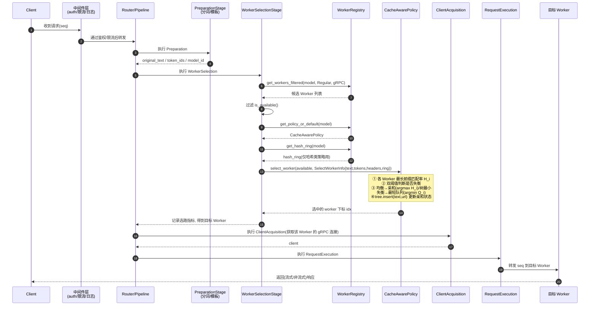

# Cache Aware（缓存感知）算法详解

> 本文档是 [ROUTING_POLICIES_ZH.md](./ROUTING_POLICIES_ZH.md) 中「Cache Aware」策略的深入拆解，
> 包含双模式动态切换、基数树与 NUMA 类比等细节。主文档仅保留概览。

**实现**：`src/policies/cache_aware.rs` + `src/policies/tree.rs` — 每个 Worker 维护近似基数树，在「缓存亲和」与「最短队列」间动态切换。

## 第一性原理降维

Cache Aware 是唯一**精确**估计 $H_i$ 的策略，也是最能体现「路由=在线调度」本质的策略。它对每个 Worker 用**近似基数树**（存原始字符而非 token，省去分词开销）记录历史请求前缀，从而精确计算最长前缀匹配率。

其核心是一个**双模式动态切换**：

$$
\text{imbalanced} \iff (\text{max} - \text{min}) > \tau_\text{abs} \;\wedge\; \text{max} > \tau_\text{rel} \cdot \text{min}
$$

- **系统均衡** → 走**缓存亲和**：
  - 若最高匹配率 > `cache_threshold`（默认 0.5）→ 路由到匹配最高的 Worker（复用 KV）；
  - 否则 → 路由到**树最小**的 Worker（缓存容量最富余）。
- **系统失衡** → 走**最短队列**：直接路由到 pending 最少的 Worker，牺牲缓存换取负载再平衡。

背景任务周期性 LRU 淘汰树叶节点（`eviction_interval_secs`、`max_tree_size`）以约束内存。特别地，树以 `pool::model` 为 key 隔离 prefill/decode/regular 池，防止交替调用互相驱逐。

## 请求从网关接收到路由出 Worker 的执行时序

下图展示一条请求（seq）从进入网关到选出目标 Worker 的完整链路。选路发生在 **WorkerSelection** 阶段，位于预处理（含分词）之后、客户端获取与执行之前；Cache Aware 的 `select_worker` 正是在此被调用（gRPC 流水线见 `src/routers/grpc/pipeline.rs`、`stages/worker_selection.rs`）。

**关键点：**
- **分词先于选路**：`PreparationStage` 产出 `token_ids`，供 PrefixHash 等策略使用；Cache Aware 直接用 `original_text`（存原始字符的基数树，无需 token）。
- **候选来自注册表**：`WorkerRegistry` 按 `model_id` + `WorkerType::Regular` + gRPC 过滤，再用 `is_available()` 剔除不健康/熔断 Worker，得到健康集合 $\mathcal{H}$。
- **策略按模型选取**：`get_policy_or_default(model)` 决定用哪种策略；hash_ring 仅对一致性哈希/前缀哈希有意义，Cache Aware 忽略它。
- **选路即更新状态**：Cache Aware 在返回前会 `tree.insert(text, url)` 记录本次归属（即使处于失衡最短队列模式），以维护后续的亲和判断。
- **PD 模式**：若为 Prefill/Decode 分离，`WorkerSelection` 会对 prefill 池与 decode 池**各调用一次** `select_worker`，分别选出 P、D 两个 Worker。

## 高阶结构化类比

最贴切的类比是 **NUMA 感知操作系统调度器**：

| OS 调度器 | Cache Aware |
|---|---|
| CPU 本地缓存亲和 | KV/Prefix Cache 亲和 |
| 工作集迁移成本 | 重新 Prefill 成本 |
| 负载失衡时抢占迁移 | 失衡时切最短队列 |

它精确回答了那个反直觉命题：**最空闲的实例未必最优**——只要 $Q_A - H_A < Q_B - H_B$，选更忙但有缓存的 $A$ 反而完成更快。

## 双模式动态切换 vs Dynamo 式「负载 + cache 加权求和」

在「如何同时兼顾缓存亲和与负载均衡」这个问题上，存在两条不同的技术路线。Cache Aware 采用的是**双模式动态切换（bang-bang / 硬切换）**，而 Dynamo 及许多负载感知路由采用的是**加权求和（soft / 连续打分）**。二者本质是**「硬阈值状态机」与「连续目标函数」**之争。

**① Cache Aware 现状：双模式硬切换**

先用双阈值判断系统是否失衡，再在两个**离散模式**间二选一：

$$
\text{mode} = \begin{cases} \textbf{缓存亲和} & \neg\,\text{imbalanced}:\ \text{匹配率} > \texttt{cache\_threshold} \Rightarrow \arg\max_i H_i;\ \text{否则}\Rightarrow \text{树最小}\\[4pt] \textbf{最短队列} & \text{imbalanced}:\ \arg\min_i Q_i \end{cases}
$$

$$
\text{imbalanced} \iff (\text{max}-\text{min}) > \tau_\text{abs} \wedge \text{max} > \tau_\text{rel}\cdot\text{min}
$$

即负载与缓存**从不同时参与同一个打分**——要么纯看缓存匹配率，要么纯看队列长度，由阈值决定切到哪一档。

**② Dynamo 式：负载 + cache 加权求和**

把缓存亲和与负载揉进**同一个连续评分函数**，一次性排序取最优（$\arg\min$ 或 $\arg\max$），例如：

$$
\text{score}_i = \alpha \cdot \underbrace{(1 - H_i)}_{\text{缓存未命中代价}} + \beta \cdot \underbrace{\frac{Q_i}{C_i}}_{\text{归一化负载}} \quad\Rightarrow\quad \text{worker} = \arg\min_i \text{score}_i
$$

Dynamo 的 vnode 加权、以及本项目 [consistent_hashing.md](./consistent_hashing.md) 中「负载感知加权环」的 $W_i = C_i / (aQ_i + bT_i + cU_i + \epsilon)$ 都属此类——**用权重把多个维度线性/非线性组合成单一分数**。

**③ 两条路线对比**

| 维度 | 双模式硬切换（Cache Aware 现状） | 加权求和（Dynamo 式） |
|---|---|---|
| 决策形态 | 离散状态机，模式间跳变 | 连续打分，平滑过渡 |
| 参数 | 阈值（`cache_threshold` + 双失衡阈值），语义直观、易解释 | 权重 $\alpha,\beta,\dots$，需调参且量纲需归一 |
| 可解释性 | **强**：可明确说出「当前处于亲和/均衡模式」 | 较弱：结果是多因子折中，不易归因 |
| 行为稳定性 | 阈值附近可能**抖动/滞回**（在两模式间反复跳） | 平滑，但权重不当会持续偏向某一维度 |
| 兼顾程度 | 同一次决策**只看一个维度**（非此即彼） | 同一次决策**同时权衡**缓存与负载 |
| 极端保护 | 天然有「失衡必切最短队列」的硬保护 | 需靠权重或额外上限约束，易被单因子主导 |
| 实现复杂度 | 低（阈值比较 + 分支） | 中（打分、归一化、权重整定、平滑） |
| 调参难度 | 低（阈值有物理含义） | 高（权重耦合，需按负载分布反复整定） |

**④ 结论与取舍**

- **硬切换**胜在**可解释、可预测、极端场景有硬保护**，代价是阈值边界的抖动与「非此即彼」的粗粒度——这正是当前 `cache_aware.rs` 的选择（配合迟滞式双阈值缓解抖动）。
- **加权求和**胜在**平滑、能在单次决策里连续兼顾多维度**，代价是权重整定困难、可解释性差、缺乏天然的极端保护。
- **可能的演进**：把 Cache Aware 的「失衡后纯切最短队列」升级为**加权求和**（在失衡区间用 $\text{score}_i = \alpha(1-H_i) + \beta Q_i/C_i$ 连续过渡），可在保留亲和收益的同时平滑负载再平衡——即用「软切换」替代「硬切换」，与 [consistent_hashing.md](./consistent_hashing.md) 的「负载感知加权环」思路同源。

## 边界与反模式

- **边界**：与 prefix_hash 的分界线是**精确 vs 近似**（基数树最长匹配 vs 固定前缀哈希）。
- **极限**：请求完全无共享前缀时，基数树退化为纯开销，此时应回退到更轻的策略。
- **反模式**：**缓存亲和绝对优先**。若只追 $\arg\max_i H_i$，会形成「缓存越热→流量越集中→缓存越热」的正反馈灾难。代码用「双阈值失衡检测 + 切最短队列」正是为破除此正反馈。

## 演进动机

它推翻了「所有健康实例等价」的假设，把路由从「无状态副本选择」进化为「**状态位置选择**」——这是模型网关区别于普通 L4/L7 负载均衡器的分水岭。

## 参数配置

策略参数定义见 `PolicyConfig::CacheAware`（`src/config/types.rs`），CLI 默认值见 `main.rs` 的 `parse_policy`。

| 参数 | 类型 | 默认值（CLI） | 含义 | 调参影响 |
|---|---|---|---|---|
| `cache_threshold` | `f32` | `0.3` | 前缀匹配率阈值：请求与某 Worker 缓存前缀匹配比例 ≥ 此值判定命中并优先亲和 | 调高 → 更严格才认命中，亲和减弱、更偏均衡；调低 → 更易命中，命中率高但易热点 |
| `balance_abs_threshold` | `usize` | `64` | 失衡判定的**绝对**差阈值：`max - min` 负载超过它才可能触发失衡 | 调小 → 更早切最短队列（偏均衡）；调大 → 更容忍失衡（偏亲和） |
| `balance_rel_threshold` | `f32` | `1.5` | 失衡判定的**相对**比阈值：`max > rel × min` 才触发失衡 | 与 abs 为「与」关系，二者同时满足才判失衡 |
| `eviction_interval_secs` | `u64` | `120` | radix tree 驱逐周期（秒），周期清理冷门前缀节点 | 调小 → 内存更省但可能误删热前缀；调大 → 命中率稳但内存占用高 |
| `max_tree_size` | `usize` | `67108864`（64M 节点） | 基数树最大节点数，超限触发驱逐 | 按可用内存与前缀规模设定，过小则频繁驱逐降命中率 |

> 失衡判据为双阈值「与」逻辑：$(\text{max}-\text{min}) > \texttt{balance\_abs\_threshold} \wedge \text{max} > \texttt{balance\_rel\_threshold} \times \text{min}$。

## 下游 Worker 节点增删对本策略的影响

Worker 的增删由 `WorkerRegistry` 感知，并经 `PolicyRegistry::on_worker_added` / `on_worker_removed` 通知到策略（见 `src/policies/registry.rs`）。Cache Aware 的私有状态是**每 Worker 一棵基数树**，因此对拓扑变更最敏感：

- **新增 Worker**：通过 `init_workers` 为新 Worker 在对应 `pool::model` 下建立一棵**空树**。新 Worker 初期无任何前缀记录 → 匹配率为 0，短期内几乎只会因「树最小（缓存最富余）」而被选中来接收新前缀，**需要一段预热期**逐步积累缓存。
- **移除 Worker**：通过 `remove_tenant(url)` 删除该 Worker 对应的租户子树，释放其前缀记录。原本亲和到该 Worker 的请求会**失去缓存亲和**，被重新按匹配率/树大小分配到其他 Worker，并在新 Worker 上重新 prefill。
- **对失衡判断的影响**：Worker 数变化会改变 `max/min` 的分布，短时间内可能触发或消解双阈值失衡检测，导致临时在「缓存亲和 ↔ 最短队列」间切换。
- **Mesh 多节点**：树操作经 CRDT 同步，新增/移除在各节点最终一致，但存在 gossip 传播延迟窗口。

**一句话**：增删都会引起**缓存亲和的重建成本**——新增有空树预热期，移除会使原亲和请求重新 prefill，是所有策略中受拓扑变更影响最大的一个。

## 优缺点、使用场景、局限性与优化迭代方向

### 优点

- **命中率最高**：唯一做**精确最长前缀匹配**的策略，在有共享前缀的负载下 KV Cache 命中率显著优于 prefix_hash 的固定前缀近似。
- **兼顾负载**：双阈值失衡检测 + 切最短队列，避免「缓存越热越集中」的正反馈热点，在亲和与均衡间自适应。
- **省分词开销**：基数树存原始字符而非 token，选路无需分词。
- **池隔离**：以 `pool::model` 为 key 隔离 prefill/decode/regular，避免交替调用互相驱逐。

### 缺点

- **内存与更新成本高**：每 Worker 维护一棵基数树，内存 $O(\text{total\_tokens})$，插入/淘汰成本高于哈希类策略。
- **实现复杂**：涉及树结构、LRU 淘汰、双模式切换、mesh 同步，维护心智负担最重。
- **失衡判据本地化**：pending 为本地计数，多节点下各节点对失衡的判断可能不完全同步。

### 使用场景

- 大量请求共享 **system prompt / few-shot 前缀**（如同一套 prompt 模板、RAG 固定上下文）。
- 多轮会话、Agent 循环等前缀高度可复用的场景。
- 对首 token 延迟（TTFT）敏感、希望最大化 prefill 复用的服务。

### 局限性

- 请求**几乎无共享前缀**时，基数树退化为纯开销，应回退到更轻的策略（Random / RoundRobin / P2C）。
- 前缀命中率的收益依赖引擎侧 KV Cache 未被淘汰；若引擎缓存压力大、前缀频繁失效，路由亲和收益会打折。
- 树的内存与淘汰参数（`max_tree_size`、`eviction_interval_secs`）需按流量规模调参，配置不当会导致内存膨胀或命中率下降。

### 优化迭代方向

- **失衡信号升级**：把 pending 本地计数替换/融合为 mesh 全局同步的负载视图，提升多节点失衡判断的一致性。
- **匹配长度感知的负载估计**：当前负载主要按在途请求数（pending）衡量，默认每个请求成本相同，无法区分短请求与超长输入请求。可基于输入长度与缓存匹配长度估算该请求实际新增的 prefill 成本：$C_{prefill}=\max(0,L_{input}-L_{matched})$，再结合预计输出长度得到 $C_{request}=C_{prefill}+\beta L_{output}$；Worker 负载则由在途请求成本累加，而非仅统计请求个数。选路时综合「迁入后的预计负载」进行判断，可避免超长输入被低估，也能让命中较长前缀的 Worker 因实际计算成本更低而保留亲和优势。为防止单个超长请求引发节点间反复迁移，请求一旦派发便固定执行，仅影响后续请求的选路，并对负载状态使用软/硬阈值与恢复迟滞。
- **与引擎缓存对齐**：订阅引擎侧真实 KV 驻留/淘汰事件校正本地树，减少「本地以为命中、引擎已淘汰」的偏差。
- **树结构优化**：更紧凑的节点编码、分片锁或无锁结构，降低高并发下的树更新竞争与内存占用。

