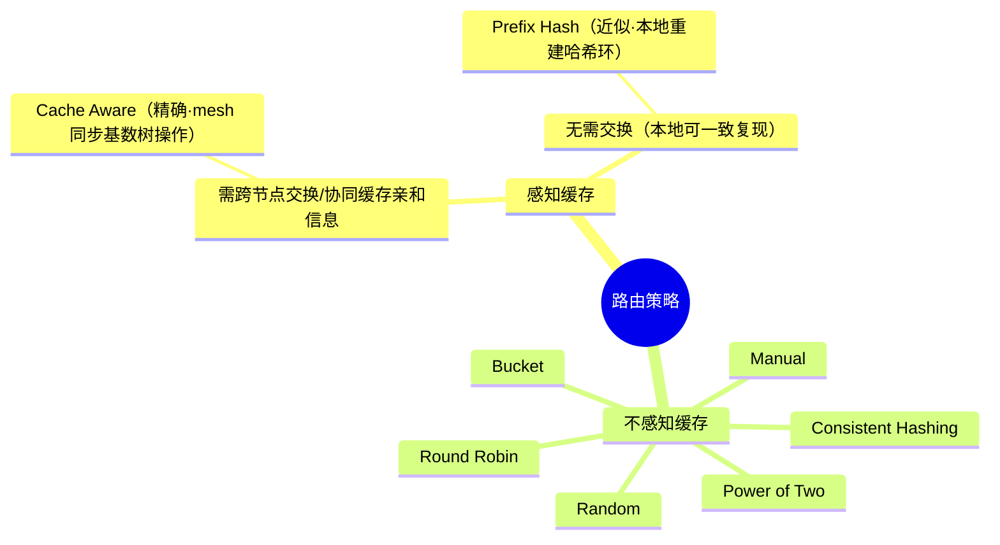

# 负载均衡路由策略深度拆解

> 本文档以第一性原理拆解 `sgl-model-gateway` 中 `src/policies/` 下的全部路由策略，
> 说明每种算法「解决什么底层矛盾、以什么结构运转、边界在哪里、为何演化出来」。
> 所有策略均实现统一的 [`LoadBalancingPolicy`](./mod.rs) trait，
> `select_worker` 返回被选中 Worker 在候选数组中的下标。
>
> 本文档为**总览**，仅保留每种算法的核心原理与取舍。较复杂的算法另有独立详解文档（含数学推导、实现细节）：
> - [POWER_OF_TWO_ZH.md](./POWER_OF_TWO_ZH.md) — Power of Two Choices（二选一）
> - [PREFIX_HASH_ZH.md](./PREFIX_HASH_ZH.md) — Prefix Hash（前缀哈希）
> - [CONSISTENT_HASHING_ZH.md](./CONSISTENT_HASHING_ZH.md) — Consistent Hashing（一致性哈希）
> - [CACHE_AWARE_ZH.md](./CACHE_AWARE_ZH.md) — Cache Aware（缓存感知）
> - [manual.md](./manual.md) — Manual（手动/强会话亲和）
> - [BUCKET_ZH.md](./BUCKET_ZH.md) — Bucket（分桶）

---

## 0. 所有策略的公共底座

在讨论任何具体算法之前，必须先厘清一个所有策略共享的事实：**策略只在「健康且熔断允许执行」的 Worker 子集上做选择**。

```text
// src/policies/mod.rs
w.is_healthy() && w.circuit_breaker().can_execute()
```

即候选集并非全部 Worker，而是：

$$
\mathcal{H} = \{\, i \mid \text{healthy}(i) \wedge \text{can\_execute}(i) \,\}
$$

这条不变量把「可靠性」与「负载均衡」解耦：熔断/健康检查负责剔除坏节点，策略只负责在好节点里做**成本最优的位置选择**。这也是理解后续所有算法的前提——它们的差异只在于「如何在 $\mathcal{H}$ 内挑一个」。

### 0.1 路由问题的第一性矛盾

大模型推理路由的底层矛盾是：

$$
\text{决策必须在 } t_0 \text{ 完成，但真实成本 } C = C_{\text{prefill}}(L_\text{in}) + \sum_{t=1}^{L_\text{out}} C_{\text{decode}}(L_\text{in}+t) \text{ 依赖未知的 } L_\text{out}
$$

且可复用状态（KV/Prefix Cache）**绑定在特定 Worker 上**。因此路由不是「均分流量」，而是在信息不完备下求解：

$$
\arg\min_i \big( \underbrace{Q_i}_{\text{排队}} + \underbrace{C_i}_{\text{预估计算}} - \underbrace{H_i}_{\text{缓存复用收益}} + \underbrace{R_i}_{\text{故障/热点风险}} \big)
$$

**每种策略本质上都是对上式中某几项的近似估计与取舍**。下表先给出全局对照，后续章节逐一深挖。

| 策略 | 主要估计项 | 决策输入 | 内部状态 | 时间复杂度 | 核心取舍 |
|---|---|---|---|---|---|
| Random | 无（假设同质） | 候选集 | 无 | $O(1)$ | 零成本 vs 零信息 |
| Round Robin | 无（均分请求数） | 候选集 | 原子游标 | $O(1)$ | 请求数均衡 vs 忽略成本差异 |
| Power of Two | $Q_i$ | 负载采样 | 缓存负载表 | $O(1)$ | 极低观测成本改善尾延迟 |
| Prefix Hash | $H_i$（近似） | token 前缀 + 哈希环 | 无（依赖外部环） | $O(\log n)$ | 稳定前缀亲和 vs 精度 |
| Consistent Hashing | 亲和稳定性 | routing key / header | 哈希环 | $O(\log n)$ | 拓扑变化下最小迁移 |
| Cache Aware | $H_i$（精确）+ $Q_i$ | 请求文本 | 近似基数树 | $O(\text{prefix\_len})$ | 精确复用 vs 内存/维护成本 |
| Manual | 强会话亲和 | routing key | key→Worker 映射 | $O(1)$ | 绝对粘性 vs 负载偏斜 |
| Bucket | PD 分桶均衡 | PD 请求特征 | 分桶状态 | ~$O(1)$ | PD 场景专用 |

---

## 1. Random（随机）

**实现**：`src/policies/random.rs` — 在 $\mathcal{H}$ 中均匀随机取一个下标。

### 第一性原理降维
Random 显式假设 $C_i \approx C,\ H_i = 0$，即**所有 Worker 同质、无可复用状态**。在此假设下，任何单次决策都无法比随机更优（因为没有任何可利用的信息），随机反而以 $O(1)$ 无状态开销获得长期期望均衡：

$$
\mathbb{E}[\text{load}_i] = \frac{\lambda}{|\mathcal{H}|}
$$

### 高阶结构化类比
等价于操作系统中最原始的**无优先级随机调度**，或哈希表的**均匀散列假设**——它不追求单次最优，只保证在大数定律下不产生系统性偏斜。

### 边界与反模式
- **边界**：与 Round Robin 的区别在于 Random 是无记忆的（马尔可夫性），不保证任意窗口内的均匀，只保证期望均匀。
- **反模式**：当请求成本方差极大（大模型典型场景）时，随机会以一定概率把多个长请求砸到同一 Worker，制造尾延迟。它是**基线**，不是优化解。

### 演进动机
它是「假设后端同质」时代的遗留最优解。一旦承认 $C_i$ 方差大、$H_i \neq 0$，Random 立即退位为兜底基线。

---

## 2. Round Robin（轮询）

**实现**：`src/policies/round_robin.rs` — 原子计数器 `fetch_add(1)` 后对 $|\mathcal{H}|$ 取模。

### 第一性原理降维
Round Robin 用一个**全局原子游标**把「随机的期望均匀」升级为「确定性的请求数均衡」：

$$
\text{selected} = (\text{counter}_{k}) \bmod |\mathcal{H}|
$$

它消除了 Random 的方差，但代价是引入了**共享可变状态**（原子变量），并隐含一个更强的错误假设：**每个请求成本相等**。

### 高阶结构化类比
等价于时间片轮转调度（Time-Slice Round Robin）在「假设每个进程时间片等长」下的退化形式；也类似 DNS 轮询。

### 边界与反模式
- **边界**：与 Random 的分界线是「有无记忆」。Round Robin 有 $O(1)$ 状态，能保证任意 $N$ 个连续请求恰好覆盖各 Worker 一次。
- **极限**：健康集合 $\mathcal{H}$ 动态变化时，取模基准会漂移，严格轮转性被破坏（这是不可避免的，因为候选集在变）。
- **反模式**：把「请求数均衡」误当「负载均衡」。10 个短请求 + 1 个超长请求下，轮询会让承接长请求的 Worker 严重过载。

### 演进动机
它是对 Random 方差的第一次修正。`reset()` 存在的意义正是承认其**有状态性**需要可清零。

---

## 3. Power of Two Choices（二选一）

**实现**：`src/policies/power_of_two.rs` — 随机抽 2 个 Worker，比较负载取低者。

### 第一性原理降维
这是本仓库唯一真正估计 $Q_i$（实时负载）的**轻量**策略。它的精髓不在「选负载低的」，而在「**只看两个**」：

$$
\text{selected} = \arg\min_{i \in \{a,b\}} \text{load}(i), \quad a,b \sim \text{Uniform}(\mathcal{H}),\ a \neq b
$$

理论结论（Mitzenmacher）：全局最忙 Worker 的期望负载从随机的 $O(\log n / \log\log n)$ 降到 $O(\log\log n)$——**只用两次采样就获得接近全局最优的尾部收益**，却避免了扫描全局带来的观测成本与「羊群效应」。负载信号优先用 token 级 `load_tokens`，缺失时两者一起降级为请求计数，保证量纲一致。

### 高阶结构化类比
等价于分布式哈希负载均衡中的 **"the power of two random choices"**，也类比 CPU 调度里的**局部窥探**（只看邻近核心而非全局队列）以规避全局锁竞争。

### 边界与反模式
- **边界**：与「全局最少负载」的分界线是**观测范围**。全局最少负载会因所有请求同时看到同一个「最空闲」节点而振荡；二选一用随机采样天然打散这种同步。
- **极限**：负载数据严重过期时退化为近似随机（负载由后台 `LoadMonitor` 定时刷新，存在陈旧窗口）。
- **反模式**：在负载信号缺失/延迟大的环境里强行相信采样值。

### 演进动机
推翻了「必须扫描全局才能优化尾延迟」的假设。它是**观测成本**与**均衡质量**之间的帕累托最优点。

> 📖 数学推导（$\log\log n$ 由来）、`load_tokens` 语义与更新周期等完整细节见 [POWER_OF_TWO_ZH.md](./POWER_OF_TWO_ZH.md)。

---

## 4. Prefix Hash（前缀哈希）

**实现**：`src/policies/prefix_hash.rs` — 取前 $N$ 个 token 做 xxhash，落到一致性哈希环，再做有界负载检查。

### 第一性原理降维
这是第一个显式优化 $H_i$（缓存复用）的策略，但用的是**近似手段**：

$$
\text{worker} = \text{Ring.lookup}\big(\text{xxh3}(\text{tokens}[0{:}N])\big), \quad N = \texttt{prefix\_token\_count}\ (\text{默认 }256)
$$

核心假设：**相同前缀 → 相同哈希 → 相同 Worker → KV Cache 命中**。但纯亲和会造成热点，因此加了**有界负载均衡**：候选 Worker 负载超过「人均 × `load_factor`」（默认 1.25）阈值时判定为过载，触发迁移。选路分为 RingHit（命中且不过载）、LoadBalanceWalk（过载则在未过载 Worker 中选最小负载）、FallbackLeastLoad（无环则选最小负载）三个分支。

### 高阶结构化类比
等价于 **NUMA 调度的缓存亲和 + 负载封顶**：优先让线程回到其缓存所在的 NUMA 节点，但当该节点过载时允许迁移，避免亲和性演变成拥塞。

### 边界与反模式
| 维度 | prefix_hash | cache_aware（基数树） |
|---|---|---|
| 查找 | $O(\log n)$ | $O(\text{prefix\_len})$ |
| 内存 | $O(\text{workers} \times v_n)$ | $O(\text{total\_tokens})$ |
| 精度 | 前缀分组（粗） | 精确最长前缀匹配 |

- **边界**：与 cache_aware 的分界线是**精度 vs 可预测性**——prefix_hash 用固定长度前缀分组换取稳定的 $O(\log n)$，放弃了精确匹配。
- **反模式**：`prefix_token_count` 设得过短会把不同请求错误聚合（假共享），过长则失去分组意义。

### 演进动机
它是 cache_aware「太重」时的轻量替代：用哈希近似代替显式前缀树，把更新成本从 $O(\text{prefix\_len})$ 降到 $O(1)$。

> 📖 `load_factor` 的精确计算方式与三分支选路逻辑等完整细节见 [PREFIX_HASH_ZH.md](./PREFIX_HASH_ZH.md)。

---

## 5. Consistent Hashing（一致性哈希）

**实现**：`src/policies/consistent_hashing.rs` — 预计算哈希环，支持 header 直连与 routing key 亲和。

### 第一性原理降维
一致性哈希优化的**不是实时负载**，而是**拓扑变化下的映射稳定性**。普通取模 $\text{hash}(k) \bmod n$ 在 $n$ 变化时几乎全部重映射；一致性哈希把 Worker 和 key 都映射到同一个环上，key 顺时针找第一个健康 Worker：

$$
\text{扩缩容时迁移的 key 比例} \approx \frac{1}{N} \quad (\text{而非取模的近 } 100\%)
$$

代码中环由 `WorkerRegistry` 预构建缓存（非每请求重建），保证 $O(\log n)$ 二分查找 + $O(k)$ 跳过连续不健康节点。其决策优先级为：

1. `X-SMG-Target-Worker`：按下标直连（$O(1)$）
2. `X-SMG-Routing-Key`：显式 key 一致性哈希
3. 隐式 key（authorization/x-forwarded-for/cookie 等稳定头）做会话亲和
4. 随机兜底

### 高阶结构化类比
经典的 **Chord DHT / Amazon Dynamo** 环形拓扑——把节点与 key 映射到同一个首尾相接的哈希环，key 顺时针找第一个健康节点作为归属，用「环 + 顺时针查找」把「成员变更的爆炸半径」限制在 $1/N$。`HashRing` 借用 Dynamo 的**虚拟节点**思路改善分布均匀性。

### 边界与反模式
- **边界**：与 Manual 的分界线是**扩容行为**。一致性哈希在加节点时**会**重分布约 $1/N$ 的 key；Manual 加节点时**完全不**重分布已有会话。
- **极限**：Worker 数很少（如 2~3 个）时环的均匀性差，需虚拟节点缓解。
- **反模式**：把一致性哈希当负载均衡器用——它天然不感知实时负载，热 key 会持续压在同一节点。

### 演进动机
推翻了「取模映射」在动态拓扑下的可用性假设，是所有需要「稳定亲和 + 弹性伸缩」场景的基石。

> 📖 环形拓扑原理、Chord/Dynamo 溯源与 $1/N$ 迁移量推导等完整细节见 [CONSISTENT_HASHING_ZH.md](./CONSISTENT_HASHING_ZH.md)。

---

## 6. Cache Aware（缓存感知）

**实现**：`src/policies/cache_aware.rs` + `src/policies/tree.rs` — 每个 Worker 维护近似基数树，在「缓存亲和」与「最短队列」间动态切换。

### 第一性原理降维
Cache Aware 是唯一**精确**估计 $H_i$ 的策略，也是最能体现「路由=在线调度」本质的策略。它对每个 Worker 用**近似基数树**（存原始字符而非 token，省去分词开销）记录历史请求前缀，从而精确计算最长前缀匹配率。

其核心是一个**双模式动态切换**：

$$
\text{imbalanced} \iff (\text{max} - \text{min}) > \tau_\text{abs} \;\wedge\; \text{max} > \tau_\text{rel} \cdot \text{min}
$$

- **系统均衡** → 走**缓存亲和**：
  - 若最高匹配率 > `cache_threshold`（默认 0.5）→ 路由到匹配最高的 Worker（复用 KV）；
  - 否则 → 路由到**树最小**的 Worker（缓存容量最富余）。
- **系统失衡** → 走**最短队列**：直接路由到 pending 最少的 Worker，牺牲缓存换取负载再平衡。

背景任务周期性 LRU 淘汰树叶节点（`eviction_interval_secs`、`max_tree_size`）以约束内存。特别地，树以 `pool::model` 为 key 隔离 prefill/decode/regular 池，防止交替调用互相驱逐。

### 高阶结构化类比
最贴切的类比是 **NUMA 感知操作系统调度器**：
| OS 调度器 | Cache Aware |
|---|---|
| CPU 本地缓存亲和 | KV/Prefix Cache 亲和 |
| 工作集迁移成本 | 重新 Prefill 成本 |
| 负载失衡时抢占迁移 | 失衡时切最短队列 |

它精确回答了那个反直觉命题：**最空闲的实例未必最优**——只要 $Q_A - H_A < Q_B - H_B$，选更忙但有缓存的 $A$ 反而完成更快。

### 边界与反模式
- **边界**：与 prefix_hash 的分界线是**精确 vs 近似**（基数树最长匹配 vs 固定前缀哈希）。
- **极限**：请求完全无共享前缀时，基数树退化为纯开销，此时应回退到更轻的策略。
- **反模式**：**缓存亲和绝对优先**。若只追 $\arg\max_i H_i$，会形成「缓存越热→流量越集中→缓存越热」的正反馈灾难。代码用「双阈值失衡检测 + 切最短队列」正是为破除此正反馈。

### 演进动机
它推翻了「所有健康实例等价」的假设，把路由从「无状态副本选择」进化为「**状态位置选择**」——这是模型网关区别于普通 L4/L7 负载均衡器的分水岭。

> 📖 双模式切换、基数树结构与 NUMA 类比等完整细节见 [CACHE_AWARE_ZH.md](./CACHE_AWARE_ZH.md)。

---

## 7. Manual（手动/强会话亲和）

**实现**：`src/policies/manual.rs` — 每个 routing key 粘死到固定 Worker，仅在其失联时才重映射，保留最多 2 个候选做快速故障切换。

### 第一性原理降维
Manual 追求的是**绝对粘性**，其不变量强于一致性哈希：

$$
\text{key} \mapsto \text{Worker} \text{ 一经建立，除非该 Worker 不健康，否则永不改变（即使扩容）}
$$

它维护 `key → [worker₁, worker₂]`（`MAX_CANDIDATE_WORKERS = 2`）映射，主 Worker 挂了立即切备用，避免会话中断。

### 高阶结构化类比
等价于**有状态服务的 sticky session**（如传统 Java 应用服务器的会话粘滞），或数据库的**主-备绑定**——上下文存在特定节点上，迁移意味着状态丢失。

### 边界与反模式
- **边界**：与一致性哈希的唯一但关键区别——**扩容不触发任何已有会话迁移**（一致性哈希会迁移 $1/N$）。用于「会话上下文存储在 Worker 本地」的强状态场景。
- **反模式**：长尾会话导致的**负载偏斜**——某些 key 极热而绑定关系又不允许迁移，会让个别 Worker 持续过载。需靠 `max_idle_secs` 淘汰空闲绑定缓解。

### 演进动机
当「会话状态无法廉价重建」时，一致性哈希的 $1/N$ 迁移都不可接受，于是演化出「只在故障时才动」的绝对粘性策略。

> 📖 执行分支、候选故障切换/恢复语义、三种分配模式与分布式兼容性等完整细节见 [manual.md](./manual.md)。

---

## 8. Bucket（分桶）

**实现**：`src/policies/bucket.rs` — 按 **请求长度（字符数）** 把 Prefill Worker 划分为若干「桶」，每个 Worker 负责一段长度区间；后台线程按滑动窗口内的真实负载**动态重划边界**，主要服务 PD（Prefill/Decode 分离）场景的 **prefill_policy**。

### 第一性原理降维
Bucket 的核心洞察是：**Prefill 阶段的计算成本近似正比于输入长度**。因此，与其在请求到达时估计每个 Worker 的排队/缓存状态，不如**按输入长度做静态分片**——让"长请求"和"短请求"分别落到固定的 Worker，从而把「重活」隔离开，避免长短请求混在同一实例上互相拖尾。

它把连续的长度轴 $[0, \infty)$ 切成 $N$ 段（$N$ = prefill worker 数），每个 Worker 认领一段区间 `[min, max]`：

$$
\text{route}(x) = \text{Worker}_k \quad\text{s.t.}\quad x \in [\text{min}_k,\ \text{max}_k]
$$

其中 $x$ 是本次请求的**字符数**（`request_text.chars().count()`，故 `needs_request_text() = true`）。选桶用**二分查找** `find_boundary`（边界有序），复杂度 $O(\log N)$。

策略采用**双层机制**：请求期以分桶为主，用双阈值检测失衡、失衡时降级为最小负载 Worker；后台线程每隔 `bucket_adjust_interval_secs`（默认 5s）按滑动窗口内的真实负载分位**重划桶边界**（含迟滞保护避免抖动）。桶以 `normalize_model_key(model_id)` 为 key 按模型隔离。

### 高阶结构化类比
类似磁盘的**分区/分级存储**或数据库的**范围分片（range sharding）**——按 key（这里是"请求长度"）的区间把负载路由到固定分片，再用后台任务按实际数据分布**动态调整分片边界**（类比 HBase Region Split / 自动 rebalance）。也可类比 CPU 调度里把长短任务分到不同队列的**多级队列**思想。

### 边界与反模式
- **边界**：适用范围窄，主要作为 PD 分离的 **prefill_policy**（长度 ≈ prefill 计算量时最有效），不建议作为通用 Regular 流量默认策略。
- **与 Cache Aware 的区别**：两者都用"双阈值失衡检测 + 降级"，但 Bucket 的一等公民是**请求长度分片**（无状态、可预测），Cache Aware 的一等公民是**前缀缓存亲和**（有状态）。Bucket 不感知 KV 缓存。
- **反模式**：
  - 当请求长度与真实计算成本**弱相关**时（如长度相近但难度差异大），长度分桶失去意义。
  - 迟滞阈值（2×）设置过松会导致边界长期不更新、分桶僵化；过紧则边界抖动、路由不稳定。
  - 长度分布极度长尾时，个别覆盖超长区间的 Worker 可能持续偏载，依赖失衡降级兜底。

### 演进动机
在 PD 分离下，prefill 是"算力密集、成本随长度线性增长"的阶段。把"按长度分片 + 按负载自适应重划边界"结合，既保留了**同长度请求路由稳定**的可预测性，又通过后台再平衡与请求期失衡降级，避免了静态分片在流量倾斜时的僵化——这是为"长度即成本"这一 prefill 特性量身定制的均衡器。

> 📖 双层机制（请求期分桶 + 后台边界重划）、关键数据结构与初始边界等完整细节见 [BUCKET_ZH.md](./BUCKET_ZH.md)。

---

## 8.5 各路由策略异同点横向比较

前面各章「纵向」深挖了每种策略的原理，本节从若干正交维度做「横向」对照，帮助在同一坐标系里看清它们的异同与取舍。

### 8.5.1 总览对比表

| 维度 | Random | Round Robin | Power of Two | Prefix Hash | Consistent Hashing | Cache Aware | Manual | Bucket |
|---|---|---|---|---|---|---|---|---|
| **核心目标** | 期望均匀 | 请求数均匀 | 抑制尾延迟 | 前缀亲和(近似) | 拓扑稳定亲和 | 前缀亲和(精确) | 绝对会话粘性 | 长度分片均衡 |
| **主要估计项** | 无 | 无 | $Q_i$ | $H_i$(近似) | 亲和稳定性 | $H_i$(精确)+$Q_i$ | 会话绑定 | 长度→成本 |
| **是否感知负载** | 否 | 否 | 是(采样) | 是(有界) | 否 | 是(失衡切换) | 否 | 是(失衡切换) |
| **是否感知缓存** | 否 | 否 | 否 | 是(近似) | 否 | 是(精确) | 否 | 否 |
| **决策输入** | 候选集 | 候选集 | 负载采样 | token前缀+环 | key/header | 请求文本 | routing key | 请求字符数 |
| **内部状态** | 无 | 原子游标 | 负载缓存表 | 无(依赖外部环) | 哈希环 | 近似基数树 | key→Worker映射 | 分桶+滑窗 |
| **时间复杂度** | $O(1)$ | $O(1)$ | $O(1)$ | $O(\log n)$ | $O(\log n)$ | $O(\text{prefix\_len})$ | $O(1)$ | $O(\log N)$ |
| **空间复杂度** | $O(1)$ | $O(1)$ | $O(\text{workers})$ | $O(1)$ | $O(\text{workers}\times v_n)$ | $O(\text{total\_tokens})$ | $O(\text{keys})$ | $O(\text{window})$ |
| **确定性** | 无(随机) | 确定 | 半随机 | 确定(同前缀) | 确定(同key) | 半确定(随负载切换) | 确定(粘死) | 确定(同长度) |
| **扩缩容迁移量** | — | — | — | ~$1/N$(环) | ~$1/N$ | 自适应 | 0(已有会话) | 重划边界 |
| **需请求文本** | 否 | 否 | 否 | 否(需token) | 否 | 是 | 否 | 是 |

### 8.5.2 策略分类脑图（按缓存维度）

下图先按**是否感知缓存**把全部策略一分为二；对于感知缓存的策略，再按**缓存亲和信息是否需要跨节点交换/协同（mesh 同步）**进一步细分。

> ⚠️ 说明：**当前实现中没有任何策略会直接向 worker 节点查询/交换 KV Cache 内容**。感知缓存的策略都是靠**本地维护的近似结构**（前缀哈希环 / 近似基数树）来*推断*缓存命中，而非与 worker 交换 cache 信息。因此第二层的「交换」特指**router 节点之间**对缓存亲和状态的协同：Cache Aware 在 mesh 下通过 CRDT 同步基数树操作，Prefix Hash 则靠各节点从一致的 worker 列表**本地重建**哈希环、无需交换缓存状态。



> 补充：Cache Aware 之所以落在「需跨节点协同」一支，是因为它的基数树是**节点私有状态**，多节点部署若不经 mesh 同步会各自为政、命中率随节点数下降；而 Prefix Hash / Consistent Hashing 的亲和可由「一致的 worker 列表 + 相同哈希函数」在各节点**无状态复现**，天然一致，无需交换任何缓存/亲和状态（详见 8.5.6）。

### 8.5.3 三条主轴上的谱系定位

绝大多数差异可以投影到三条正交主轴上：

**① 信息利用度（无信息 → 全信息）**

$$
\text{Random} \prec \text{Round Robin} \prec \text{Power of Two} \prec \text{Prefix Hash} \prec \text{Cache Aware}
$$

从「假设后端完全同质、零信息」逐步演进到「精确感知每台机器的缓存内容与实时负载」。信息越多，单次决策越接近最优，但观测/维护成本也越高。

**② 亲和强度（无亲和 → 绝对粘性）**

$$
\text{Random/RR} \prec \text{Power of Two} \prec \text{Cache Aware} \prec \text{Consistent Hashing} \prec \text{Manual}
$$

从「不关心请求落在哪」到「同一 key 永远粘死同一 Worker」。亲和越强，缓存/会话复用越好，但负载偏斜风险越大、弹性越差。

**③ 均衡刚性（柔性期望均衡 → 刚性约束均衡）**

$$
\text{Random(柔)} \prec \text{Power of Two} \prec \text{Round Robin} \prec \text{Bucket(按长度硬分片)}
$$

从「靠大数定律长期均匀」到「用确定规则强约束分配」。

> 关键洞察：**亲和强度与均衡刚性天然对抗**。Cache Aware / Prefix Hash / Bucket 之所以都内置「双阈值失衡检测 + 降级」，正是为了在这条对抗轴上安放一个可调的安全阀——平时吃亲和红利，失衡时退回均衡。

### 8.5.4 关键「分界线」速查（两两易混策略的本质区别）

| 对比 | 相同点 | 本质区别（分界线） |
|---|---|---|
| Random vs Round Robin | 都不感知成本/缓存，$O(1)$ 无输入依赖 | **有无记忆**：Random 无状态只保证期望均匀；RR 有原子游标保证任意 $N$ 连续请求恰好各覆盖一次 |
| Round Robin vs Power of Two | 都不感知缓存 | **是否感知负载**：RR 假设每请求等成本；P2C 用两次采样估计真实负载 $Q_i$，专治成本方差大 |
| Power of Two vs 全局最少负载 | 都选负载低者 | **观测范围**：P2C 只看 2 个、用随机采样打散羊群效应；全局最少会因同步涌向"最空节点"而振荡 |
| Prefix Hash vs Cache Aware | 都优化前缀缓存复用 $H_i$ | **精度 vs 可预测**：前者固定长度前缀哈希、$O(\log n)$ 稳定；后者基数树精确最长匹配、$O(\text{prefix\_len})$ |
| Prefix Hash vs Consistent Hashing | 都基于哈希环 | **优化对象**：前缀哈希优化"相同前缀→同 Worker"的缓存命中；一致性哈希优化"拓扑变化下映射稳定" |
| Consistent Hashing vs Manual | 都做 key→Worker 亲和 | **扩容行为**：一致性哈希扩容迁移 $1/N$；Manual 扩容对已有会话**零迁移**（只在故障时才动） |
| Cache Aware vs Bucket | 都用"双阈值失衡检测 + 降级最小负载" | **一等公民**：Cache Aware 是**前缀缓存亲和**(有状态)；Bucket 是**请求长度分片**(无状态、不感知 KV) |

### 8.5.5 失衡降级机制对比（三个"双模式"策略）

Power of Two、Cache Aware、Bucket 都会在某种"失衡"下切换行为，但触发条件与降级目标不同：

| 策略 | 常态模式 | 失衡判据 | 降级模式 | 负载指标 |
|---|---|---|---|---|
| Power of Two | 两采样取低者 | 无显式失衡开关（本身即抑制热点） | — | token 负载(退化为请求计数) |
| Prefix Hash | 哈希环命中 Worker | `load(w) > avg×load_factor` | 同样满足 load_ok 的最小负载 Worker | 活跃请求数 |
| Cache Aware | 前缀亲和 / 树最小 | $(max-min)>\tau_{abs} \wedge max>\tau_{rel}\cdot min$ | pending 最少的 Worker | pending 请求数 |
| Bucket | 按长度二分命中桶 | 同 Cache Aware 双阈值 | 累计字符最少的 Worker | 滑窗内累计字符数 |

可见 Prefix Hash 用「人均×倍率」的**有界负载**做单点判据，而 Cache Aware/Bucket 用「极差 + 比值」的**双阈值**做全局判据——前者防单点过热，后者防全局倾斜。

### 8.5.6 状态与故障行为对比

| 策略 | 有无共享可变状态 | 需后台任务 | 扩缩容影响 | 单 Worker 故障时 |
|---|---|---|---|---|
| Random | 无 | 否 | 立即纳入候选 | 健康集自动剔除 |
| Round Robin | 原子游标 | 否 | 取模基准漂移 | 健康集自动剔除 |
| Power of Two | 负载缓存表 | 是(LoadMonitor 定时拉取) | 下周期纳入 | 剔除+缓存陈旧窗口 |
| Prefix Hash | 无(环外部维护) | 否 | 环重建、迁移 $1/N$ | 顺时针跳过 |
| Consistent Hashing | 哈希环 | 否(环由 Registry 预建) | 迁移 $1/N$ | 顺时针跳到下一健康节点 |
| Cache Aware | 每 Worker 基数树 | 是(LRU 淘汰) | 树自适应 | 剔除+对应树弃用 |
| Manual | key→Worker 映射 | 是(idle 淘汰) | 已有会话不迁移 | 立即切备用候选(最多2个) |
| Bucket | 分桶+滑窗队列 | 是(定时重划边界) | 重置边界 | 移除 URL、重划边界 |

### 8.5.7 分布式部署（多 router 节点）各策略的额外兼容性工作

当把网关从单实例扩展为 **多 router 节点 Mesh 集群**（`--enable-mesh`，见 [MESH_DEPLOYMENT.md](../../MESH_DEPLOYMENT.md)）时，每个节点各自持有一份策略内部状态。策略状态是否需要、以及如何跨节点保持一致，直接决定了路由质量。理解这一点要先厘清 **Mesh 到底同步了什么**：

> **名词解释：Gossip 协议与 CRDT 同步是什么**
>
> **Gossip（流言）协议**是一种去中心化的状态传播方式：每个 Router 周期性地把自己知道的信息告诉少量其他 Router，其他 Router 再继续传播，类似“口口相传”。它不依赖中心节点，容错性和扩展性较好，但状态不会瞬间到达所有节点，只能保证经过若干轮传播后最终趋于一致。因此，短时间内不同 Router 看到的 Worker、负载或缓存索引状态可能不同。
>
> **CRDT（Conflict-free Replicated Data Type，无冲突复制数据类型）** 是一类特殊设计的数据结构，让多个副本**各自独立更新、无需加锁或中心协调，最终仍能自动收敛到一致状态**。其合并操作在数学上满足**交换律、结合律、幂等性**，因此无论网络乱序、重复、延迟，各节点反复合并邻居状态后结果必然相同——即**强最终一致性（Strong Eventual Consistency）**，无需 Paxos/Raft 这类强共识。
>
> 实现上分两种风格：**状态型（CvRDT）** 周期广播整个状态并 `merge()`；**操作型（CmRDT）** 只广播增量操作再重放。本项目中：
> - **Worker 成员/健康/负载状态** 走状态收敛（`mesh_sync.sync_worker_state`）；
> - **Cache Aware 基数树** 走**操作型**：广播 `TreeOperation::Insert` / `Remove` 树操作（`sync_tree_operation`），各节点重放后收敛一致。
>
> 代价是同步为「**最终**一致」而非「立即」一致——存在 **gossip 传播延迟窗口**，这也是下文多处「mesh 收敛延迟」的由来。

**Gossip 与直接广播的对比。** 这里的“直接广播”是指状态产生节点立即将更新发送给集群内所有其他节点；Gossip 则是每个节点每轮只把状态传播给少量节点，再由接收者继续扩散。

| 对比项 | 直接广播 | Gossip |
|---|---|---|
| 传播方式 | 源节点一次 fan-out 到其余 $N-1$ 个节点 | 每个节点每轮只联系少量邻居，多轮扩散 |
| 理想传播延迟 | 一轮网络传输，通常较低 | 约 $O(\log N)$ 轮，存在最终一致窗口 |
| 源节点发送压力 | $O(N)$，更新密集时容易成为瓶颈 | 通常每轮 $O(1)$，压力分散到集群 |
| 网络流量特征 | 短时间集中，容易产生流量尖峰 | 分散在多轮中，但可能有重复消息 |
| 故障容忍 | 单次发送失败会遗漏，需要额外重试/确认机制 | 同一状态可经多条路径传播，后续轮次可自然补偿 |
| 一致性表现 | 更快接近全量可见，但不等于强一致 | 最终一致，短时间内各节点视图可能不同 |
| 实现复杂度 | 小集群下简单直观；规模扩大后需处理连接、重试和背压 | 需处理周期、邻居选择、去重、版本合并和收敛监控 |
| 扩展性 | 节点越多，源节点和瞬时网络压力越大 | 更适合大规模、频繁更新的集群 |

- **直接广播的优势**：传播快、路径直接、行为容易理解；**劣势**是源节点承担线性 fan-out 压力，频繁更新时容易出现瞬时流量尖峰，单次失败还需主动重试。适合**节点较少、更新频率较低、要求快速可见**的集群，例如向几台 Router 下发少量配置。
- **Gossip 的优势**：去中心化、单节点压力低、扩展性和容错性较好；**劣势**是传播更慢、存在重复消息和短暂状态分歧。适合**节点较多、状态更新频繁、允许最终一致**的集群，例如持续同步 Worker 健康、负载及缓存索引元数据。
- **选择不只取决于节点数**：即使 Router 较少，若更新频率和数据量很高，Gossip 仍可避免广播尖峰；即使节点较多，若某项控制指令要求立即、可确认地生效，也应使用带 ACK/重试的广播或更强的协调机制。若业务要求强一致，单纯广播和 Gossip 都不够，需要 Raft 等共识协议。

**Mesh 已经全局同步的公共底座（所有策略免费共享）：**

- **Worker 成员与健康/负载状态**：由 `WorkerRegistry` 通过 `mesh_sync.sync_worker_state` 用 CRDT 同步（见 `src/core/worker_registry.rs`）。因此所有节点看到**一致的健康 Worker 集合 $\mathcal{H}$**。
- **哈希环**：并非直接同步环本身，而是各节点**从同步后的 worker 列表本地重建**（`rebuild_hash_ring`）。因为哈希函数与 worker 集合确定，各节点重建出的环**天然一致**，无需额外同步。

**Mesh 不会自动同步的部分：策略私有的内部状态**。`LoadBalancingPolicy::set_mesh_sync` 默认是空实现，**当前仅 `CacheAwarePolicy` 真正接入了 mesh**（同步基数树操作）。其余策略的内部状态都是**节点本地**的。

据此，各策略在分布式下需处理的额外兼容性工作如下：

| 策略 | 私有状态是否需跨节点一致 | 当前 mesh 支持 | 分布式下的额外兼容性工作 / 影响 |
|---|---|---|---|
| **Random** | 否 | 天然兼容 | 无。无状态，各节点独立随机，期望均匀性不受节点数影响。 |
| **Round Robin** | 游标建议一致，但非必须 | 未同步（游标本地） | 各节点持有独立原子游标 → **全局不再是严格轮转**，只是「N 份独立轮转」的叠加。总体仍近似均匀，通常可接受；若要严格全局轮转需自行引入共享计数器（不推荐，热点）。 |
| **Power of Two** | 否（负载已全局同步） | 负载经 Worker 状态同步 | 基本兼容。负载信号来自全局同步的 Worker 状态，各节点看到一致负载视图。注意**采样是各节点独立随机**，多节点并发采样可能短暂放大对某 Worker 的偏好，但 P2C 的随机性本身即可打散，影响有限。 |
| **Prefix Hash** | 否（环可本地重建一致） | 环一致 + 负载全局同步 | 兼容性最好之一。相同前缀在任意节点都哈希到**同一 Worker**，天然跨节点缓存亲和；有界负载判据用的是全局同步负载，判定一致。**无需额外工作**。 |
| **Consistent Hashing** | 否（环可本地重建一致） | 环一致 | 兼容性最好之一。相同 routing key 在任意节点映射到**同一 Worker**，会话亲和天然跨节点成立；扩缩容时各节点基于一致的 worker 列表重建环，迁移集合一致。**无需额外工作**。 |
| **Cache Aware** | **是**（前缀树必须协同） | **已接入 mesh**（唯一） | 需要 mesh，否则各节点独立维护基数树 → 命中率随节点数下降。启用后通过 `sync_tree_operation` / `apply_remote_tree_operation` 同步树操作（CRDT），并在 `set_mesh_sync` 时 `restore_tree_state_from_mesh` 恢复。**代价**：树操作的 gossip 流量与最终一致延迟；失衡判据用的 pending 是本地计数，各节点可能对失衡判断不完全同步。 |
| **Manual** | **是**（绑定必须一致才粘性） | **未同步**（绑定本地） | ⚠️ **最需注意**。`key → [worker₁, worker₂]` 绑定存于**本地 DashMap，不跨节点同步**。多节点下同一 key 若被负载均衡打到不同 router 节点，各节点可能**独立建立不同绑定**，破坏「绝对粘性」。兼容做法：① 在入口层用 **一致性哈希/会话保持** 把同一 key 的请求固定路由到同一 router 节点；或 ② 改用 Consistent Hashing（其亲和可无状态跨节点复现）。 |
| **Bucket** | 边界建议一致，但非必须 | 未同步（分桶+滑窗本地） | 各节点独立维护滑动窗口与桶边界 → 不同节点的边界可能因各自看到的局部流量而**短暂分化**。因边界重划是自适应的，长期趋同、总体仍均衡；对可预测性要求高时需接受这种节点间边界差异。 |

**一句话总结**：**无状态策略（Random）与「亲和可由公共底座无状态复现」的策略（Prefix Hash、Consistent Hashing）在分布式下零额外成本**；**依赖全局负载的策略（Power of Two）靠 Worker 状态同步即可**；**依赖策略私有状态的策略里，只有 Cache Aware 做了 mesh 同步，而 Manual 的会话绑定不跨节点同步，是多节点部署下最需要在入口层额外兜底的策略**；Round Robin、Bucket 的本地状态不影响正确性、只影响全局均衡的严格程度。

### 8.5.8 路由节点冷启动需要进行的工作

一个新的 router 节点从进程启动到能够正确参与路由，需要依次完成若干**初始化与状态引导（bootstrap）**工作。这些工作的核心目标是：让新节点在开始接客前，尽可能补齐路由决策所依赖的三类状态——**worker 成员/健康视图、策略私有状态、负载视图**。冷启动期是路由质量最脆弱的窗口，理解各步骤有助于避免「刚启动就误路由」。

**① 装载 worker 成员并建立初始健康视图。**
- 单实例：从静态配置 / 启动参数注册初始 worker，随后由后台健康检查器（`WorkerRegistry::start_health_checker`，见 `src/server.rs`）填充健康状态；若启用了 Kubernetes 服务发现（`start_service_discovery`），则从 API Server 拉取当前 Pod 列表并持续 watch。
- Mesh 集群：新节点加入后，`WorkerRegistry` 会通过 `set_mesh_sync` 接入 CRDT 同步（`src/core/worker_registry.rs`），从集群其他节点**收敛出全局一致的 worker 成员与健康/负载状态**。这一步是后续所有策略的公共底座。
- ⚠️ **冷启动窗口**：健康检查有首个探测周期、mesh 收敛有 gossip 传播延迟。在健康视图补齐前，健康 Worker 集合 $\mathcal{H}$ 可能偏小，应结合就绪探针（readiness）延迟接入流量，避免把请求路由到尚未确认健康的 worker。

**② 重建 / 恢复策略私有状态。** 各策略在冷启动时的工作量差异很大：

| 策略 | 冷启动需做的工作 | 是否需要预热 |
|---|---|---|
| **Random** | 无 | 否，立即可用 |
| **Round Robin** | 初始化本地原子游标（从 0 或随机相位） | 否 |
| **Power of Two** | 等待 `LoadMonitor` 首轮拉取负载填充 `cached_loads`；填充前缺失即降级为本地请求计数 | 轻微，首个采集周期内保真度略低 |
| **Prefix Hash / Consistent Hashing** | 从**已收敛的 worker 列表本地重建哈希环**（`rebuild_hash_ring`），无需跨节点同步环本身 | 否，环重建后即恢复一致亲和 |
| **Cache Aware** | 通过 `set_mesh_sync` 触发 `restore_tree_state_from_mesh`，从 mesh 恢复已同步的基数树（`src/policies/cache_aware.rs`）；非 mesh 部署则从空树开始 | **是**，空树期命中率低，需靠流量逐步重建前缀 |
| **Manual** | 从空的 `key → worker` 绑定 DashMap 开始 | **是**，历史会话绑定不跨节点/不跨重启保留，冷启动后同一 key 会被重新分配 |
| **Bucket** | 初始化滑动窗口与桶边界（冷启动时窗口无样本，边界为默认值） | 轻微，需若干窗口样本后边界才自适应稳定 |

**③ 启动后台服务。** 冷启动还需拉起若干后台任务，它们的首轮执行往往滞后于进程启动：
- **健康检查器**：周期性探测 worker，填充/刷新健康状态。
- **`LoadMonitor`**：仅当存在 Power-of-Two 策略时启动，周期性拉取 `total_tokens` 负载并推送给策略（`load_monitor.start()`）。
- **服务发现 watch**（可选）：持续将 worker 注册表与 K8s Pod 对齐。
- **mesh gossip**（可选）：加入集群、持续收发成员/状态/树操作的 CRDT 同步。

**④（Mesh）设置同步管理器的时机。** 如 `src/server.rs` 所示，`set_mesh_sync` 在注册表和策略注册表构建完成后统一设置：worker 注册表接入后开始收敛成员视图，策略注册表接入后 Cache Aware 才会执行树状态恢复。**顺序上先补 worker 视图、再恢复策略状态**，才能保证恢复出的树/环与最新 worker 集合一致。

**一句话总结**：冷启动的本质是**在开始接客前尽量补齐三类状态**——① 用配置/服务发现/mesh 收敛出一致的健康 worker 视图；② 按策略重建可无状态复现的部分（环）、恢复需持久协同的部分（Cache Aware 树），并接受无法恢复的部分（Manual 绑定、Bucket 边界）从零重建；③ 拉起健康检查、负载监控、服务发现、mesh 等后台任务。**无状态与「亲和可本地重建」的策略冷启动几乎零成本；Cache Aware、Manual、Bucket 存在预热期**，此期间应配合就绪探针延迟接入流量以规避误路由。

---

## 9. 统一收敛：如何选择策略

回到第 0 节的目标函数，各策略只是对不同项的侧重：

$$
\arg\min_i \big( Q_i + C_i - H_i + R_i \big)
$$

| 工作负载特征 | 推荐策略 | 理由 |
|---|---|---|
| 成本相近、无共享前缀 | Round Robin / Random | 无可利用信息，均分即最优 |
| 突发负载、成本方差大 | Power of Two | 低成本估计 $Q_i$，抑制尾延迟 |
| 大量相同 system prompt | Cache Aware | 精确最大化 $H_i$，兼顾失衡切换 |
| 前缀共享但要求稳定延迟 | Prefix Hash | 近似 $H_i$，$O(\log n)$ 可预测 |
| 多租户会话、动态扩缩容 | Consistent Hashing | 亲和 + $1/N$ 迁移 |
| 强状态会话、不可迁移 | Manual | 绝对粘性 + 故障切换 |
| PD 分离部署 | Bucket | 阶段异构分桶均衡 |

### 核心本质结论

> **路由策略的全部差异，本质是在「未来成本未知、可复用状态分散在不同机器」这一约束下，用不同精度、不同观测成本去估计「排队 + 计算 − 缓存复用 + 风险」，并在『利用已有状态』与『避免因利用状态而制造热点』之间划定各自的安全边界。**

