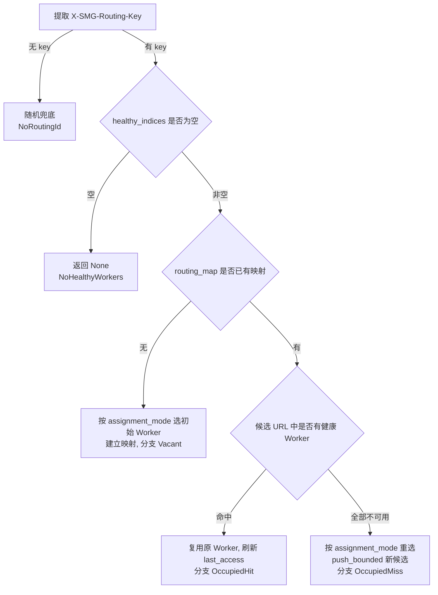

# Manual（手动/强会话亲和）策略详解

> 本文档是 [index.md](./index.md) 中「Manual」策略的深入拆解，
> 包含绝对粘性不变量、候选故障切换、TTL 驱逐与分配模式等细节。主文档仅保留概览。

**实现**：`src/policies/manual.rs` — 每个 routing key 粘死到固定 Worker，仅在其失联时才重映射，保留最多 2 个候选做快速故障切换。

## 第一性原理降维

Manual 追求的是**绝对粘性**，其不变量强于一致性哈希：

$$
\text{key} \mapsto \text{Worker} \text{ 一经建立，除非该 Worker 不健康，否则永不改变（即使扩容）}
$$

它维护 `key → [worker₁, worker₂]`（`MAX_CANDIDATE_WORKERS = 2`）映射，主 Worker 挂了立即切备用，避免会话中断。关键设计点：

- **映射存 URL 而非下标**：`Node.candi_worker_urls` 保存 Worker 的 URL。即使 Worker 列表增删/重排导致下标漂移，仍能通过 URL 找回原 Worker，保证粘性不因列表变动而失效。
- **有界候选列表**：`push_bounded` 保证候选最多 2 个（超出时移除最旧项），既限制内存，又保留最近一次故障转移目标。
- **访问即续期**：每次命中都刷新 `last_access`，避免仍在使用的映射被后台 TTL 任务误删。
- **原子「查询或创建」**：用 `DashMap::entry` 对当前 key 所在分片加锁，使并发同键请求原子地完成查询或建映射，避免各自建立不同初始绑定。

## 选路流程与执行分支

`select_by_routing_id` 是粘性的核心，返回 `(worker 下标, 执行分支)`，分支用于可观测性指标：

| 执行分支 | 触发条件 | 行为 |
|---|---|---|
| `NoHealthyWorkers` | 无任何健康 Worker | 返回 `None` |
| `NoRoutingId` | 请求未携带路由键（或为空） | 退回随机选择 |
| `Vacant` | 首次遇到该 key | 按 `assignment_mode` 选初始 Worker 并建映射 |
| `OccupiedHit` | 已有映射且候选中仍有健康 Worker | 复用原 Worker（会话粘死） |
| `OccupiedMiss` | 已有映射但候选全部不可用 | 重新分配并加入候选列表 |

**候选故障切换 / 恢复语义**（由测试固化）：
- 主 Worker 变不健康 → 立即切到候选中下一个健康 Worker（`OccupiedMiss`）。
- 原 Worker 恢复健康后，若它仍在候选列表且排在前面，请求会**自动切回原 Worker**（候选按历史顺序优先）。
- 因候选上限为 2，连续故障转移超过 2 个 Worker 后，最早的候选会被挤出——恢复后不再自动回切到已被挤出的 Worker。

## 高阶结构化类比

等价于**有状态服务的 sticky session**（如传统 Java 应用服务器的会话粘滞），或数据库的**主-备绑定**——上下文存在特定节点上，迁移意味着状态丢失。候选列表则类比主-备副本：主挂切备，主恢复回主。

## 边界与反模式

- **边界**：与一致性哈希的唯一但关键区别——**扩容不触发任何已有会话迁移**（一致性哈希会迁移 $1/N$）。用于「会话上下文存储在 Worker 本地」的强状态场景。
- **反模式**：长尾会话导致的**负载偏斜**——某些 key 极热而绑定关系又不允许迁移，会让个别 Worker 持续过载。需靠 `max_idle_secs` 淘汰空闲绑定缓解，或改用 `MinLoad` / `MinGroup` 分配模式在**首次分配**时做均衡。

## 演进动机

当「会话状态无法廉价重建」时，一致性哈希的 $1/N$ 迁移都不可接受，于是演化出「只在故障时才动」的绝对粘性策略。

## 参数配置

策略参数定义见 `PolicyConfig::Manual`（`src/config/types.rs`），默认值见 `ManualConfig::default`（`src/policies/manual.rs`）。

| 参数 | 类型 | 默认值 | 含义 | 调参影响 |
|---|---|---|---|---|
| `eviction_interval_secs` | `u64` | `60` | 后台 TTL 驱逐任务的扫描周期（秒）；为 `0` 时禁用驱逐 | 调小 → 更及时回收空闲映射但更频繁扫描；调大 → 内存回收滞后 |
| `max_idle_secs` | `u64` | `14400`（4 小时） | 映射在被驱逐前允许的最大空闲时间（秒）；为 `0` 时禁用驱逐 | 调小 → 空闲会话更快释放，但活跃度低的长会话可能被误删而丢粘性；调大 → 粘性保留更久、内存占用更高 |
| `assignment_mode` | `ManualAssignmentMode` | `random` | 遇到**新路由键**时的初始 Worker 分配方式 | 见下表 |

> `eviction_interval_secs` 与 `max_idle_secs` 任一为 `0` 时，`with_config` 不会启动后台驱逐任务（`_eviction_task = None`），映射将永久保留直到进程退出。

**`assignment_mode` 三种模式**（仅影响 `Vacant` / `OccupiedMiss` 的**首次/重新分配**，命中已有映射时不生效）：

| 模式 | 序列化值 | 依据指标 | 说明 | 适用场景 |
|---|---|---|---|---|
| `Random` | `"random"` | 无 | 从健康 Worker 中等概率随机挑选（默认） | 各 Worker 能力相近、key 数量大能自然均摊 |
| `MinLoad` | `"min_load"` | `Worker::load()`（在途请求数） | 选运行中请求数最少者，并列则随机打散 | 请求时长差异大，希望新会话导向更空闲实例 |
| `MinGroup` | `"min_group"` | `Worker::worker_routing_key_load()`（活跃路由键数） | 选绑定会话数最少者，并列则随机打散 | 希望各 Worker 承载的独立会话数尽量均匀 |

> 注意：无路由键时**始终走随机兜底**，即使配置了 `MinLoad` / `MinGroup` 也不生效（分配模式仅作用于「按 key 建立映射」的路径）。

## 下游 Worker 节点增删对本策略的影响

Worker 增删由 `WorkerRegistry` 感知。Manual 的私有状态是 `key → [worker_url…]` 的 `DashMap`，映射以 **URL** 为准，因此对拓扑变更的反应与其他策略显著不同：

- **新增 Worker**：**零重分布**——这是 Manual 相对一致性哈希的核心差异。已有 key 的映射完全不变，新 Worker 只会承接**此后新出现的 key**（且仅在 `MinLoad` / `MinGroup` 模式下更易被选中，因其负载/绑定数最低）。
- **移除 Worker**：绑定到该 Worker 的 key 在其变不健康时通过 `OccupiedMiss` 重新分配到候选中的下一个健康 Worker；若候选也已耗尽，则按 `assignment_mode` 从健康集合重选。被迁移的会话会**丢失原 Worker 上的上下文/缓存**，需重建。
- **临时不健康 vs 永久移除**：只要 URL 仍在候选列表且 Worker 恢复健康，请求会自动切回原 Worker（映射未被删除，只是暂时跳过）。
- **列表重排**：因映射存 URL 而非下标，Worker 列表的顺序变化不影响粘性。

**一句话**：Manual 是所有策略中**扩容代价最低**（零重分布）、但**缩容/故障代价按会话本地状态而定**的策略——粘性越强，节点丢失时的上下文重建成本越集中。

## 分布式部署（多 router 节点）的兼容性

⚠️ **Manual 是多节点部署下最需要额外兜底的策略**。`key → [worker…]` 绑定存于**本地 `DashMap`，不跨节点同步**（`LoadBalancingPolicy::set_mesh_sync` 对 Manual 是空实现）。多节点下同一 key 若被入口负载均衡打到不同 router 节点，各节点可能**独立建立不同绑定**，破坏「绝对粘性」。兼容做法：

1. 在入口层用**一致性哈希/会话保持**把同一 key 的请求固定路由到同一 router 节点；或
2. 改用 [Consistent Hashing](./consistent_hashing.md)（其亲和可无状态跨节点复现，代价是扩容迁移 $1/N$）。

## 冷启动行为

Manual 从**空的 `key → worker` 绑定 DashMap** 开始，历史会话绑定**不跨节点、不跨重启保留**。因此进程重启或新节点加入后，同一 key 会被**重新分配**（可能落到与重启前不同的 Worker），存在**预热期**——此期间应配合就绪探针延迟接入流量，避免把强状态会话误路由到尚未持有其上下文的 Worker。

## 优缺点、使用场景、局限性与优化迭代方向

### 优点

- **绝对粘性**：同一 key 恒定路由到同一 Worker，扩容零重分布，是亲和性最强的策略。
- **快速故障切换**：保留最多 2 个候选，主 Worker 挂了立即切备用，会话不中断。
- **故障恢复自动回切**：原 Worker 恢复健康后，只要仍在候选列表就自动切回，复用其上下文。
- **首次分配可均衡**：`MinLoad` / `MinGroup` 让新会话在建立绑定时避开热点。
- **内存自管理**：TTL 后台任务按空闲时间驱逐冷映射，`O(1)` 选路开销。

### 缺点

- **负载偏斜风险**：热 key 绑定后不迁移，个别 Worker 可能持续过载。
- **不跨节点/不跨重启**：绑定为本地状态，多节点或重启后粘性丢失，需入口层兜底。
- **不感知运行中负载变化**：绑定一旦建立，即使目标 Worker 变忙也不会迁移（除非不健康）。
- **候选上限较小**：仅保留 2 个候选，连续多次故障转移后早期候选被挤出，无法回切。

### 使用场景

- **强状态会话**：会话上下文（如多轮对话状态）存储在 Worker 本地、无法廉价重建或迁移。
- 需要**比一致性哈希更强的粘性**、且能接受扩容零迁移带来的负载偏斜。
- 单 router 节点部署，或入口层已保证同一 key 固定落到同一 router 节点。

### 局限性

- 多节点部署下粘性不保证，必须依赖入口层会话保持或改用一致性哈希。
- 强状态会话在 Worker 故障时仍会丢失上下文——粘性只保证「尽量不迁移」，不等于「状态不丢失」。
- 热 key 无法自动均衡，需靠 `max_idle_secs` 淘汰或人工干预。

### 优化迭代方向

- **候选数可配**：将 `MAX_CANDIDATE_WORKERS` 从固定 2 改为可配置，在故障切换与内存间权衡。
- **绑定跨节点同步**：接入 mesh，将 `key → worker` 绑定作为 CRDT 同步，使多节点下粘性一致（代价是 gossip 延迟与冲突合并语义）。
- **负载感知的软粘性**：允许在目标 Worker 严重过载时按阈值触发一次主动迁移（类似有界负载），在绝对粘性与均衡间取折中。
- **持久化绑定**：将映射落盘/外部存储，使重启后可恢复粘性（适合需长期会话保持的场景）。

